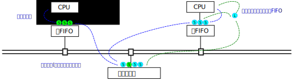
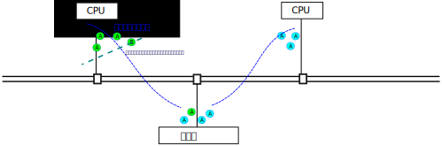

.. Copyright by Kenneth Lee. 2020. All Right Reserved.

内存访问模型
============

我们这里说的内存访问模型主要对应英文的Memory Consistency Model。我们主要关心的
是整个系统所有的内存使用对象对内存的访问能否有共同的控制语义和认知。

内存访问的的原子化行为
----------------------

一条独立的指令，从写指令的人看来，这是原子的，但在CPU执行的时候，呈现为一组复
杂的微架构行为，所以，当我们从CPU上发出一条指令的时候，程序员不能简单假设这个
指令从其他CPU、加速器或者其他设备上看到也是一样的。

本小节我们看看鲲鹏上（就这个问题来说，其实主要是ARMv8的架构定义上，但鲲鹏920芯
片内部不但包含有CPU，所以不见得会完全重合，但由于其他处理单元也需要维持CPU的语
义，所以基本上是重合的）是如何解决这个问题的。

作为RISC指令集，ARMv8的访存指令和计算指令是明确分开的。程序员很容易区分这些指
令的行为，这些指令要不从内存中读写数据，要不基于寄存器的数据进行内部的运算。不
会出现一边计算，一边访问内存的行为。

        | RISC
        | Reduced Instruction Set Computer，精简指令集计算机。
        | 这是一种通用CPU指令设计策略，原始的含义是简化指令集的功能。
        | 让每个指令完成一个独立的功能，而不会产生执行一个指令，
        | CPU内部要反复调度多个硬件多步完成这个功能的情况。
        | 这种设计对于流水线布置，性能优化，都有更好的预期性，
        | 已经呈现现代CPU设计的主流，即使在部分表面指令呈现为非RISC
        | 行为的处理器中，内部实现也是按RISC理念设计的，只是把一个
        | 复杂的指令请求翻译为多个RISC形式的指令发送而已。

正如我们在介绍泰山核的内部结构时提到的那样。在执行这些指令的时候，CPU可能会进
行预测执行，访问内存会产生Cache合并，这个优化在每代的硬件中都会进行优化。所以
对于软件工程师，我们其实更关心的是底层微架构在指令上的“承诺”。我们不能基于硬件
做成什么样来编程。而对于鲲鹏920，这个承诺就是ARMv8构架定义。

在ARMv8的架构定义中，所有单寄存器，而且和寄存器大小对齐的地址访问指令，都保证
是原子的。换句话说，你在一个CPU里发出这样的指令去修改内存，其他的CPU或者加速器
，必然或者看到这个指令生效前的情况，或者看到生效后的情况，不会出现修改了一半的
情况。

这一点保证了多个CPU同时访问内存的时候结果是有办法预期的，否则多核通讯就没法直
接基于内存做了。

其他每个具体指令的内存行为ARMv8架构设计中有具体的定义，我们这里不是要翻译ARMv8
架构手册，所以我们这里不深入进去。

我们看看其他的原子需求在这个平台是怎么实现的。首先是CAS。CAS是Compare-And-Set
的简称。这是软件实现锁的的基本方法：在内存上放一个变量v，每个CPU不断去读这个变
量，如果它是a的时候，表示某种资源（比如其他内存变量），立即把它设置为b，使用那
种资源，用完后，再把它设置为a，让其他CPU可以使用它。

这个逻辑很简单，但需要保证读到它是a和把它设置为b这两个动作是原子的，否则这个逻
辑就不成立了。完成这样原子指令就称为CAS。

ARMv8定义了一组包括CAS指令在内的原子指令：

* CAS Compare-And-Set，有不同字长的版本（下同）
* LDADD/STADD Load/Store-and-Add
* LDCLR/STCLR Load/Store-and-Clear
* LDEOR/STEOR Load/Store-and-EclusiveOR
* LDSET/STSET Load/Store-and-Set
* LDMAX/STMAX Load/Store-and-取最大值，分不同字长和有符号数和无符号数版本（下同）
* LDMIN/STMIN Load/Store-and-取最小值

所有这些指令都是在内存操作上叠加一个运算以实现多核之间数据更新，这说起来违背我
们前面提到的RISC设计原则，但这就是这个产业的特点，永远都是个度的问题。

原子指令在软件上看来逻辑并不复杂，但在微架构上看，成本是很高的。如果我们把CPU
和内存都看做是总线上的一个个独立的实体，有一个CPU要做CAS指令，这个CPU需要先从
内存中读一个值，同时要在内存控制器上设置一个标志，保证其他CPU写不进去，等它比
较完了，然后再决定写一个值回去，才会让其他CPU写入。

不同微架构实现有不同方法对行为进行优化，在鲲鹏920上，原子指令的请求需要在
L3Cache上进行排队，保证在原子操作的多个动作之间能维持原子指令要求的语义。这个
排队本身也有成本。所以没有原子需要就不要轻易用原子变量，这其实是有成本的。

        .. figure:: atomic_inst_arch.svg

原子指令在遇到冲突的时候，会直接阻住CPU的执行。这个对于很多CPU的锁行为是有害的
，所以ARMv8还有一套exclusive指令：

* LDEX Load-Exclusive，有不同字长的版本（下同）
* STEX Store-Exclusive
* LDAEX Load-Exclusive-Acquire
* STLEX Store-Exclusive-Release

这个方案把部分自由度还给软件：LDEX读一个内存，同时在这个内存地址上打上一个标记
，STEX负责对这个地址写入一个值，如果这这种有其他CPU修改过这个值，这个写入会失
败本CPU可以重新做这个LDEX。这个方案不需要CPU作等待，CPU如果写不成功，可以先去
做别的操作，根据策略重试。这对于共享的核的数量非常多的时候，收益会很大。

这对指令的Acquire和Release版本只是增加了内存顺序强制，这个我们在讲内存顺序模型
的时候讨论。

和原子指令把同步行为推到L3 Cache不同，在鲲鹏920上Exclusive指令的同步是在靠近
CPU的Cache上做的，LDA在本地的Cacheline上设置了一个标记，其他CPU如果更新了这个
数据，会把这个Cacheline置为无效，这时再做STL就可以知道数据更改过了。但Cache同
步本身也有成本（共享这个数据的CPU越多成本越高），所以这也是个权衡的问题，通常
我们用后者做锁操作，而用前者做原子变量一类的功能。

        .. figure:: exclusive_inst_arch.svg

一般应用的工程，一般比较好的实践是用对应语言的一般语义编程比较好，把这个优化工
作留给芯片和底层软件的优化者是个更好的配合策略。


内存Cache和Cache Coherency设计
------------------------------

相对CPU的计算单位，一次时钟跳变，或者一般说一个Cycle，内存的速度非常慢，在配置
xxxx主频的DDR4上，一个内存访问操作需要xxx个Cycle（待确定，但一般我会认为是200
个Cycle左右）。

这时就会选择使用Cache。Cache是更快、更小、更靠近CPU的存储单元。Cache的存在和设
计上不断的改进和变化，控制要素都是它的这三个特征：

* 更快：更快而没有取代DDR内存，显而易见，因为成本高
* 更小：同上
* 更靠近CPU：即使没有前面这个成本的问题，大量的CPU需要访问相同的地址，也需要排
  队，Cache仍可以带来优势。

        | 根据 [1]_ 的数据，2012年SRAM的单次访问时间是0.5-2.5ns，
        | 每GB的价格是500-1000美元。而DDR的单次访问时间是60-70ns，
        | 每GB的架构是10-20美元。

.. [1] Computer Organization and Design: RISC-V Edition

鲲鹏920的Cache分近CPU Cache(L1和L2）和远CPU Cache（L3），示意如下图：

        .. figure:: kp920_cache_arch.svg

近CPU Cache可以不跨域系统总线访问，远CPU Cache则需要跨越总线。后者被分成两部分
。Cache内容索引（Tag）在CPU和加速器一侧，而实际的数据在总线的另一端。


Cacheline和关联性
`````````````````
Cache比目标空间小，这就造成一个目标地址标识的问题的了。如果一个字长的数据需要
一个地址，那么一个64位的数据就需要一个64位的索引（Tag），用更大的数据粒度，对
地址的要求就可以下降。这个粒度就称为Cachenline。不同层级的Cacheline的长度不需
要完全一致，鲲鹏920的Cachenline长度，可以在Linux发行版上运行getconf命令获得。
但在本文写作的时候，这里只有L1 Cache的长度，这是一个Bug。

读者如果需要参考数据，鲲鹏920的L1和L2 Cacheline长度是64个字节，而L3 Cachenline
的长度是128个字节。这些值的选择，都是针对应用的权衡的结果，并没有确定的规矩。

关联性则是进一步降低对Tag的要求：如果规定每个Cacheling只能对应一定数量的地址，
Tag的大小可以进一步降低：

        .. figure:: cache_addressing.svg

把Cache分成多个Way，多个Set，也有助于简化硬件的设计。

Cacheline这种东西的存在，也会对程序产生边缘效应。比如你定义了两个独立的变量给
两个CPU，如果他们靠得太近，正好落在同一个Cachenline中了，你以为这两个变量没有
共享，但总线系统以为他们共享了，任何一个CPU更新了自己的变量，都要同步给另一边
的CPU，这个性能就会掉下来。

解决这个问题的方法当然是保证不同CPU的变量独占各自的Cacheline，但这个问题更值得
我们关注的问题是：任何一种代理都会产生边际效应，我们不要指望抽象和封装可以解决
所有问题，抽象和封装在性能面前常常是无所遁形的。

ICache和DCache
``````````````
和很多其他CPU的选择一样，鲲鹏的指令和数据Cache（分别称为ICache和DCache）是分离
的。对于冯诺依曼计算机来说，指令和数据其实都是数据。所以很多时候把两者分离是没
有必要的，但在最靠近CPU一级，把两者分离有好处：它们的预取策略，Tag方式是不同的
。

比如，一般数据的Cache地址是基于物理地址的（相同的物理地址可以被不同的虚拟地址
共享），而ICache基于虚拟地址没有好处，因为ICache在解码的时候并不知道物理地址，
物理地址需要经过MMU进行翻译才能知道。

鲲鹏920 ICache声称是基于虚拟地址的，这可以从Linux内核的启动日志中可以看出来：
        ::

        Detected VIPT I-cache on CPU0
        Detected VIPT I-cache on CPU1
        Detected VIPT I-cache on CPU2
        Detected VIPT I-cache on CPU3
        ...

这里声称每个CPU是的ICache是VIPT的，意味着Linux会以虚拟地址为考量进行相应Cache
的刷新，但这其实并非是鲲鹏920 ICache设计的全部，因为其实鲲鹏920的取指部件是同
时发出物理地址和虚拟地址两个请求的，根据哪个先返回决定用那个地址。但对操作系统
暴露的接口，它是认为它是VIPT的。

        | VIPT
        | Virtual Index Physical Tag，表示用虚拟地址做索引，
        | 而用物理地址做Tag匹配的Cache Tag设计方式。
        | 与之对应的还有VIVT，PIPT等其他策略。

我们说明这一点，是要让读者看到，其实大部分时候没有必要靠软件去响应硬件的多种变
化，因为硬件也在玩小聪明，软件也在玩小聪明，系统就不再聪明了。所以不如简单一点
严格按接口和自己的目标来写程序。

地址交织
````````
地址交织也是一种提升访问带宽的技术。比如一个系统有两个内存单元（比如两条DIMM条
），那么我们可以有两种常见的编址方法。一种是直接分段使用，比如[0,X)是第一片内存
的空间，[X, Y]是第二片内存的空间。这种如果你连续访问一片内存，比如做一个memcpy
，这个访问的带宽受限于到其中一个内存单元的带宽。

第二种方法是第一个地址放在第一片内存中，第二个地址放在第二片内存中，第三个地址
放在第一片内存中，第四个地址在第二片内存中。这样在做连续地址访问的时候内存的带
宽就可以扩展一倍。这种编址的方法就叫地址交织。

地址交织可以发生在Cache上，也可以发生的内存中，都是总线地址访问策略，在鲲鹏920
中，用户可以通过BIOS配置设置不同的交织方法。但其实并没有策略，每种交织策略只是
对某种应用内存访问模式的一种妥协。

鲲鹏920支持如下内存映射模式：

* Rank-Row-Bank-Col
* Rank-Row-Col-Bank-Col
* Rank-Row-Rank-Col-Bank-Col
* Rank-Row-Bank-Row-Bank-Raw
* Rank-Row-Col-Row-Bank-Col

它们分别根据内存条的不同Rank，Row, Bank和Columne进行编址，其中最前面RRBC模式就
是没有交织的一般方式。

不同的交织模式是根据业务的需要进行的全局权衡，对于软件程序员，大部分时候最好不
要去感知内存的位置，工作在numa的封装上才能保证软件的通用性。


Cache预取
`````````
访问内存比较慢，访问Cache就快得多，越靠近CPU的Cache访问越快。

todo：提供一个示例程序，和运行结果。

这样很自然我们我想到要打这个时间差，比如我们可以先发起一个Cache访问操作，然后
先完成其他计算，然后在来使用这个地址，这样内存加载和计算就可以并行起来。

比如下面是一个矩阵乘法的算法：

.. code-block:: c

        int a[W][H]; //第一个矩阵
        int b[H][W]; //第二个矩阵
        int c[W][W]; //结果

	for (i=0; i<W; i++) {
		for(j=0; j<W; j++) {
			c[i][j] = 0;
			for (k=0; k<H; k++) {
				c[i][j] += a[i][k]*b[k][j];
			}

		}
        }

这个循环中的关键计算是中间的核心乘法，但在鲲鹏920中，一个乘法的时间，就算不考
虑流水线，也不过3到12个时钟周期，但如果需要从DDR中把数据提取出来，常常就需要超
过100个时钟周期（todo：需要再次确认）。所以最好是在还在计算的时候就开始先让
Cache把数据取出来，让计算和加载的过程同步进行。比如这样：

.. code-block:: c

	for (i=0; i<W; i++) {
		for(j=0; j<W; j++) {
			c[i][j] = 0;
			if (!(j%INT_PER_CACHELINE))
				__builtin_prefetch((const void *)&c[i][j+INT_PER_CACHELINE], 1, 3);
			for (k=0; k<H; k++) {
				c[i][j] += a[i][k]*b[k][j];
				if (!j && !(k%INT_PER_CACHELINE))
					__builtin_prefetch((const void *)&a[i][k+INT_PER_CACHELINE], 0, 3);
				if (!i && !(j%INT_PER_CACHELINE))
					__builtin_prefetch((const void *)&b[k][j+INT_PER_CACHELINE], 0, 3);
			}

		}
        }

其中这里的__builtin_prefetch是gcc的内置函数，在不同的硬件平台上封装为不同的预
取指令。在上面的算法中，我们进行计算的时候，已经可以知道后面要计算的内存单元
是什么了，我们就可以提前把数据取出来。

这是鲲鹏920上，PRFM和PLI等指令的设计初衷。但实际上，如果在鲲鹏920上运行这个程
序，很可能并不会让速度更快。因为除了软件在做prefetch外，硬件也在预判指令序列的
行为，这两者一综合，这个效果就没有了。

硬件prefetch是个训练器，根据PC和目标地址的历史动态插入prefetch。示意如下：

        .. figure:: hw_prefetch.svg

早期的prefetch算法比较简单，比如Next Line算法，仅仅就是你取了Cacheline i，HWP
帮你取Cacheline i+1，后来逐步出现用于支持类似memcpy这样的stream算法和支持多个
内存向量运算（类似上面的模型）的Stride-K算法，以及更加复杂的比如Spatial Memory
Stream这样的算法。未来也许会用机器学习的模型来实现这个部分。鲲鹏920的实现是把
多个算法组合在一起实现的。但无论如何，软件工程师想找出某种规律和它配合，其实很
困难。

现在这个阶段，我是建议对于这个prefetch的使用随缘。有些优化工程师提出这么一个策
略：先把硬件prefetch关掉（todo：补充一张图，展示BIOS中的配置项）进行优化，如果
有效果，就重新把prefetch打开，如果性能没有变差，就留着它。通常硬件prefetch只是
让软件prefetch没有效果，不会让它变得更差。


Cache Coherency
```````````````
存在Cache，就会存在内存数据有多个版本的问题。为了实现多个CPU的数据交换，我们就
要确定多个“观察者”看到的内存的一致性。这可以两种策略，一种是让每个用户自己主动
把Cache推给另一端，另一种方案是硬件主动维护Cache的一致性，让每个观察者“觉得”
Cache不存在。后面这种策略，就称为Cache Coherent，简称CC。在中文语境中，我们既
把CC作为形容词用，也作为名词用，对应英文的Cache Coherency。

鲲鹏920的总线对外宣称是CC的。这可以从两个层面来说。从协议支持来说，前面介绍总
线的时候我们说过，鲲鹏总线支持AMBA协议，包括AMBA的CHI协议，所以每个Station后面
的节点，可以基于这个协议实现Cache之间的同步。所以，对于感知这个协议的节点，可
以直接基于这些协议去保证不同节点之间Cache是同步的。

而对于不认知这个协议的节点，Station上发出的就是简单的物理地址请求，总线仍可以
保证对它来说，其他节点的内容是Cache Coherent的，它自己有Cache的话，就是它自己
如何保证它自己和别人通讯的时候Cache是同步的这个问题了。

        .. figure:: cache_coherency_on_kp920.svg

具体的CHI协议如何工作，有标准文本定义。本文不重复这些标准文本。这完全是一个如
何标记Cacheline状态，以及在通讯网络中选择哪个节点进行消息同步的问题。而且这个
协议一直在改变，从使用者的角度，感知这个协议的细节，对软件设计没有太多的意义，
我们更关心的是这个设计的特征，如何影响软件设计时的取舍。

从架构上说，CC的关键在于所有的通讯节点，谁承诺了和你CC，以及谁你手中数据的另一
份数据。所以，在它的概念空间中，有两个非常关键的概念：

* PoS：Point of Serialization，串行化点。这是特定实现选中的，把请求在这个点上
  进行排队的点，也就是进行同步的中心点。这种点通常承载在一个称为Home Node的节
  点上，负责代理实际的地址请求。不同地址的PoS和HN不需要是同一个。

* 共享状态：表示一个Cacheline是否被共享，如果它没有被共享，我们只需要关心它是
  否有效（称为Valid）以及是否已经同步到上级Cache上（没有同步称为Dirty，同步称
  为Clean）了，如果它被共享，我们就需要随时到PoS上通知所有的共享节点。

所以，对于CC，软件核心需要关心的，是减少共享Cacheline，比如你定义一个数组，每
个CPU一个成员，这些成员本来没有关系的，但如果你让他们的内容交织在一起，硬件就
认为他们共享了数据，每次更新都要走一次CC协议，这个速度就会慢下来。

todo：提供一个例子程序呈现一下数据。

另外，我们还可以看到，CC的复杂度也和共享数据的节点的数量有关，所以不要让没有必
要共享的数据的Cacheline出现在无关的节点上，无论是CPU还是设备。

todo：在提供一个例子呈现这个特征。


Cache QoS
``````````
Cache可以大幅提高每个节点的处理形成，所以它非常重要，如果某个进程或者虚拟机访
问了大量的数据，就会导致其他进程或者虚拟机的Cacheline不断失效。这样Cache QoS就
成为了服务器一个重要的需求了。

todo：920的Cache QoS特性


内存顺序模型
------------
多节点，带Cache的通讯模型，还带来另一个内存语义上的问题，就是内存以什么样的顺
序呈现给不同的通讯接口。

比如说，我们有两个CPU（核）通过内存进行通讯，内存mem[0-16]是数据，mem[17]是数
据有效的标记。负责准备数据的CPU这样写程序：

.. code-block:: c

        mem[0] = xxx;
        mem[1] = xxx;
        ...

        mem[17] = VALID;

这个“程序顺序”是mem[0], mem[1]这样一路修改过去的，但这个“程序顺序”很多时候都不
是系统的承诺，有很多人都可以修改它，比如：

* 编译器：编译器可以以流水线，寄存器使用等优化为理由，把没有依赖关系的内存访问
  重新调度。

* CPU：CPU顺序执行指令，但由于流水线和异步执行的存在，前一条指令没有执行完，下
  一条指令就可能生效了。

* 存储系统：CPU的访存系统可能会合并访问操作，在不同的Cache上生效和同步的时机也
  不同，这同样会改变这个顺序模型。

但如果没有一个规矩，上面这个程序就没法写了。这是内存顺序模型要解决的问题。

最粗暴的方法是要求所有内存的访问顺序都和程序顺序一致，但前面我们也看到了，这样
的要求就禁止了编译器，CPU，包括存储系统的所有优化，所有内存操作都必须串行排队
，这个性能无法接受。但作为和其他方案对比，我们把这个方式称为绝对顺序模型。

业界比较常见的内存顺序协议有两种，Total Store Ordering和Weak Memory Ordering。
这两个名字也不是严格的定义，不同的体系结构对它们有不同的细节要求，但我们总的来
说，它们的原理基本是一致的，我们这里重点讨论这个基本原理。

无论是哪种内存顺序模型，本地的语义依赖是必须保证的，比如对于同一个CPU，向
mem[0]写入a，接着读出来，读出来的值就必须是a。反过来，如果mem[0]本来是b，你先
读这个值，然后写成a，这个读出来的值就只能是b，不能是a。编译器和CPU的优化只是尝
试在本地程序语义感受不到的地方偷步，如果本地算法上有依赖的顺序都不能保证，这就
不是冯诺依曼计算机了。

顺序协议保证的是在总线上的所有可以访问内存的通讯实体（比如CPU）内存变化的顺序
是可控制的，可预期的。

Total Store Ordering的本质是在全系统中维护一个全局的Store顺序，也就是说，在一
个核上写的先后顺序，在其他核上也会看到一样的先后顺序。在上面的例子中，mem[0]，
mem[1]一个个写下来，到mem[17]写VALID，其他核看到mem[17]=VALID的时候，mem[0]的
值一定是已经写好的值。但这不包括读。

比如我们在两个核上分别执行下面的程序：::

        //assume mem[0]==memp1]==0 at beginning
         <cpu1>                   <cpu2>
        mem[0] = 1;             mem[1] = 1;
        print(mem[1]);          print(mem[0]);

假定mem里一开始都是0，cpu1上，我们先写mem[0]，然后读mem[1]。而cpu2上，我们先写
mem[1]，再读mem[0]。按TSO，它只保证cpu1上的mem[0]写和cpu2上的mem[1]写也是有序
的，但读在什么时候发生作用是不保证的，那么这些读的结果就可以表现为：::

        mem[0, 1] = 0, 1
        mem[0, 1] = 1, 0
        mem[0, 1] = 1, 1
        mem[0, 1] = 0, 0

其中，0,0这个结果在绝对顺序模型中是不会发生的，因为cpu 1已经看到mem[1]是0了，
说明这时mem[0]肯定已经是1了，但TSO只保证了Store的顺序。

除了这种情形，大部分情形下，TSO是可以保证系统的顺序的。但TSO保证这个顺序，是有
成本的：很多实现是在每个内存使用者（比如CPU）上设计一个写操作FIFO，所有的写操
作都需要进行排队，而读操作则需要先从FIFO上看有没有重叠操作，然后再到总线外取得
数据，这中间存在一个外部的对齐点，读操作需要保证在这个对齐点上同步数据：



TSO在编程上更简单，因为我们一开始谈到的给mem[]写VALID的方法不需要增加任何额外
的逻辑，但硬件留下的余地上。

另一种常见的方法是硬件不再做这么多的判断的，如果软件有这种顺序依赖关系，自己主
动指定就好了。这种方法就简单称为Weak Memory Ordering。鲲鹏920，ARMv8都采用这种
内存模型。这种模型通过额外的“栅栏”指令保证顺序。



在没有顺序要求的时候，内存请求可以任意发射，也不需要保持同步。直到你确实需要保
证某个顺序的时候，你才需要用栅栏指令等待前面的特定操作全部进入同步点。这样明显
更容易控制整个通讯过程，但软件就要多做一些工作了。对于上面的mem[]的程序，代码
必须这样写：

.. code-block:: c

        mem[0] = xxx;
        mem[1] = xxx;
        ...

        mem_write_barrier();
        mem[17] = VALID;

mem_write_barrier()拦住之前发射的所有写指令，当这些操作都结束后（也就是他们的
结果被所有内存的访问者都“看见”以后），栅栏指令才会结束。这是，如果有人看见
mem[17]变成VALID了，mem[0]到mem[16]的内容一定是之前写的内容。

ARMv8的主要的栅栏指令是DMB和DSB，两者功能相似，在ARMv8的构架定义中只是说，后者
是一个更强力的栅栏，会把一些系统行为考虑在内。在鲲鹏920的实现中，后者会同时拦
住比如tlbi这样的操作，保证如果更新了页表，这些更新也会在DSB之后生效。而DMB则不
会考虑这样的要素。

DMB/DSB的参数主要用于控制栅栏的范围：

* 拦读还是拦写，还是两者都拦（比如ST, LD标记）
* 内存的范围，是否包含设备地址空间（比如NSH）
* 同步的对象范围，比如仅仅包括SMP的CPU（比如ISH，OSH）
* 等等

Linux内核对这个语义封装成这样的语义了：::

        mb();           // 读写栅栏
        rmb();          // 读栅栏
        wmb();          // 写栅栏
        smp_mb();       // 仅作用在CPU之间的读写栅栏
        smp_rmb();      // 仅作用在CPU之间的读栅栏
        smp_wmb();      // 仅作用在CPU之间的写栅栏

一般的内核代码，只工作在这个语义上就可以了。如果是IO，Linux还有这样的封装（X是
读写的长度标识）：::

        writeX_relaxed();       // 简单写
        writeX();               // 写栅栏后再写
        readX_relaxed();        // 简单读
        readX();                // 读后加读栅栏

这样前面mem例子就可以写成这样了：

.. code-block:: c

        writeX_relaxed(&mem[0], xxx);
        writeX_relaxed(&mem[1], xxx);
        ...
        writeX(&mem[17], VALID);

在用户态，如果我们基于标准的系统库编程，这种问题不需要特别考虑，因为如果你要共
享数据，本来就应该用锁对共享数据进行宝库，这个锁操作本身就能保证程序的顺序语义
得到保证。除非你要写自己的锁行为，这时就需要用栅栏指令来实现你的意图了。

.. vim: fo+=mM tw=78
