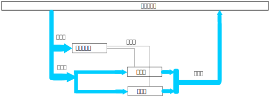
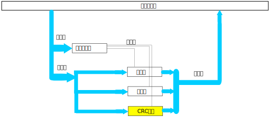

.. Copyright by Kenneth Lee. 2020. All Right Reserved.

综述
====

通用计算
---------
服务器主要提供三种能力：计算、网络和存储。计算是其中重要一极，而且是软件开发工
程师打交道最多的一极。

计算能力本质是一种信息加工，把一种形态的信息，加工为另一种形态的信息。现代半导
体技术通过空间和时间两个维度上的展开，实现复杂的计算能力。

所谓空间上的展开，是通过组合电路实现的计算的过程，比如下面是一个加法器的示意图
：

todo：去要一张鲲鹏的加法器的电路图。

数字电路电平翻转速度基本上可以认为是光速(todo：需要确定），所以理论上只要布置
足够的电路，就可以完成任何计算。当然，由于工程上有相移等问题的存在，这其实是有
范围限制的，但大体上我们可以认为有这个趋势：通过布置更多的电路，就能完成更多的
计算。这是空间角度的展开。

使用多核，加速器，多硬件线程，多CPU等，都是广义的空间角度的展开手段。

空间展开的优点是计算速度快，缺点是占用更大的晶元面积，而且如果某个计算过程不是
经常需要，这些面积的利用率不高。

空间展开不足可以通过时间补偿，通过时钟驱动电路把整个计算过程分成多次，就可以完
成更复杂的计算。比如一个32位的加法，可以分解成两次16位加法的组合。对应的面积就
可以小得多。但这样带来的问题也是显而易见的。它的速度受限于时钟频率，速度慢得多
。而时钟频率又受限于电压和加工工艺，不能无限增长。而且更快的频率和需要更高的电
压支持，最终都会反映在计算单元的功耗上。

所有计算子系统的设计都是要平衡时间和空间的关系，而这个时间和空间的关系的设计依
赖于应用的计算类型。所以，几乎没有一种计算单元可以完全满足所有计算的需要。故此
，在服务器设计的时候，设计师们会根据应用的需要，设计不同的计算单元，把不同的计
算分解给不同的计算单元从而满足不同的应用需要。

鲲鹏920SoC内部提供两种类型的计算单元，一种是基于ARMv8的通用计算单元，另一种是
专门针对特定应用的硬件加速器单元。其他的，如果有需要，则可以通过PCIE接口，加入
更多例如TPU，GPU一类的计算单元。

鲲鹏920选择ARMv8作为通用计算单元，有其策略上的考量。一方面是海思和ARM有长期的
合作经验，可以形成组合投资优势。另一方面，ARMv8在现代服务器设计上是有其他一些
明显的优势的。比如说，ARMv8在64位升级上的成功转型。前面说过，布置的功能越多，
占用的面积就越大，所以兼容性，对所有人来说都是痛苦的选择。为了兼容过去的二进制
应用，一些已经没有必要支持的计算单元仍然需要支持，这会增大面积，但对不使用这些
功能的应用，这些多余的面积就是浪费的。所以，同时兼容32位和64位两种指令，对于任
何一方面的应用，无论是32位的，还是64位的，都有部分浪费。ARMv8兼容v7，但允许不
支持v7，而且顺利对生态进行升级，让用户接纳了64位的整个生态。这样整个CPU设计就
可以轻装上阵了。所以大部分基于ARMv8的服务器，包括鲲鹏920，直接就放弃了32位支持
，也放弃了对很多老旧的设计的支持，整体上为它提供更高的性能，更小的面积和功耗提
供了动力，这可以弱化它缺乏服务器历史这个缺点，形成明显的竞争力。

        | ARMv7和v8
        | ARM构架经过多年的发展，形成了很多针对不同场合的Profile和版本，v7和v8
        | 是它进入构架化发展的标志。其中v7版本使用32位地址。而v8提供两个模式，
        | Aarch32和Aarch64，Aarch32兼容v7的指令空间，Aarch64的指令空间其实是一
        | 个新的指令空间，只是可以和Aarch32互相切换，互相认知对方对本方寄存器
        | 的修改。ARMv8架构认为Aarch32是可选的特性，让CPU的实现者彻底放弃这部
        | 包袱，专注实现Aarch64需要的的功能。

鲲鹏的通用计算单元基于ARMv8。在很多开发者的眼中，ARM一般用于移动终端，并不能提
供足够高的计算能力。但我们应该注意到，鲲鹏只是使用了这个指令集，并非使用移动终
端的实现，我们可以对比一下同时代的麒麟980和鲲鹏920的大小：

todo：需要一张麒麟和鲲鹏的对比图

两者在流水线深度，内部缓存，计算单元等各个方面，都是完全不同的设计。指令集仅仅
提供了软硬件接口，并不决定两者的应用范围。

专用计算
--------
除了通用计算，服务器还会需要专用计算，比如向量或者特殊算法单元。

我们从构架上理解一下这个问题。比如我们提供一个通用计算处理器，里面提供加法和乘
法单元，它的电路可以示意如下：

通常加法器还可以做减法，移位，跳转一类的功能，乘法器也可以完成比如除法这样的功
能。所以，让我们假设我们这个简单的CPU可以完成几乎所有的C语言可以要求的计算。

现在假设我们把这个计算用于某个文件存储系统，在我们的计算中每次都要做CRC计算，我
们用开源的zlib中的算法来考量一下这个计算过程，它是这样的：

.. code-block:: c

        local unsigned long crc32_little(crc, buf, len)
            unsigned long crc;
            const unsigned char FAR *buf;
            z_size_t len;
        {
            register z_crc_t c;
            register const z_crc_t FAR *buf4;

            c = (z_crc_t)crc;
            c = ~c;
            while (len && ((ptrdiff_t)buf & 3)) {
                c = crc_table[0][(c ^ *buf++) & 0xff] ^ (c >> 8);
                len--;
            }
            ...
            return (unsigned long)c;
        }

这里的核心计算是while里面的那个包含很多数组引用，乘法，移位，加法的过程。如果
我们用现有的计算方法去做，每个计算过程就需要至少一个时钟周期（通常乘法不止一个
时钟周期）。为了让这个速度加快，我们可以增加一个crc计算单元，让它变成这样：

这样我们做这个计算的时候可能一步到位，让计算加快。但如果一百万条指令都调用不了
一次这个计算单元，这个计算单元就只能在这里吃土和耗电，这个额外增加的面积就没有
什么用了。这是我们前面提到的我们到底要以空间还是时间为目的的问题。

为了节省资源，我们可以进行聚合，比如我们可以让100个核提供通用计算，另外提供
10个核提供crc的计算。这个额外的计算单元就没有那么浪费了。这样聚合出来的单元，
我们就叫它“加速器”，或者“专用计算单元”。行业中有很多成熟的独立计算单元的设计，
比如GPGPU，FPGA，还有鲲鹏920中集成的压缩和加解密计算单元等。

加速器通常在核外，这不是必须的，但为了更好的功耗控制，这也是常态，这样加速器就
有可能不能和原有的计算密切配合，比如它无法直接读取通用算法的寄存器。如果要让计
算过程更加密切，就需要把加速器实现在CPU核的内部，这样实现的计算单元，我们通常
称为协处理器，比如鲲鹏920中实现ARM NEOM指令的单元就是一个协处理器。协处理器相
比加速器最大的缺点是引入了额外的状态，如果使用了协处理器的线程发生了切换，就
需要额外保存更多的状态寄存器，这为OS带来更更多的负担。我们在讨论协处理器的时候
再来详细讨论这个问题。

总的来说，专用计算单元通常用于处理特定计算类型的单元，它的设计通常是针对技术特
征的一种权衡。

.. vim: fo+=mM tw=78
