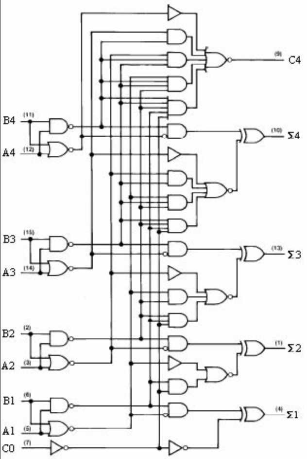

.. Copyright by Kenneth Lee. 2020. All Right Reserved.

综述
====

服务器主要提供三种能力：计算、网络和存储。计算是其中重要一极，而且是软件开发工
程师打交道最多的一极。

计算能力本质是一种信息加工，把一种形态的信息，加工为另一种形态的信息。现代半导
体技术通过空间和时间两个维度上的展开，实现复杂的计算能力。

所谓空间上的展开，是通过组合电路实现的计算的过程，比如下面是一个加法器的示意图
：

todo：去要一张鲲鹏的加法器的电路图。

这里先用一张其他加法器的示意图来表示：

这个电路在时钟的驱动下进行一次一拍的进行翻转，所以，如果我们要增强它的计算能力
，我们可以在这个基础上叠加更多的门，从而可以一拍实现一个更复杂的计算。数字电路
电平翻转的速度受限于TAU常数（RC参数），这个值在现代高速电路中实际最终受限于工
艺和门的时延（称为Propogation Delay或者Gate Delay）。工艺是工程发展的问题，我
们这里先不论，门的时延会控制每个计算单元的在门上的规模。在一定的工艺水平下，如
果我们提高单个计算单元的复杂度，我们就不得不降低这个单元的主频。

        | TAU常数。是一个等效容阻电路的充电时间，等于等效电阻和电容的乘积，
        | 所以又称为RC常数。根据电容充电时间公式可以推出，
        | 一个等效RC电路把电容充到63%左右的时间等于等效电容和等效电阻的乘积，
        | 而把电容从0充到99%的时间为5个RC单位。所以可以通过这个参数估算电路
        | 翻转的时间范围。

但无论如何在某个固定的参数条件下，我们可以通过提升每个计算单元的规模，实现更复
杂的计算过程。而且即使每个计算单元的规模首先，我们仍可以通过增加计算单元的手段
实现并行计算。使用多核，加速器，多硬件线程，多CPU等，都是广义的这种技术的具体
体现。这种技术策略，我们称为空间展开。它消耗更大的晶元面积，但计算效率更高，但
如果某个计算过程不是经常需要，这个面积的利用率就不高了。

空间展开不足可以通过时间补偿，也就是说，我们可以把计算过程分成多次来完成。比如
我们在电路上可以完成一次翻转做64位的加法，我们可以发起两次加法，实现128位的计
算，这是算法在时间上的展开。

时间展开可以呈现给软件（需要软件发出多次指令），也可以不呈现（由硬件通过多个时
钟周期完成一条执行）。这里的控制要素在于指令译码和CPU内部运行状态保留的成本。
比如，有些指令集有一次加载两个寄存器的指令，有些指令集没有，前者不见得就比后者
的性能更高，这完全取决于CPU的内存加载单元是否进行了足够高的空间展开。

对算法根据应用需求进行时间和空间上的平衡，是CPU计算子系统设计的重要主题。软件
的一系列行为，理论上都可以通过空间展开变成一次翻转的行为（但同时受限于通讯效率
，比如内存加载，因为内存本身是个独立的系统，它在时间上无法像CPU内部的行为那样
受控），但如果无限进行这样的展开，CPU的利用率就很低。

所以，鲲鹏920的计算子系统设计上以有多种计算单元为策略的。一种是空间利用率不高
的通用计算单元，这是基于ARMv8指令集的泰山核。另一种是专门针对特定应用的硬件加
速单元。鲲鹏920提供的计算单元还是初步的应用加速单元，比如压缩，加密等特定算法
的单元，但这不是鲲鹏加速器的核心设计目标，鲲鹏加速器的最终目标是把针对不同计算
目标的计算单元进行配比，从而平衡不同的计算需求。

鲲鹏920选择ARMv8作为通用计算单元，有其策略上的考量。一方面是海思和ARM有长期的
合作经验，可以形成组合投资优势。另一方面，ARMv8在现代服务器设计上是有其他一些
明显的优势的。比如说，ARMv8在64位升级上的成功转型。前面说过，布置的功能越多，
占用的面积就越大，所以兼容性，对所有人来说都是痛苦的选择。为了兼容过去的二进制
应用，一些已经没有必要支持的计算单元仍然需要支持，这会增大面积，但对不使用这些
功能的应用，这些多余的面积就是浪费的。所以，同时兼容32位和64位两种指令，对于任
何一方面的应用，无论是32位的，还是64位的，都有部分浪费。ARMv8兼容v7，但允许不
支持v7，而且顺利对生态进行升级，让用户接纳了64位的整个生态。这样整个CPU设计就
可以轻装上阵了。所以大部分基于ARMv8的服务器，包括鲲鹏920，直接就放弃了32位支持
，也放弃了对很多老旧的设计的支持，整体上为它提供更高的性能，更小的面积和功耗提
供了动力，这可以弱化它缺乏服务器历史这个缺点，形成明显的竞争力。

        | ARMv7和v8
        | ARM构架经过多年的发展，形成了很多针对不同场合的Profile和版本，v7和v8
        | 是它进入构架化发展的标志。其中v7版本使用32位地址。而v8提供两个模式，
        | Aarch32和Aarch64，Aarch32兼容v7的指令空间，Aarch64的指令空间其实是一
        | 个新的指令空间，只是可以和Aarch32互相切换，互相认知对方对本方寄存器
        | 的修改。ARMv8架构认为Aarch32是可选的特性，让CPU的实现者彻底放弃这部
        | 包袱，专注实现Aarch64需要的的功能。

鲲鹏920的通用计算单元基于ARMv8。在很多开发者的眼中，ARM一般用于移动终端，并不
能提供足够高的计算能力。这个认识并不正确，鲲鹏只是使用了这个指令集，并非使用移
动终端的实现，我们可以对比一下同时代的麒麟980和鲲鹏920的大小：

todo：需要一张麒麟和鲲鹏的对比图

两者在流水线深度，内部缓存，计算单元等各个方面，都是完全不同的设计。指令集仅仅
提供了软硬件接口，并不决定两者的应用范围和性能。

对于加速器应用，我们从构架上进一步理解一下。比如我们提供一个通用计算处理器，里
面提供加法和乘法单元，它的电路可以示意如下：

.. figure:: simple_cpu.svg

通常加法器还可以做减法，移位，跳转一类的功能，乘法器也可以完成比如除法这样的功
能。所以，让我们假设我们这个简单的CPU可以完成几乎所有的C语言可以要求的计算。

现在假设我们把这个计算用于某个文件存储系统，在我们的计算中每次都要做CRC计算，我
们用开源的zlib中的算法来考量一下这个计算过程，它是这样的：

.. code-block:: c

        local unsigned long crc32_little(crc, buf, len)
            unsigned long crc;
            const unsigned char FAR *buf;
            z_size_t len;
        {
            register z_crc_t c;
            register const z_crc_t FAR *buf4;

            c = (z_crc_t)crc;
            c = ~c;
            while (len && ((ptrdiff_t)buf & 3)) {
                c = crc_table[0][(c ^ *buf++) & 0xff] ^ (c >> 8);
                len--;
            }
            ...
            return (unsigned long)c;
        }

这里的核心计算是while里面的那个包含很多数组引用，乘法，移位，加法的过程。如果
我们用现有的计算方法去做，每个计算过程就需要至少一个时钟周期（通常乘法不止一个
时钟周期）。为了让这个速度加快，我们可以增加一个crc计算单元，让它变成这样：

.. figure:: simple_cpu_with_crc.svg

这样我们做这个计算的时候可能一步到位，让计算加快。但如果一百万条指令都调用不了
一次这个计算单元，这个计算单元就只能在这里吃土和耗电，这个额外增加的面积就没有
什么用了。这是我们前面提到的我们到底要以空间还是时间为目的的问题。

为了节省资源，我们可以进行聚合，比如我们可以让100个核提供通用计算，另外提供
10个核提供crc的计算。这个额外的计算单元就没有那么浪费了。这样聚合出来的单元，
我们就叫它“加速器”，或者“专用计算单元”。行业中有很多成熟的独立计算单元的设计，
比如GPGPU，FPGA，还有鲲鹏920中集成的压缩和加解密计算单元等。

加速器通常在核外，这不是必须的，但为了更好的功耗控制，这也是常态，这样加速器就
有可能不能和原有的计算密切配合，比如它无法直接读取通用算法的寄存器。如果要让计
算过程更加密切，就需要把加速器实现在CPU核的内部，这样实现的计算单元，我们通常
称为协处理器，比如鲲鹏920中实现ARM NEOM指令的单元就是一个协处理器。协处理器相
比加速器最大的缺点是引入了额外的状态，如果使用了协处理器的线程发生了切换，就
需要额外保存更多的状态寄存器，这为OS带来更更多的负担。这是一个两难问题，需要针
对不同的应用场景进行不同的权衡。我们在讨论协处理器的时候再来详细讨论这个问题。

本章我们会审视鲲鹏920计算子系统在通用和专用处理功能上的实现，以及配套这个实现
的安全，性能，通讯等方面的设计考量，我们还会专门讨论虚拟化技术在这个子系统上的
实现。

.. vim: fo+=mM tw=78
