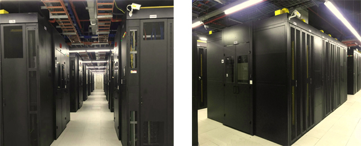
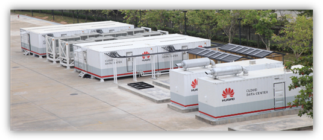
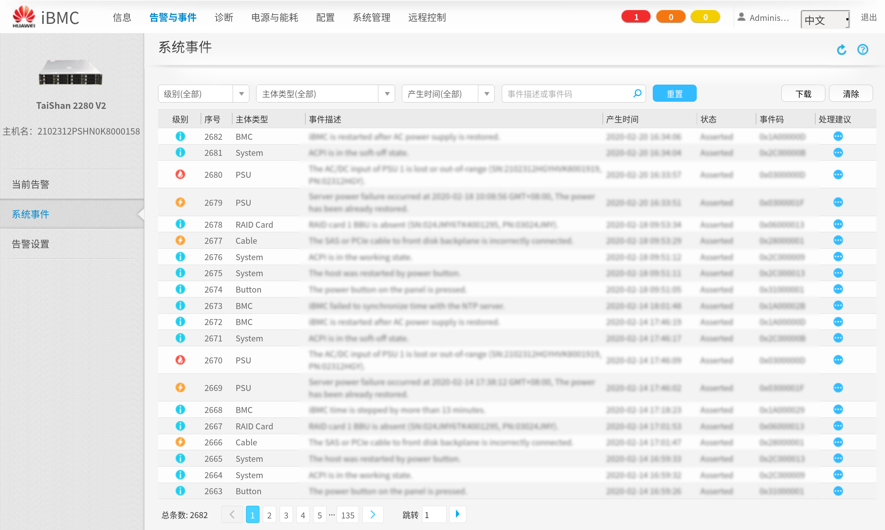
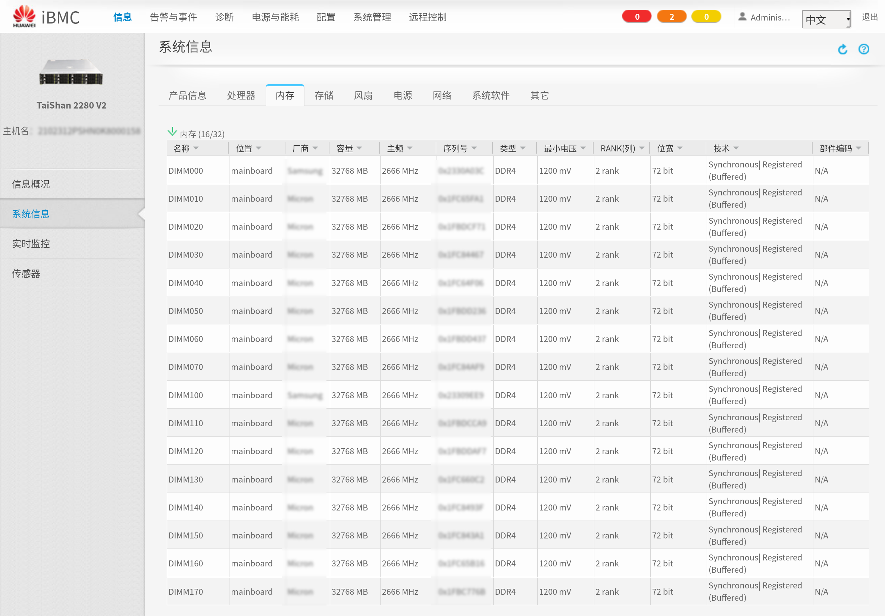
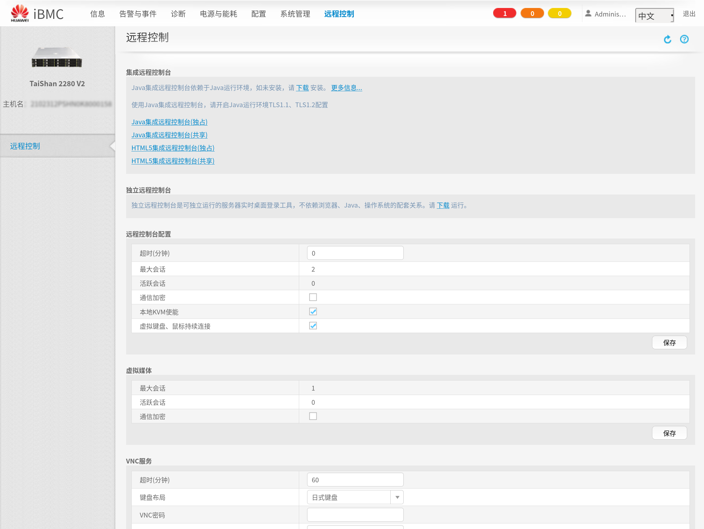
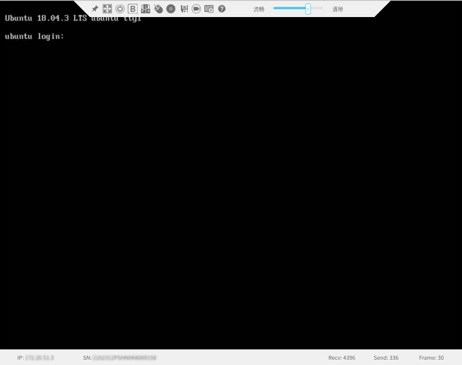
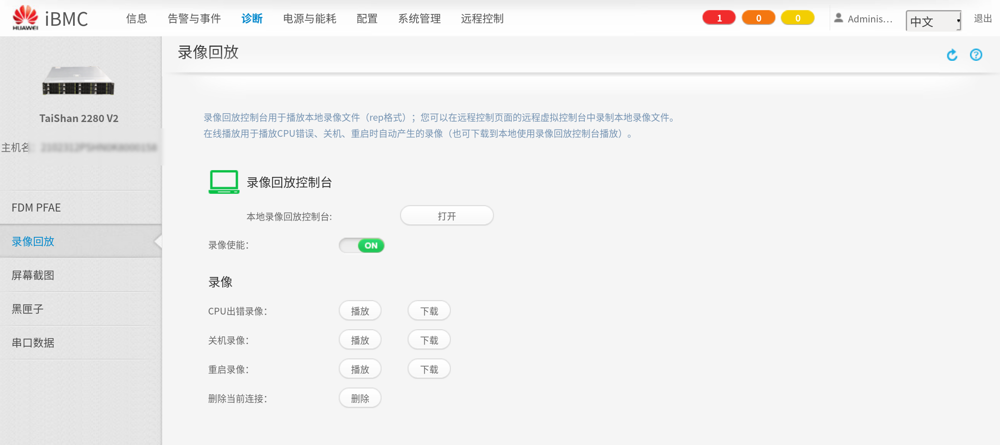

.. Copyright by Kenneth Lee. 2020. All Right Reserved.

数据中心
========

数据中心是一种聚合大量服务器的手段，也是实现这种手段的相关建设和建筑。通过标准
化的供电，温控，网络等各种基础设施的设计，它可以达到提高维护效率，降低研发、维
护、使用成本等目的。

下面是一个华为公司数据中心的一角：

        注：本图来自网络，仅在本开源版本中使用

大型的数据中心可以占地XXX亩，todo：需要一个华为大型数据中心的数据。也可以小到
做成一个集装箱，todo：需要一个华为集装箱式数据中心的介绍。

        注：本图来自网络，仅在本开源版本中使用

服务器本身可以设计成不同的外形，比如塔式，刀片式，机柜式等等。在现代数据中心中
，通常采用机柜式设计，这样在空间布置上有优势。在这样的布置中，所有服务器都是使
用一样的宽度，很容易堆叠在一起。在高度上，这些服务器使用标准的尺寸进行打包：它
总是约44.45mm的整倍数，这种高度称为1U，2U，3U等等。这样把服务器插到机架上，可
以不留下空隙，替换也很容易。

        | 关于1U概念的来源
        | 1U是数据中心机柜一个单元（Unit）的含义，实际高度是todo：请教一下硬件
        | 设计的伙伴们。

这种标准化的机柜设计反过来约束了服务器的物理设计方向，使这些设计必须满足这些机
柜的尺寸要求。

组网上，数据中心服务器通常先连接本机架的交换机（称为TOR交换机），然后在通过TOR
交换机连接到数据中心的网络上。这些网络通常还会使用多平面结构，把业务，管理等多
个功能的网络分开，以保证可靠性、安全性和通讯效率。

        | TOR交换机
        | Top Of Rack交换机。部署在机架顶部，用于提供机架内机柜互联和对外接口
        | 的交换机。todo：缺图

数据中心的服务器通常需要被远程维护，所以单板上会集成独立的控制芯片，称为BMC
（Board Management Controller）。BMC有自己的控制网络，通常在服务器加电的时候自动
启动，用户可以通过Web或者远程软件一类的方法，通过网络访问BMC，对主系统进行开关机，
安装操作系统，查看控制台，查看设备状态等等。BMC可以为服务器提供近似本地使用键盘
鼠标和显示器一样的体验。

        | KVM
        | KVM是服务器专用术语，表示Keyboard，Video，和Mouse。
        | 在服务器中通常通过一个代理设备远程模拟给管理客户端。
        | 基于KVM的功能，用户在远程操作一个应用程序或者Web界面，
        | 会被模拟成在这个服务器旁边直接键盘鼠标一样，
        | 服务器的显示也会被输出到远程的管理客户端上。
        | KVM通常会被实现为BMC功能的一部分。

下面是基于鲲鹏920的泰山服务器的BMC控制界面，iBMC：

它可以直接从Web或者应用界面上看到服务器的全部状态，包括硬件的配置，比如下面是
这台服务器的内存配置：

可以通过kvm用不同的方式直接接入设备的控制台：

这是KVM本身的界面：

还可以对这个界面进行截屏或者直接做视频录像：

todo：需要一组图和解释：开关机，安装操作系统，KVM访问操作系统图形界面

基于BMC，使用者可以远程访问任何一台服务器，和使用本地PC一样。但对于管理员来说
，这仍然是不够的，比如，如果一台服务器的业务出了问题，需要把这个业务迁移到另一
台服务器上，这个过程就会变得很复杂。所以现代数据中心常常使用IaaS架构，管理员先
给所有服务器统一安装一个基本的操作系统，然后把业务部署在虚拟机里面。这样，所有
的服务器的底层软件都是一样的，不一样的软件都在虚拟机中，如果硬件发生了故障，只
要把整个虚拟机迁移到其他硬件上就可以了。

        | IaaS
        | Infrastructure as a Service。中文一般翻译为“基础设置即服务”。
        | 他是基于虚拟化技术引入的概念。最初的时候，
        | 数据中心通常提供的仅仅是“托管服务”。也就是说，
        | 用户自己把服务器交给数据中心运营商，数据中心运营商为服务器提供场地，
        | 供电，网络等等设施，而服务器是由用户自己管理的。
        | 这种方法增加数据中心的管理多样性，从而也提高了管理成本，
        | 之后技术发展到另一个方案：不但网络，供电，场地等，服务器本身，
        | 也是数据中心提供的“服务”的一部分。运营商自己采购服务器，
        | 统一安装自己的基础系统，
        | 而提供给用户在这些基础系统上创建虚拟机的能力，
        | 用户可以根据需要增加和删除不同配置的虚拟机，增加和减少资源占用，
        | 这样一种技术，称为IaaS。

数据中心中的服务器根据用途的不同，分成不同的类型，一般会包括：

* 业务服务器：用于运行完成业务的软件，比如Web Server，数据库，大数据分析等等。

* 存储服务器：用于提供存储功能，通常这种服务器会包含大量的磁盘，对外提供比如
  SCSI，iSCSI，NFS，Samba等接口

* 其他专用服务器：为了提供性能，部分数据中心会把部分专用的功能汇聚，比如进行AI
  训练的机器需要大量的GPU算力，进行加密的设备需要专用的加速器，这些专用服务器会
  被独立管理专门用于解决这类的问题。

todo: 能否拿到华为某个不那么重要的数据中心不同类别的服务器的数量？

.. vim: fo+=mM tw=78
