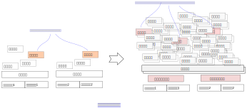

.. Copyright by Kenneth Lee. 2020. All Right Reserved.

服务器的软件生态
================

软件生态
--------
介绍现代的处理器的软件组成是一件很困难的事情。作者常常被人问到这个问题：“某某
处理器的软件支持是怎么样的？”，这个问题很难回答，因为它背后隐藏了一个老旧的假
设：每种硬件都应该有支持它工作的单一的，或者少数的几种软件组合。

这个假设是来自在软件不丰富的时代。在那个时代，每个硬件都有人为它写针对性的软件
，虽然有一定的复用，但大部分时候还是各自有各自独立的组合。这种情况下，简单认为
每种处理器会有一套自己的软件组合是合理的假设。

但随着软件不断的发展，行业中已经存在大量的软件了，这种时候，还要用一种固定的思
路去理解“软件支持”这个概念，就会产生很多错觉和误判。

todo：需要整理一些行业代码量的数据

就像下图示意的这样：

软件得到巨大发展后，开发成本已经从软件向硬件设计靠拢，转变为硬件设计向软件靠拢
，最终变成大量的软硬件开发聚焦到一组方案上，并且在新需求和竞争压力的左右下，不
断进行部分替换，取得新的竞争力。这样一种发展模型，不允许我们以一种静态的，单一
的思路去看待这些软件。

我们看一个具体的例子，以Linux Kernel为例，现在的主线5.5版本，就支持下面这些处
理器构架：::

        alpha
        arc
        arm
        arm64
        c6x
        csky
        h8300
        hexagon
        ia64
        m68k
        microblaze
        mips
        nds32
        nios2
        openrisc
        parisc
        powerpc
        riscv
        s390
        sh
        sparc
        um
        unicore32
        x86
        xtensa

每种构架，都有不同的变体，我们会有成千上万的组合。比如下面是编译arm32位时可以
做的平台选择菜单：

        .. figure:: linux_arch_selection_arm32.png

ARM平台在Linaro做了标准化设计，在一个编译中可以多选多个平台。但如果用的是
PowerPC，每个编译的二进制，就只能支持一种平台：

        .. figure :: linux_arch_selection_powerpc.png

        | Linaro
        | todo

所以，这些组合有些可以用同一个源代码支持；有些需要用不同的源代码支持；有些可以
用同一个二进制支持；有些需要不同的编译选项编译的二进制才能支持；有些可以虽然用
同一个二进制支持，但不同的二进制在不同的硬件上会有不同的性能表现，等等。

比如，我们可以简单说树莓派支持Linux Kernel，但你不能直接下载一个主线Linux
Kernel就期望它可以运行在树莓派上，你需要下载另一个版本的Linux Kernel，在本书写
作的时候，树莓派用的Linux Kernel在这个分支上提供：::

        git://github.com/raspberrypi/linux.git

当你用这个分支编译一个用于树莓派3的二进制代码，它可以运行在树莓派3上，但它不能
运行在树莓派2上（todo：需要确认一次）。但对于鲲鹏920，你编译的主线内核，它不但
可以运行在鲲鹏920上，也可以运行在它前一代鲲鹏916上，还可以运行在其他的64位ARM
服务器上。这些都有其具体的需求在驱动着，不能用一个简单的逻辑来说明：谁可以被谁
支持，谁和谁可以组合。服务器由于应用的复杂度高，它就会追求通用性，要求一个二进
制版本在更多的实体上都可以工作，而嵌入式设备追求极致的性能，它就会为特定的应用
开发特定的版本，但这些版本的生存周期有限，最终他们可能就会在生命周期结束后，退
回到长远发展版本上重新开始。

很多人都希望简化这个问题，比如，作为一个硬件开发者，他可能希望有人告诉他：到底
哪些软件和版本是需要支持的？而作为一个软件开发者，他则希望有人告诉他，到底那些
硬件平台和版本是需要支持的？或者那些操作系统平台是必须支持的？而作为一个用户，
他希望有人告诉他：“到底某个软硬件件组合能否应用到我的场景中？”

每个这样的问题都容易回答，但把他们组合起来就很难回答了。现在你不可能做一个软件
或者硬件，只让它用于一种场合。做一个CPU，让它运行某种特定的数据库很容易，但你
能否接受做一个CPU，只让某种数据库在某种业务模型下性能高，其他情形下性能都很差
？或者你能否接受你开发一个数据库，这个数据库只能运行在特定的硬件上，在其他硬件
上都没法运行？这对于专用设备有时可以接受，但对于通用设备，大部分时候在成本上没
法接受。

所以，从软件架构的角度考虑现代的处理器软件支持，不是简单讨论某种“特定”的情形下
某个方案是可以工作的，我们必须考虑它具有多大的复用范围，并且在这些复用范围中发
挥这些软硬件的最大优势。所以，我们往往不说一个处理器的“软件组合”或者“软件栈”，
我们更关心的是一个处理器的“软件生态”。

当我们使用“软件生态”这个概念的时候，我们也就承认了：

* 软件是一个不断发展的对象，比如Linux Kernel主线，大约每两个半月，就会推出一个
  新版本，这个版本包含大约10000个补丁，（todo：证据）。所以，我们说，某个Linux
  内核支持某个硬件，和Linux主线支持某个硬件，这不是一回事。

* 软件掌握在不同的人的手里，这些人常常不会提前进行移植合作。比如说，某个云服务
  提供商使用了一款自己的数据库。在某种处理器没有推出前，他不会提前考虑和这种处
  理器提供商合作。在处理器推出并表现出某种竞争优势后，他们会考虑进行移植，但如
  果这个移植的成本表现得很高，他们就会放弃这个打算。换句话说，如果你认为这个云
  服务器提供商没有合作机会，这是不对的，因为他们明明在你推出产品后进行了这个合
  作，但如果你认为这个合作必然会发生，这也是不对的。这对很多习惯于“开发确切需
  求”的工程师或者决策者来说很难忍受，但这是通用软件生态的现实。这种现实在左右
  着技术的发展，我们不能因为不能或者还不能为此定义一个简单的规律就认为这种现实
  不存在。

* 软件生态意味着滚雪球效应。软件和硬件有越多的人用，就会有越大的生态。后来者要
  想打破已经成熟的生态让自己加入，就必须提供不可抗拒的竞争力，并且和生态的其他
  部分共存，如果没有遇到颠覆性的技术变化，重建生态几乎不可能。比如说，一个银行
  已经用惯了某种数据库，各种人工的或者电子的业务流都依赖这种数据的接口，特性，
  甚至Bug，替换这种数据库就需要成本和冒险。新的方案如果不能提供超过这个成本和
  风险的优势，这种替换就很难发生。

所以，软件生态不能用一种静态的眼光去看待。我们既要看到它所存在的一定的结构，也
必须理解这个结构的变化要素在什么地方。这已经有点像人类社会了，我们无法简单概括
人类社会的特征，但我们也不能简单说它没有特征。我们不能给他们一个完整的抽象，但
每个具体的问题上，他们还是有实际的规律。后面我们讨论具体的情形的时候，我们再看
更多的实例。

服务器软件生态
---------------
服务器是软件多样性最为复杂的领域之一，因为在很长的时间内，服务器开发工程师占据
了软件开发工程师的主体，成为计算机行业软件技术进步的领导者。简单可以这样理解：
当大部分人都是服务器软件工程师的时候，你需要一个排序算法，你大概率会用一个最初
在服务器上使用的版本，你的软件就会更像一个服务器软件的样子——无论你是否最后把它
用在服务器上。

经历长期的发展，不但不同服务器硬件有不同的操作系统方案，在这些操作系统之上还形
成不同的软件分层组合。我们不去分析所有的操作系统解决方案，我们用一个近年发展较
快的一个实例作为研究对象，由这一个实例来推广其余。

我们的研究对象是GNU/Linux。用这个作为研究对象有几个理由：

1. GNU/Linux是服务器软件生态中相对发展较快的领域之一，也是现代服务器中使用最广
   泛，最典型的软件方案之一。

        todo: 需要Linux服务器市场占用率的数据图示

2. GNU/Linux的开源首选让我们可以避开很多授权上的困难

3. GNU/Linux是鲲鹏服务器首先支持的软件解决方案

GNU/Linux由于独特的授权和开源的合作方式，在服务器领域得到广泛的应用。但同样因
为它的这个特征，也带来了这个方案本身的软件多样性。换句话说，即使不考虑其他操作
系统的生态，仅GNU/Linux的生态也非常复杂。

        | 开源
        | 开源直接的含义是把用于生成软件程序的原始代码公开给代码拥有者之外的第
        | 三方。但这种方式引起了软件开发上的巨大变化，这让这个词语现在有了新的
        | 含义，在很多场合下它指一种软件的开发和维护方式，这种方式下，开发者赋
        | 予使用者修改源代码的权力，使使用者变成另一个开发者，从而生成软件的另
        | 一个版本，供自己或者其他人使用。
        |
        | 开源开发方式把软件开发领入了一个新的时代，让很多软件可以像生物圈一样
        | 基于基因和竞争力通过复制进行淘汰式的发展。用户可以选择直接使用开发者
        | 提供的软件，也可以生成这个软件的一个分支进行使用。这些具有相同基因的
        | 软件在自己的使用空间中生存和发展，后继无力的分支被淘汰，优秀的基因被
        | 剩下的分支吸收，最终只有少数的分支能成为幸存者，引领这个软件的发展。
        |
        | 在服务器领域的各种讨论中，开源的原始含义和它的引申含义都会被人使用，
        | 它的确切含义需要结合上下文来理解。本书中，如果没有特别指出，我们一般
        | 指它的引申含义。

        | GNU/Linux
        | GNU是一个开源项目，目的是开发一套开源的，可以取代Unix的软件系统。
        | 它包括编译器，开发库，操作系统内核等一系列软件模块。
        | GNU项目最初开发的操作系统内核是Hurd，但没有获得大规模使用。
        | 在Linus Tovards开发了Linux内核后，GNU项目采用了Linux内核，
        | 构成GNU/Linux。它包含了GNU项目的编译器（gcc），
        | 开发库（glibc）和很多其他基础软件，以及Linux Kernel。
        | 这样一个综合的软件组合，称为GNU/Linux。
        |
        | 基于GNU/Linux这个基础，人们把其他开源的或者非开源的软件组合到
        | GNU/Linux中，人们把这样的软件组合，也称为GNU/Linux。
        

todo：搞一张中软统计的EulerOS的代码量数据。

仅从软件类别进行分类示意，GNU/Linux的软件生态大致包括Boot Loader、操作系统内核
、基础库，Hypervisor，编译器，中间件，应用程序等。图示如下：

这其实是一个非常不严谨和粗糙的描述。但无论怎么努力，这种不严谨都是必然的，因为
软件概念的关系一直就不是这样的一个分层的关系，而是一种立体的，多角度的组合关系
。软件架构师进行设计的时候，概念视图和模块视图就是互相独立的，一个概念可以属于
多个模块，一个模块可以属于多个进程，但多个进程内的模块又可能是同一个部署模块……
这样的交叉关系，是软件设计的常态。

在上面这幅图中，看起来应用程序离服务器硬件很远，好像是和服务器硬件是无关的，但
实际上，应用程序要通过指令运行在服务器处理器上，所以，如果更换服务器硬件，应用
程序是不能运行的。但反过来，我们也不能下结论说，应用程序就不能在其他服务器上运
行，因为部分应用程序是源代码形态的（比如脚本语言），它的执行过程是通过中间件一
次次解释实现“执行”的，这样的应用程序就和服务器硬件没有关系了。

我们解释这种现实情况，是要提醒读者，不要尝试简单去理解这些软件结构，每个概念可
能仅仅就是它说明的时候“表面”的那个样子，是不能被引申的。这一点，可能每个软件工
程师都有一定的体会，但不是每个人对此有完整的认识。

有了这个前提，我们才可以大致理解一下这里提到的软件部件的含义：

Boot Loader
------------
Boot Loader负责启动过程控制，它是服务器被加电后遇到的第一个软件（不考虑BMC等要
素），这个软件负责发现硬件里有哪些设备，给他们设置参数，找到操作系统，然后把操
作系统投入运行。Boot Loader是计算机分工的必然产物。最早的计算机，只有一个管理
软件，不需要分Boot Loader和操作系统。交付硬件的人需要告诉交付软件的人它的所有
行为，但交付硬件的人也需要根据需要进行自己的参数调整，每次进行两个团队或者组织
的沟通，成本太高，硬件的人就会留下一段代码自己维护，设置好了，给软件的东西就是
每次都一样的了。所以，对于很多工程师来说，Boot Loader不算软件，而属于“硬件”。
因为是“硬件的人”做的。但Boot Loader确实是个“软件”，而且这个软件有很多的变体，
甚至有基于操作系统改的，比如linuxboot项目就提供一个用Linux Kernel作为Boot
Loader的软件。

Boot Loader最终启动操作系统内核。我们先要解释一下，在计算机领域，操作系统也是
一个非常粗糙的概念。比如在一般的用户眼中，操作系统提供商提供的一切软件，都是操
作系统，包括计算机领域一般认为的如Internet浏览器，文件管理器等“应用软件”，也是
操作系统的一部分。所以，我们这里强调“操作系统内核”，表示它仅仅是操作系统中具有
最高特权级的那部分软件。但这个定义本身，也是粗糙的，我们仍需要具体问题具体分析
。但无论如何，操作系统内核，大体上完成整个计算机的资源管理，控制应用程序谁可以
运行，运行的时候可以访问什么资源等。

        | 特权级
        | 计算机系统通过特权级控制软件不同部件的权限。
        | 大部分计算机会有一个基本的分层模型，这个不同的层次，
        | 构成不同的特权级。通常计算机加电的时候进入最高特权级，
        | 高特权级软件设定相关参数和软件布置后，再降低特权级，
        | 让低特权级的软件部件运行，低特权级的软件发动越权操作的时候，
        | 就会回到高特权级的软件的布置中。
        | 但现代的服务器的特权级系统，已经逐步变成一个多维度的网格结构了，
        | 不是传统简单的分级设计。

驱动程序是综合控制硬件行为的软件部件，对宏内核操作系统，比如Linux，它是内核的
一部分，并没有一个明确的内核和驱动的区分。

        | 宏内核
        | 宏内核是微内核概念提出来后的一种对非微内核系统的区分。
        | 微内核概念的提出者认为操作系统内核需要保持稳定，
        | 不应该包括例如驱动这样的功能，建议把这些非核心功能从最高特权级分离。
        | 所以，作为一个不严谨的定义，宏内核是把更多功能，例如驱动，
        | 放到内核中一同管理的一种内核。
        | 但其实今天的宏内核也会把一些驱动放到低特权级去管理
        | （比如Linux的Fuse），部分微内核为了提高效率，
        | 也会把部分的驱动放到内核中管理，这并非是非此即彼的清晰定义。

基础库
-------
基础库，或者说库，也是一个含混不清的概念。首先，它是一个单独的文件实体，却不是
一个单独的运行实体。它的功能是为上层的软件提供公共的调用服务。当它被放在磁盘上
，它是一个单独的文件。但当它被运行，它属于每个被运行的程序，有不同的实体，这时
你也可以说它其实代表应用程序或者中间件，这其实无法被严格区分。而且库这个概念，
只是一段程序，也很难说什么库是基础的，什么库属于应用。我们只能理解为一种大致的
指向，无法精确定义它。

对于GNU/Linux来说，glibc是它的基础库，这个库的功能从它的手册目录中可以感知：::

        1 Introduction
        2 Error Reporting
        3 Virtual Memory Allocation And Paging
        4 Character Handling
        5 String and Array Utilities
        6 Character Set Handling
        7 Locales and Internationalization
        8 Message Translation
        9 Searching and Sorting
        10 Pattern Matching
        11 Input/Output Overview
        12 Input/Output on Streams
        13 Low-Level Input/Output
        14 File System Interface
        15 Pipes and FIFOs
        16 Sockets
        17 Low-Level Terminal Interface
        18 Syslog
        19 Mathematics
        20 Arithmetic Functions
        21 Date and Time
        22 Resource Usage And Limitation
        23 Non-Local Exits
        24 Signal Handling
        25 The Basic Program/System Interface
        26 Processes
        27 Inter-Process Communication
        28 Job Control
        29 System Databases and Name Service Switch
        30 Users and Groups
        31 System Management
        32 System Configuration Parameters
        33 Cryptographic Functions
        34 Debugging support
        35 Threads
        36 Internal probes
        37 Tunables

它既包括基本的内核的系统调用的封装，也包括C语言基本调用的支持，还有其他一些基
本的数学算法的基本封装。

但这并不能认为是一个基础库充分必要的功能，只能反映一种“实现”的选择。

Hypervisor
----------
Hypervisor，是虚拟机的管理者，提供者。有些描述中，会把这个实体放在操作系统的下
面，因为它模拟了一个虚拟的计算机。那么在这个虚拟的计算机中，我们图里的每个对象
在虚拟机中会有一个重复的对象，这个重复的对象中也可以包含一个Hypervisor，这就构
成一种递归循环的关系了。谁在谁的下面，是一个鸡生蛋，蛋生鸡的问题。我们仍只能就
具体问题进行分析，无法给出一个清晰的定义来。

        | Hypervisor
        | 用一台计算机A模拟另一台计算机B，有两种常见的方法，
        | 一种是设计一个模拟器，解释计算机B的软件请求，
        | 模拟硬件B的行为和对软件的反馈。这是纯软件的方法，
        | 通常对硬件没有特殊的要求。
        | 另一种方法只能用于A和B的大部分指令都是一样的情形，
        | 当A模拟B的时候，通过一个调度程序，让A暂时让出硬件，
        | 把B投入运行，这种模拟技术，需要一个程序进行全局的管理，
        | 这个管理调度和虚拟机运行的程序，称为Hypervisor。

当然，现实中虚拟机本身有一个虚拟带来性能下降，资源占用等问题，并不能无限叠加下
去，上面只是说一个理论化的情形。

Hypervisor这个概念本身也有很多值得辨析的地方，我们建立一个虚拟机，有些地方依赖
CPU的支持，有些地方依赖操作系统的而支持，有些地方依赖被模拟系统的支持，这些地
方都会存在一些软件部件，当我们提到Hypervisor这个概念的时候，我们是模模糊糊指向
这些软件的一部分，这个地方并没有非常确切的指向。

GNU/Linux有两个常见的Hypervisor解决方案，KVM和Xen，还有其他更多商用的或者开源
的解决方案，比如开源的VirtualBox。

编译器
------
编译器的问题也很复杂。编译器是一个运行在一台机器（令为M1）上的应用程序，这个应
用程序可以把源代码处理为某台机器（令为M2）上的应用程序。这里提到了两个应用程序
：编译器这个应用程序，和被编译的那个应用程序。如果我们讨论的是编译编译器这个应
用程序，我们将涉及三种机器：

* 编译编译器的那个机器
* 被编译的编译器将要运行的机器
* 被编译器编译的应用程序将要运行的机器

在GNU的标准编译工具gcc中，这三者分别被称为Build，Host和Target。它们可以是一样
的，也可以是不一样的。当编译器的Host和Target相同的时候，我们称为本地编译（
Native Compilation），否则称为交叉编译（Cross Compilation）。两者对源代码，特
别是编译脚本的要求是不同的，部分软件并不支持交叉编译，部分软件有可能必须要交叉
编译，这也带来软件生态的复杂性。一般来说，大部分软件都主要支持本地编译。但对每
个具体的用户来说，更重要的是他要用的软件支持的到底是本地编译还是交叉编译。比如
，在本书写作的时候，Android AOSP的源代码默认对ARM Target就是只能交叉编译的。

编译器的语义也是有不同的范围的，有时它仅仅指把源代码翻译成二进制对象文件的那个
工具，有时也指包含了后期处理的比如汇编器，链接器等这些工具一体的所有工具的集合。

编译器中也包含了编译器专用的库，所以，我们也可以认为它也包含部分的“基础库”，
但我们常常还是把它看做是编译器的一部分。

所以我们把编译器放在中间件和应用程序的下面，但实际上，我们也用编译器编译编译编
译器下面基础库，操作系统。我们用基础库，操作系统支持编译器的运行，编译器编译支
持它运行基础库和操作系统，甚至Boot Loader。甚至编译器也是用编译器编译的，只是
我们会用旧的或者已有平台的编译器编译新的版本的，新的平台的编译器而已。这也是当
前软件生态的常态。

中间件和应用程序
----------------
中间件也是一个模糊不清的定义。在实际应用中，人们把可以直接使用的软件称为“应用
软件”，而把支持最终软件的独立发布的软件称为“中间件”。比如Python，我们可以用
Python开发Web Server。我们可以把那个Web Server称为“应用程序”，把Python称为“中
间件”。但实际上，我们可以把Python本身作为一个控制台来使用，这时把它称为“应用程
序”，也没有任何问题。Kubernetes可以用于管理很多的进程组组成的服务器，人们也可
以把它称为“中间件”，但从操作系统运行的角度，它也确确实实是一个“应用程序”。

所以，中间件和应用程序从操作系统的角度并无差别，只是我们把复用程度高一点，基础
性质更大一点的软件称为“中间件”而已。

中间件和应用程序是整个软件生态中规模和复杂性最大的部分。每个领域都会产生这个领
域自己的一套独特的生态，这并没有很好的特征可以抽象。

todo：介绍一些IaaS，HPC，网络存储等典型软件应用方案的例子？

总结
----
从上面的讨论中我们可以看到软件生态的复杂度。而且由于模块化和接口抽象的设计理念
，大部分这些软件部件是可以有替代品的。而且，由于开源生态的特点，GNU/Linux在这
个问题上表现得尤其突出。这些可替换品有些是对已有的软件的分支设计，也有是为了实
现不同的目的和优势重新实现的。比如前面提到的Boot Loader，常见的有如uboot，
uefi+grub等等，还有人用Linux Kernel本身实现Boot Loader(比如前面提到的Linux
Boot），这些都可以成为某个解决方案中Boot Loader的选择。编译工具主流可以有有gcc
和llvm，而大部分芯片厂商还有自己实现的版本。这些版本部分基于gcc和llvm分支，部
分是从头开始开发。Hypervisor主流有Xen和KVM的不同实现，其他的Libraries根据具体
的领域不同，每个都有很多的实现，这些实现部分处于开发验证很初步的阶段，也有很多
被广泛使用，处于非常成熟阶段。

        | 分支
        | 分支是软件的一个管理概念。由于软件拷贝基本没有成本，
        | 软件随时可以被拷贝一份出来单独维护，这个被单独维护的软件，
        | 就称为一个“分支”。“分支”的发展方向可以和原来的分支完全不同，
        | 但它们有共同的初始基因，有很多可以互相借鉴的地方。
        | 所以也有些分支采用紧跟原始分支的方式进行维护，
        | 这样它总能获得上游分支的新能力，并每次补充自己加入的能力，
        | 但响应地，这样它的发展范围也是受限的。
        | 分支是软件发展的必然产物，因为软件的开发和应用不能同时发生，
        | 那么分不同的分支管理这些不同用途的软件状态，就必然是分支了。

由于分支的存在，即使不考虑每个功能本身的多样性，软件部件之间的组合都可以是无限
的。实际上，在这样的生态中，提供一个能解决“所有问题”的方案几乎是不可能的，人们
只能给出一种“能解决问题的组合方案”而已。但每个服务器的提供商，也确实在努力希望
达成“可以支持更多解决问题组合”的解决方案。

所以，“发行版”成为GNU/Linux世界的一个重要成功实践：既然我们无法给出适合所有人
的解决方案，我们可以通过对软件进行组合得到一个“发行版”，当有人增加更多的方案的
时候，以这种发行版为基础进行增加，这样组合的数量就可以得到减少了。

但尽管如此，“发行版”本身也会被分支。比如一个数据中心的运营商可能使用某个发行版
提供商提供的发行版，但他也可能根据他的需要替换这个发行版的部分组件。这样，这个
发行版就会变成另一个组合的“发行版”，这都是GNU/Linux开源生态的常态。

我们必须考虑这种软件的常态，才能正确认识服务器系统的设计思路在什么地方。这不能
为了简化问题，强行选择某些组合认为是“权威组合”，然后仅仅支持那个“权威组合”来运
行。因为服务器软件生态的力量，恰恰就是提供了这样的多样性，让各种创新力量都有一
个平台得以蓬勃发展，封闭了这种可能性，这个服务器的软件生态也失去了它的生机了。
这是一个至关重要的问题，很多软件架构师会因为某个软件生态的组合能力差，而放弃选
择那个平台，以免在快速迭代换部件的时候自己的方案很快失去竞争力。

.. vim: fo+=mM tw=78
