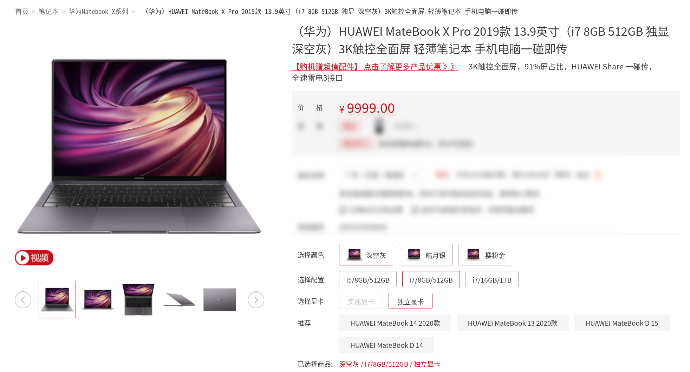
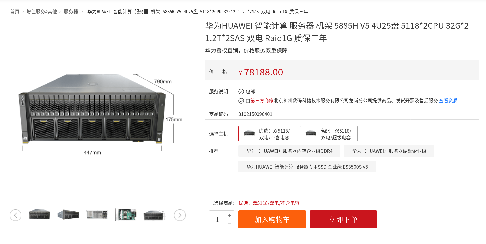

.. Copyright by Kenneth Lee. All Right Reserved.

综述
====

服务器是一种特殊类型的计算机。这是一个很宽泛的定义。一般来说，我们会认为服务器
主要是用于提供公共服务，而不是面向某个特定的个人（比如个人电脑），或者面向特定
的应用（比如机床控制设备）的通用计算机。

在现实中，服务器通常具有相比个人电脑更强大的性能，更可靠的服务能力，当然，更高
的价格和能耗。比如下面是华为公司的一款个人电脑产品：

        注：本图为网络截图，仅在公开版本中临时使用
        
根据产品介绍，该产品使用4核的CPU，主频1.8G-4.9G，提供8G或者16G的普通内存，没有
ECC，使用65W电源适配器，主网络连接基于Wifi。

而下面的是服务器产品：

        注：本图为网络截图，仅在公开版本中临时使用

该产品有多种CPU选配，我们参考一种高配的选择，比如铂金8180，28个CPU内核，每个内
核包含2个物理线程，最大2.5G的主频。同时可以插4个CPU，总共224个物理线程。使用
ECC内存，最大可以达到3072GB。包含25个2.5英寸的硬盘位，15个PCIE扩展插槽，2个
10GE的光纤网口和2个千兆RJ45网口，4个电源互相备份。

这两个产品如果仅从功能和可以运行的软件来说，其实有很多相似之处，甚至可以运行完
全一样的软件，但我们可以看到后者包含更多的CPU和CPU核，更多的内存，更高带宽的网
络，还有更多的可靠性保障手段，比如ECC，RAID和冗余电源等。

        | ECC
        | Error Correcting Code。一类通过增加冗余位对数据进行校验的技术。

        | RAID
        | Redundant Arrays of Independent Disks。一种通过把多个磁盘聚合使用，
        | 实现部分磁盘损坏也不会影响全部数据的一种技术。

服务器可以被独立部署，但到了近代，它更多时候会被组织成数据中心。提供统一的场地
，把大批的服务器组织在一起，这为统一管理，提高效率提供了很大的便利。今天，很多
小型的企业不再购买自己的服务器硬件，建立自己的服务器机房，而是租用云服务提供商
的硬件，这进一步为服务器的数据中心化提供了动力。标准化的高聚合，高性能低功耗服
务器成为服务器设计的一个重要趋势。

.. vim: fo+=mM tw=78
