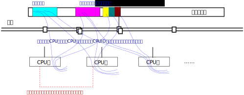

.. Copyright by Kenneth Lee. 2020. All Right Reserved.

Linux内核软件架构基础
=====================

介绍
----

本书介绍软件实例的时候，主要使用Linux作为例子，所以很多地方都会涉及Linux内核的
实现。我们这里不是写一本关于Linux内核的书，但我们需要和读者建立一个共识，让读者
在一定程度上和我们有对于Linux代码有接近的看法，所以我们在本章介绍一些基本Linux
架构逻辑。

本章的介绍主要以5.5的内核为代码基线，我们尽量聚焦到核心逻辑上，所以相关的逻辑也
可以推广到其他的版本。但如果涉及细节，那就只能针对每个具体的细节版本来说了。这
一点请读者注意。

我们假定读者对一个用户态的普通C程序的代码的工作原理是熟悉的。Linux内核其实和一
个普通的C进程很接近，对大部分程序员来说，他们只关心main函数，不关心main函数的前
面的汇编准备过程，如果读者不关心更多的细节，其实也不需要关心汇编的初始化过程，
Linux内核的代码从init/main.c:start_kernel()开始执行，然后一个模块一个模块调用它
们的初始化函数，完成所有的初始化以后，最后调用do_idle()进入等待状态，这之后就是
等着各种外部刺激激发内核响应不同的操作了。这种刺激可以是：

* 中断
* 系统调用

这和我们创建写一个网络服务程序，创建很多线程等待客户端请求，然后主程序进入Idle
等待的运行模型是一样的。

汇编初始化过程
--------------
但我们仍说明一下汇编的初始化过程。和普通程序一样，大部分时候Linux内核也是一个
ELF程序。这个ELF的代码的布局在它的ld script中定义，鲲鹏920作为通用的ARM服务器，
它的ld script就在这里：::

        arch/arm64/kernel/vmlinux.lds.S

从这里我们可以找到它的程序入口：

.. code-block:: as 

        ENTRY(_text)
        ...
	.head.text : {
		_text = .;
		HEAD_TEXT
	}
        ...
	.text : {
		_stext = .;
			IRQENTRY_TEXT
			SOFTIRQENTRY_TEXT
			ENTRY_TEXT
			TEXT_TEXT
       ...
       }
       ...

这段定义表明，这个ELF文件的入口地址在_text上，而_text定义为.text段的首地址，而
.text段包含多个子段（部分不存在），……我们忽略这些细节，最后可以找到这个入口：

        arch/arm64/kernel/head.S:_head

顺着这个入口走下去，完成最基本的内存准备，最后就会走到这里：

.. code-block:: as 

        __primary_switched:
                ...
                add	sp, sp, #16
                mov	x29, #0
                mov	x30, #0
                b	start_kernel
        ENDPROC(__primary_switched)

后面的行为，就是基本的C语言的范畴了。
        
        
运行参数
--------

C的main函数有argc和argc，Linux Kernel使用cmdline作为输入参数，这些参数由
Bootloader负责加载到内存中，通过特定的寄存器告知内核。

在服务器解决方案中，常见的方法是BIOS把Grub作为二级Bootloader进行加载，然后用
Grub加载内核，Grub中就可以给内核指定启动参数：

todo: grub.cfg的示例。

这些参数在内核中有一个详细的说明文档，在
Documentation/admin-guide/kernel-parameters.txt文件中。内核代码中有专门的代码
框架处理这些参数，读者可以全局搜索__setup()和__setup_param()宏的使用，这个宏的
定义如下：

.. code-block:: c

        #define __setup_param(str, unique_id, fn, early)			\
                static const char __setup_str_##unique_id[] __initconst		\
                        __aligned(1) = str; 					\
                static struct obs_kernel_param __setup_##unique_id		\
                        __used __section(.init.setup)				\
                        __attribute__((aligned((sizeof(long)))))		\
                        = { __setup_str_##unique_id, fn, early }

        #define __setup(str, fn)						\
                __setup_param(str, fn, fn, 0)

其中str是参数的名称，fn是对应的初始化函数。内核初始化流程中有一个比较早期的步骤，
会找到所有的这些定义，回调相应的fn，以完成一些基本的参数设置。

Linux启动以后，可以从/proc/cmdline获得当前使用的命令行参数。

Cmdline提供用户修改Linux内核运行行为的机会，但内核正常运行还需要Bootloader提供
的硬件参数。部分硬件参数可以从硬件寄存器上获得，比如PCI设备就可以通过总线枚举流
程自动发现，但部分硬件才是硬连线决定的，并没有什么太好的方法自动发现出来。这只
能通过Bootloader直接传递。

比较常用的传递参数的方法有Device Tree和ACPI接口。Device Tree是一种NoSQL数据库的
形态，通过一张树状的描述表描述系统中的所有设备和参数，Linux初始化的时候从这个描
述表中读到对应的参数，为部分核心模块提供参数，或者创建设备对象，匹配对应的驱动
从而提供支持。ARM平台支持Device Tree方式访问，并且很多硬件平台把自己的Device
Tree表放在Linux内核中，读者可以从如下目录看到这些定义：::

        arch/arm64/boot/dts/

Device Tree比较简单直接，但它描述的是一个相对静态的数据结构，比较适合嵌入式系统
，现在Device Tree也能支持Boot Loader动态修改表格结构，但仍不是特别灵活。

作为服务器，鲲鹏920主要使用的是ACPI的接口。ACPI本来是一个用于电源管理的接口标准，
但要做电源管理，就需要描述系统的结构，所以慢慢它就变成了一个描述系统结构的标准
接口了。

        | ACPI
        | todo

ACPI一大特点是支持AML语言，AML可以编译成本本地代码，ACPI的用户可以直接调这些代
码来获得参数。这让它支持更为动态的行为。比如你得到一个设备，你可以直接调用AML函
数执行Reset，这不需要描述接口说明Reset寄存器是什么，写多少是Reset，之类的，只要
提供这个函数，就可以实现设备复位，这样比Devtree灵活得多。

Linux内核对这些接口都支持，BIOS传递过来的参数中使能了什么，就用什么。驱动可以同
时支持用两种方式获得参数，也可以支持其中一种。从架构上来说，这总能做到，如果读
者关心细节，可以直接看相关的代码。hns_enet.c是一个典型的例子，它的probe函数
同时判断device tree和acpi的配置，根据相应的配置进行类似的初始化过程。

hns_enet是鲲鹏之前的服务器CPU的内置网卡驱动，在鲲鹏920中，网卡设备都虚拟化为
PCIe设备，在它的驱动hns3_enet中，设备参数通过硬件自动枚举发现，就不需要这些配置
了。

多核支持逻辑
------------
CPU核是互相独立的实体，每个CPU核按指定的指令序列执行代码，它们之间要互相影响，
只能通过通过核间发中断，或者在内存中通过共享的变量互相传递信息。当系统包含多个
核的时候，它们每个也只能从各自的复位初始地址上开始进入执行。但这样一来，内核的
初始化就很难同步了。

Linux内核对硬件做这样的假设：在Linux内核被投入执行的时候，只有一个CPU核（通常是
0核）被投入运行，也就是说，_stext函数是0核运行的，在系统初始化的前期，只有0核在
工作，等0核完成多核都需要的基本数据结构的初始化了，就通过硬件指定的方法启动其他
核，其他核再进入复位向量。这段代码在start_kernel的后期，创建内核线程kernel_init
后，在kernel_init()一开始调用kernel_init_freeable()->smp_init()完成。

之后0核之外的其他核也从_stext向量进入，根据自己的CPU ID（从系统寄存器中获得），
使用约定的自己的数据结构进行初始化，这可以通过定义CPU数量大小的数组实现。在ARMv8
兼容平台上，这会进入secondary_start_kernel()作为C语言的入口。这个地方不需要和
其他平台共享代码，因为只要调度器已经被初始化了，同时这个CPU的状态切换成在线，
CPU就可以响应线程创建和从其他核迁移进程过来的请求，这个CPU就可以负责调度系统中
分配的线程和进程了。

动态模块
--------
Linux是个很大的程序，下面这个是鲲鹏上一个bash进程的大小（来自这个pid的
/proc/<pid>/smaps文件）：::

        aaaaca312000-aaaaca405000 r-xp 00000000 08:02 23592962                   /bin/bash
        aaaaca414000-aaaaca419000 r--p 000f2000 08:02 23592962                   /bin/bash
        aaaaca419000-aaaaca422000 rw-p 000f7000 08:02 23592962                   /bin/bash
        ...

忽略其他动态库，这里的r-xp是它的代码段，大小不到1MB。而相同平台上的Linux Kernel
的大小如下（来自内核打印Buffer dmesg）： ::

        Memory: 526958844K/536866688K available (12092K kernel code, 1694K rwdata, 5112K rodata, 5504K init, 1161K bss, 9875076K reserved, 32768K cma-reserved)

代码段的大小是12M。这么大的程序，很多功能其实用不到。Linux就把部分功能做成独立
的模块，动态加载。这种动态加载的模块称为LKM，Linux Kernel Module。在Linux运行
的时候可以通过lsmod命令看到它有那些模块是动态加载的。

LKM的源代码形态中有自己的初始化和反初始化函数，如果在内核编译配置的时候把一个模
块编译为LKM，它就会变独立链接为.ko文件，这个文件被加载到内核中的时候，这个初始化
函数就会被调用，一边这个动态模块可以被注册到内核的其他子系统中，而这个模块被卸载
的时候，它的反初始化函数会被调用，从而脱离那些子系统的注册。

编译者也可以考虑把这些模块编译为内核的一部分，这些模块就不需要动态加载，而是在内
核完成核心系统的初始化后，统一调用他们的初始化函数。这就和一个普通的C程序的模块
没有什么区别了。

Linux内核中包含很多硬件的驱动，这些驱动大部分都会被实现为动态模块。因为不是每个
硬件平台都有这些硬件，包含这些驱动并没有意义。但LKM并不一定是硬件驱动，硬件驱动
也不需要一定是LKM。

驱动框架
--------

驱动操作系统中对硬件进行封装的代码。在一些操作系统中，操作系统只包含很少的一部
分驱动代码，其他代码通过类似LKM那样的技术动态加载（但这不是必须的，部分操作系统
也可以用进程作为驱动），而且这些动态加载的程序和OS没有密切关系，可以一定程度上
有不同的版本偏离。比如1.0的驱动，可以用于1.0, 2.0, 2.1的操作系统中。

所以很多用户对驱动的理解类似一个类似进程一样的独立实体。但Linux不是这样的，
Linux的驱动是内核的一部分，它们没有互相分离的版本，默认两者是一同编译的。（但正
如我们一直说的，每种架构判断都有可能有人做变种，我们这里只讨论设计意图）

抛开部署的逻辑，Linux内核在数据结构上用三个结构去管理驱动：

* struct driver，表示一段可以支持某种硬件的代码。

* struct bus_type，表示一种总线类型，这是一个逻辑概念，不需要表示一条真实存在的
  总线，在本小结中，我们把它简称为bus。

* struct device，表示一个设备，这是标识这个设备的数据结构，物理的总线也可以是一
  个device。

bus_type通常是一个静态的结构，表示某种类型的总线，driver和device都可以注册到
bus_type中，bus_type有机制保证任意一方注册到总线中，它就可以通过一个bus专属的
match函数，判断两者是否匹配（比如PCI总线可以匹配driver支持什么vendor和device id
，然后匹配加进来的device的vendor和device id是否一致，如果一致，就说明两者匹配成
功了），就调用driver提供的probe函数，用struct device作为输入，驱动就可以用
device的数据初始化硬件，并且把这个硬件注册到特定的子系统中了。

整个逻辑组织起来就是这样的：

1. 内核启动或者LKM插入的时候，驱动程序负责向自己支持的总线注册自己的驱动接口。

2. 硬件平台初始化代码根据硬件平台的特点创建device，注册给不同的总线。这个可以硬
   编码，也可以是对device tree或者ACPI配置的解释。也注册到对应的总线上

3. 1, 2两步不分先后，如果匹配上，就会产生probe，probe负责初始化硬件，并注册子
   系统

4. 注册的设备中如果包含总线控制器，它可以创建更多的bus，然后扫描自己的总线，把
   设备加入这个新的总线中。它也可以直接把新的设备加入已经存在的bus中。

所以，最终如果有driver没有device，driver就只是闲着，有device没有driver，device
也只是闲着。Linux还有其他机制在device加入bus的时候通知用户态的helper，尝试找一
个匹配的LKM插入内核以驱动这个device。这是另一套逻辑，而且不是主要的逻辑，我们这
里忽略。

driver, bus, device都是“对象”，Linux使用kobject来管理它们，在Linux启动后，我们
可以从sysfs上查看这些对象。sysfs通常被大部分发行版mount在/sys目录中，下面是一个
/sys/bus的内容：::

        ac97         container  event_source  isa           memory    nvmem        platform  serial       typec   workqueue
        acpi         cpu        gpio          machinecheck  mipi-dsi  parport      pnp       serio        usb     xen
        cec          dax        hdaudio       mdio_bus      mmc       pci          rapidio   snd_seq      virtio  xen-backend
        clockevents  edac       hid           media         nd        pci-epf      scsi      spi          vme
        clocksource  eisa       i2c           mei           node      pci_express  sdio      thunderbolt  wmi

我们看pci_express的内容：::

        drwxr-xr-x 2 root root    0 3月   5 15:17 devices
        drwxr-xr-x 6 root root    0 3月   5 15:17 drivers
        -rw-r--r-- 1 root root 4096 3月   5 15:17 drivers_autoprobe
        --w------- 1 root root 4096 3月   5 15:17 drivers_probe
        --w------- 1 root root 4096 3月   5 15:17 uevent

devices和drivers目录指向对应的devices和drivers的kobject所在的目录。
drivers_autoprobe等文件称为这个kobject的“属性”，可以通过读写这些属性改变这个
kobject的行为。比如，我们可以通过driver的unbind属性强行解绑定一个device等等。

对于服务器，最重要的两个bus_type是platform和pci。前者用于没有总线控制，无条件连
接的设备，这种总线的匹配通常就只能是字符串匹配。后者用于PCI和PCIe等设备的匹配，
配备方法就是PCI协议规定的Vendor和Device ID匹配了。

在驱动写作的时候，hns_enet用的就是platform设备，它的driver定义是这样的：

.. code-block:: c

        static const struct of_device_id hns_enet_of_match[] = {
                {.compatible = "hisilicon,hns-nic-v1",},
                {.compatible = "hisilicon,hns-nic-v2",},
                {},
        };

        static const struct acpi_device_id hns_enet_acpi_match[] = {
                { "HISI00C1", 0 },
                { "HISI00C2", 0 },
                { },
        };

        static struct platform_driver hns_nic_dev_driver = {
                .driver = {
                        .name = "hns-nic",
                        .of_match_table = hns_enet_of_match,
                        .acpi_match_table = ACPI_PTR(hns_enet_acpi_match),
                },
                .probe = hns_nic_dev_probe,
                .remove = hns_nic_dev_remove,
        };

这里提供了对device tree（of_mastch_table）和ACPI两个匹配表，任何一个配置文件
中描述了这个设备，都可以匹配这个驱动。

而鲲鹏920使用PCIe设备，它的driver定义就是这样的：

.. code-block:: c

        static const struct pci_device_id hns3_pci_tbl[] = {
                {PCI_VDEVICE(HUAWEI, HNAE3_DEV_ID_GE), 0},
                {PCI_VDEVICE(HUAWEI, HNAE3_DEV_ID_25GE), 0},
                {PCI_VDEVICE(HUAWEI, HNAE3_DEV_ID_25GE_RDMA),
                 HNAE3_DEV_SUPPORT_ROCE_DCB_BITS},
                {PCI_VDEVICE(HUAWEI, HNAE3_DEV_ID_25GE_RDMA_MACSEC),
                 HNAE3_DEV_SUPPORT_ROCE_DCB_BITS},
                {PCI_VDEVICE(HUAWEI, HNAE3_DEV_ID_50GE_RDMA),
                 HNAE3_DEV_SUPPORT_ROCE_DCB_BITS},
                {PCI_VDEVICE(HUAWEI, HNAE3_DEV_ID_50GE_RDMA_MACSEC),
                 HNAE3_DEV_SUPPORT_ROCE_DCB_BITS},
                {PCI_VDEVICE(HUAWEI, HNAE3_DEV_ID_100G_RDMA_MACSEC),
                 HNAE3_DEV_SUPPORT_ROCE_DCB_BITS},
                {PCI_VDEVICE(HUAWEI, HNAE3_DEV_ID_100G_VF), 0},
                {PCI_VDEVICE(HUAWEI, HNAE3_DEV_ID_100G_RDMA_DCB_PFC_VF),
                 HNAE3_DEV_SUPPORT_ROCE_DCB_BITS},
                /* required last entry */
                {0, }
        };

        static struct pci_driver hns3_driver = {
                .name     = hns3_driver_name,
                .id_table = hns3_pci_tbl,
                .probe    = hns3_probe,
                .remove   = hns3_remove,
                .shutdown = hns3_shutdown,
                .sriov_configure = hns3_pci_sriov_configure,
                .err_handler    = &hns3_err_handler,
        };

内核对象树
----------

理解Linux内核常常还会涉及内核对象树的概念。从纯粹的抽象概念上说，Linux内核中管
理了各种各样的对象。用户态常常需要获得这些对象的相关信息，比如我们需要知道系统
中有哪些设备，知道这些设备的属性是什么，等等。就需要通过特定的内核接口去获得这
些信息。

Linux早期主要依赖procfs来做这种通讯（主流的发行版通常把这个文件系统mount在/proc
目录下，但这不是必须的）。其原理是在内核中模拟一种虚拟的文件系统，某个内核对象
需要给用户态提供信息，就注册一些回调函数到这个虚拟文件系统上，当用户程序读写这
个文件系统的时候，依靠这些回调函数来提供信息给用户进程，或者接受用户进程的控制
。

比如下面是/proc/meminfo的内容，里面提供了内存子系统的大部分信息：::

        MemTotal:       527035420 kB
        MemFree:        523934248 kB
        MemAvailable:   522525312 kB
        Buffers:           26236 kB
        Cached:           383776 kB
        SwapCached:            0 kB
        Active:           306672 kB
        Inactive:         275296 kB
        Active(anon):     173452 kB
        Inactive(anon):     1772 kB
        Active(file):     133220 kB
        Inactive(file):   273524 kB
        Unevictable:           0 kB
        Mlocked:               0 kB
        SwapTotal:       2097148 kB
        SwapFree:        2097148 kB
        Dirty:                24 kB
        ...

它的代码实现在这里：

.. code-block:: c

        fs/proc/meminfo.c
        static int __init proc_meminfo_init(void)
        {
                proc_create_single("meminfo", 0, NULL, meminfo_proc_show);
                return 0;
        }

这就仅仅注册了一个meminfo_proc_show()函数，所以文件只读，用户态读这个文件，就
由这个函数提供内容。函数内部只要向内存中写字符串就可以了。

这种方法简单，但不标准，特别对于设备一类的对象，这种方式不好管理。所以Linux内核
又引入了一个抽象的概念，称为kobject，其工作原理和/proc几乎是一样的，但它提供更
多的抽象，比如它有对象属性，对象索引，父对象，子对象，对象类型，对象集合一类的
的概念。大部分发行版会把这个文件系统Mount在/sys目录中。当然，如前所述，这也不是
必须的。

/sys在层次关系表达上比procfs更清楚，比如/sys/bus中包含了前面提过的所有的
bus_type：::

        root@host:/sys/bus# ls
        acpi         container     genpd            mdio_bus  nd       pci_express    scsi    spi        xen
        amba         cpu           gpio             memory    node     platform       sdio    usb        xen-backend
        cec          edac          hid              mipi-dsi  nvmem    pnp            serial  virtio
        clockevents  event_source  i2c              mmc       pci      rapidio        serio   vme
        clocksource  fsl-mc        iscsi_flashnode  mmc_rpmb  pci-epf  scmi_protocol  soc     workqueue

而pci目录中给出了pci这个对象的属性：::

        root@host:/sys/bus/pci# ls
        devices  drivers  drivers_autoprobe  drivers_probe  rescan  resource_alignment  slots  uevent

其中devices和driver是在这个对象上注册的所有设备和驱动：::

        root@host:/sys/bus/pci/devices# ls
        0000:00:00.0  0000:02:00.0  0000:74:01.0  0000:79:00.0  0000:7d:00.2  0000:86:00.0  0000:b4:00.0  0000:b8:01.0
        0000:00:08.0  0000:03:00.0  0000:74:02.0  0000:7a:00.0  0000:7d:00.3  0000:86:01.0  0000:b4:01.0  0000:b9:00.0
        0000:00:0c.0  0000:03:00.1  0000:74:03.0  0000:7a:01.0  0000:80:00.0  0000:86:02.0  0000:b4:02.0  0000:bb:00.0
        0000:00:10.0  0000:03:00.2  0000:74:04.0  0000:7a:02.0  0000:80:04.0  0000:86:03.0  0000:b4:03.0  0000:bc:00.0
        0000:00:11.0  0000:03:00.3  0000:75:00.0  0000:7b:00.0  0000:80:08.0  0000:87:00.0  0000:b4:04.0  0000:bd:00.0
        0000:00:12.0  0000:04:00.0  0000:76:00.0  0000:7c:00.0  0000:80:0c.0  0000:88:00.0  0000:b5:00.0  0000:bd:00.1
        0000:01:00.0  0000:05:00.0  0000:78:00.0  0000:7d:00.0  0000:80:10.0  0000:89:00.0  0000:b6:00.0  0000:bd:00.2
        0000:01:00.1  0000:74:00.0  0000:78:01.0  0000:7d:00.1  0000:85:00.0  0000:8a:00.0  0000:b8:00.0  0000:bd:00.3

        root@host:/sys/bus/pci/drivers# ls
        ahci        ehci-pci   hinic           hns3  imsttfb  ixgbe         ohci-pci  serial  uhci_hcd    xhci_hcd
        asiliantfb  hibmc-drm  hisi_sas_v3_hw  igb   ipmi_si  megaraid_sas  pcieport  shpchp  virtio-pci

这里的设备是一个对象链接，如果我们详细看文件的属性，就是这样的：::

        root@host:/sys/bus/pci/devices# ls -l
        ...
        lrwxrwxrwx 1 root root 0 Mar 12 01:08 0000:bd:00.0 -> ../../../devices/pci0000:bc/0000:bc:00.0/0000:bd:00.0
        lrwxrwxrwx 1 root root 0 Mar 12 01:08 0000:bd:00.1 -> ../../../devices/pci0000:bc/0000:bc:00.0/0000:bd:00.1
        lrwxrwxrwx 1 root root 0 Mar 12 01:08 0000:bd:00.2 -> ../../../devices/pci0000:bc/0000:bc:00.0/0000:bd:00.2
        lrwxrwxrwx 1 root root 0 Mar 12 01:08 0000:bd:00.3 -> ../../../devices/pci0000:bc/0000:bc:00.0/0000:bd:00.3

设备实际上首先是系统全体设备管理这个对象的管理之下，然后再被注册给pci bus_type
，pci bus_type再建立一个到这个设备的索引，这样，设备和各个管理系统的关系就被建
立起来了。

对象中可以有属性：::

        root@host:/sys/bus/pci/devices/0000:bd:00.3# ls -l
        ari_enabled               d3cold_allowed   iommu           mdio_bus   remove     sriov_drivers_autoprobe  subsystem_device
        broken_parity_status      device           iommu_group     modalias   rescan     sriov_numvfs             subsystem_vendor
        class                     devspec          irq             msi_bus    reset      sriov_offset             uevent
        config                    dma_mask_bits    local_cpulist   msi_irqs   resource   sriov_stride             vendor
        consistent_dma_mask_bits  driver           local_cpus      net        resource0  sriov_totalvfs
        current_link_speed        driver_override  max_link_speed  numa_node  resource2  sriov_vf_device
        current_link_width        enable           max_link_width  power      revision   subsystem

这里每个文件就是这个设备对象的一个属性，它的内容就和前面提到的procfs的每个文件
的原理是一样的了。

kobject在内核中的实现代码不难理解，但细节很多，本文不深入进入讨论这些细节，仅让
读者了解这个设计的构架思路是什么。

比如说，如果系统中增加了新的kobject，部分用户程序需要知道监控这种增加，Linux引
入了uevent机制让用户态可以监控整个，或者部分的kobject树的变化。这个特性我们这里
不说，但这些特性的增加，大部分时候都不会改变前面提到的基本逻辑，这种逻辑，本文
就称为构架思路。本书的各种介绍，基本上都聚焦到这样的架构思路上。否则我们就无法
清楚描述这些设计的特点了，因为它们几乎每天都会变化。

最后补充一句，kobject是个纯粹的抽象概念，它不和某种具体的实现绑定，可以不一定仅
用于管理设备。
