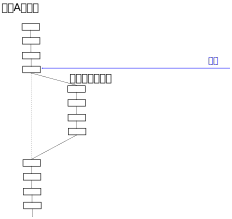
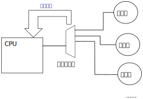
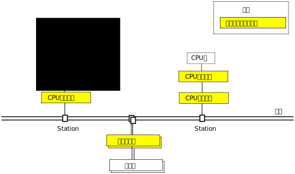
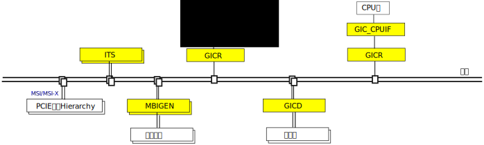

.. Copyright by Kenneth Lee. 2020. All Right Reserved.

中断
====

介绍
----

中断是一种重要的异步通讯机制。我们从没有中断的系统的通讯方式来理解中断在计算机
系统中的作用：

总线把计算机中的CPU和设备连接在一起，对于总线，CPU和设备其实没有什么区别，所以
，我们也可以把CPU看做是一种设备。总线上的每个设备是独立的实体，它们如果要配合完
成同一个工作，就需要把工作分成多个任务，分别分配给不同的设备执行。

那么，如果设备B完成了一个任务要告知A，这应该怎么办呢？一般有两种方法：

1. A通过总线定期去询问B的状态

2. B完成后，主动发一个消息给A

行为2，就叫中断。因为A当时肯定正在处理其他任务，要让A停下来做另一个工作，这明显
就是一种“中断”。

中断行为需要CPU或者设备的程序语义配合，这个技术我们在计算子系统一章中深入介绍。
我们这里首先讨论中断的收集和路由方法。

信号中断和电平中断
------------------

传统的中断大多数通过一根信号线来实现的，类似下面这样：

CPU内部电路监控中断线的信号，如果发现中断来了，就切换CPU的执行状态，跳转到中断
上去执行，这就是中断的基本方法了。一样的策略同样用在设备上，只是软件都在CPU上运
行，语言的主语都是CPU，所以通常设备的中断不叫中断，而叫比如Doorbell这样的名字。

CPU可以用多种方法来监控中断的发生，比如：

* 中断线在高电平
* 中断线在低电平
* 中断线从高电平变成高电平
* 中断线从低电平变成高电平

前面两种监控方法就叫电平中断，它一旦发生，如果CPU不控制中断源改变电平，中断就会
一直发生。后面两种叫边缘触发中断，它每发生一次，CPU就发生一次中断，事后CPU也不
用控制中断源停止。

CPU可以屏蔽一个中断，这是一个CPU内部的设置，当CPU屏蔽一个中断的时候，即使中断线
上出现了中断信号，CPU也不会转到中断向量中执行。

如果CPU不屏蔽一个中断，当这个中断上报的时候，CPU会保存当前的PC，然后把它修改为
设定好的中断入口地址，开始从中断向量执行，中断向量执行结束，再恢复原来的PC指针
（称为中断地址），继续执行原来的程序。这个恢复原来PC指针的操作，称为中断返回，
简称iret。

        | PC
        | Program Counter，当前指令地址的指针。
        | 冯诺依曼计算机通过PC控制CPU的执行过程。

对很多CPU来说（比如ARMv8的兼容CPU），所谓中断向量，只是一个软件的概念，CPU自己
只关心这个触发过程，跳转到中断向量后，软件完全可以不返回到原来的位置，按自己的
逻辑继续执行下去，永远不iret。

所以，理论上，中断并没有结束这个概念。如果中断源给CPU报了一个电平中断，CPU进入
中断向量中执行，CPU什么时候再把CPU切换到中断向量的入口上，完全看CPU的检测机制是
怎么设计的。一些简单的CPU会在iret的时候重新检测中断线。

中断控制器
----------

当系统中有很多的中断源，CPU就需要很多的中断线。但CPU很难为每个设备拉中断线。像
在ARMv8兼容的处理器上，就只定义了IRQ和FIQ两个中断线，这根本就杯水车薪。

所以，很自然地，CPU会把这些中断的收集功能独立出来，变成这样：

正如我们一直说的一样，在系统中增加代理，就会对语义空间制造无穷的变数。对CPU来说
，原来中断线的概念很明确，但现在中断线可以表示中断控制器对CPU的输入，也可以表示
中断源对中断控制器的输入。

所以，当我们说屏蔽一个中断的时候，既可以针对CPU的输入来说，也可以针对中断控制器
来说，还可以针对中断源来说。一些遗留代码和文档资料中并不区分它们的区别，所以很
多新入行的开发者会觉得无所适从。

这时，如果我们要细化概念，就要分清“屏蔽”的宾语。如果屏蔽的对象是CPU的中断输入，
那么所有的中断都无法通过这根中断线报到CPU里。如果屏蔽的对象是中断控制器的输入，
那么控制的是中断控制器不上报中断，但它仍有可能缓存这个中断。如果屏蔽的对象是中
断源本身，那么中断根本不会上报。

一旦引入了缓冲这个概念，又会引入中断响应的问题了。只有一根中断线报到CPU的时候，
CPU收到一个中断是一个中断，后面的中断就不要了。而中断控制器有缓存就不同了，中断
控制器可能收集了多个中断，要一个个上报给CPU，那什么时候可以报下一个呢？这要CPU
主动通知。这种通知通常称为EoI，End of Interrupt。

EoI和iret是两个概念，但从软件的语义上，它们似乎都表示中断结束。所以像Linux这样
的操作系统中，会有一个Bottom Half的概念，它表示EoI之后，iret之前的中断处理过程
。

全局中断控制器
--------------

前面我们只讨论了一个CPU的场景，如果有很多CPU和很多中断源（通常是设备，但显然CPU
也可以作为其他CPU的中断源的），这个关系就变得很复杂了。在ARM GIC的兼容架构中。
这种多CPU的构架，称为全局中断控制器，GIC。它的原理可以示意如下：

        | GIC
        | Global Interrupt Controller
        | ARM针对CPU和中断控制器有相对独立的标准，
        | 其中GIC标准定义中断控制器的标准。

        注：这是一个原理示意图，不表示任何实际的产品和标准定义，
        比如，GIC只定义了一个GICD，并没有多个实例。

中断分发器，GICD，在中断源一侧收集中断，收集完了转化为总线消息发给对应的路由器
，GICR。GICR根据路由要求转发给不同的节点，报给CPU接口，CPUIF，CPUIF根据CPU最后
的中断线的要求，在CPU内部产生中断。

如果CPU之间要互相发中断，就直接发给自己的GICR。由GICR转到其他CPU的路由器上就可
以了。

消息中断
--------

电平和边缘触发中断对总线并不友好，特别是对于PCIe这种跨域多个网桥的外部总线。所
以作为一种自然的想法，人们直接设计了基于总线语义的中断报告方法。PCI的MSI和PCIe
的MSI-X就是典型的消息中断。它把设备的中断请求转化为对某个物理地址的访问操作，对
某个特定的物理地址写入中断号等信息，就可以把中断报告出来了。这种完全基于总线消
息的中断报告形态，就叫消息中断。

早期GIC标准定义GICD的时候，对消息中断的支持考虑不多，后期要增强的时候也不适合修
改GICD的定义了。所以从GICv3开始，GIC标准就引入了ITS来解决消息中断的问题。

        | ITS
        | Interrrupt Translation Service
        | ITS是GIC中基于消息收集中断请求的部件，相比GICD，
        | 它具有更高的收集和部署灵活性，更大的指令空间，
        | 更强的配置能力。

ITS可以直接支持MSI/MSI-X，我们可以从鲲鹏920对GICv3的实现理解它的原理：

和GICD不同，ITS直接作为一个通讯节点挂在总线上，MSI/MSI-X中断可以直接写到它的中
断物理地址上，就可以直接产生中断了。

从泰山920服务器运行Linux 5.0一个启动记录中我们可以看到泰山920的ITS分布实例： ::

        [    0.000000] SRAT: PXM 0 -> ITS 0 -> Node 0
        [    0.000000] SRAT: PXM 2 -> ITS 1 -> Node 2
        [    0.000000] ITS [mem 0x202100000-0x20211ffff]
        [    0.000000] ITS@0x0000000202100000: Using ITS number 0
        [    0.000000] ITS@0x0000000202100000: allocated 65536 Devices @3f7e400000 (flat, esz 8, psz 16K, shr 1)
        [    0.000000] ITS@0x0000000202100000: allocated 65536 Virtual CPUs @3f7e500000 (flat, esz 16, psz 4K, shr 1)
        [    0.000000] ITS@0x0000000202100000: allocated 256 Interrupt Collections @3f7e387000 (flat, esz 16, psz 4K, shr 1)
        [    0.000000] ITS [mem 0x200202100000-0x20020211ffff]
        [    0.000000] ITS@0x0000200202100000: Using ITS number 1
        [    0.000000] ITS@0x0000200202100000: allocated 65536 Devices @3f7e480000 (flat, esz 8, psz 16K, shr 1)
        [    0.000000] ITS@0x0000200202100000: allocated 65536 Virtual CPUs @3f7e600000 (flat, esz 16, psz 4K, shr 1)
        [    0.000000] ITS@0x0000200202100000: allocated 256 Interrupt Collections @3f7e388000 (flat, esz 16, psz 4K, shr 1)

这个硬件包含两个Socket，每个Socket中包含一个ITS。所以这里包含两个独立的ITS。理
论上我们应该把本Socket的设备绑定到本Socket的ITS上，但由于都是总线关联，实际上软
件可以根据需要进行想要的任何绑定。

为了把片内部分设备简单的电平或者边缘触发中断转化为这种消息，鲲鹏920中设计了一些
中断收集器，称为MBIGEN, Message-Based Interrupt Gernerator。它可以把收集的线路
中断转化为ITS认可的消息。在实际设计中，基于GIC标准的要求，部分中断MBIGEN其实是
报到GICD的，但这不改变这个技术的原理。

实际上，MBIGEN还可以看做是一种简化布线的方法，GICD无论和设备的连接，还是和
GICR的连接，都是线连接，这个对布线带来很大的压力，用MBIGEN就没有这个问题了。

下面是泰山920服务器中运行Linux Kernel 5.0时MBIGEN相关启动记录（启动了debug级别
的打印）： ::

        [    8.892866] bus: 'platform': add driver Hisilicon MBIGEN-V2
        [    8.892957] bus: 'platform': driver_probe_device: matched device HISI0152:00 with driver Hisilicon MBIGEN-V2
        [    8.892959] bus: 'platform': really_probe: probing driver Hisilicon MBIGEN-V2 with device HISI0152:00
        [    8.892982] irq: Added domain \_SB_.MB30
        [    8.892992] ITS: alloc 8192:32
        [    8.892995] ITT 32 entries, 5 bits
        [    8.892996] driver: 'Hisilicon MBIGEN-V2': driver_bound: bound to device 'HISI0152:00'
        [    8.893003] bus: 'platform': really_probe: bound device HISI0152:00 to driver Hisilicon MBIGEN-V2
        [    8.893006] bus: 'platform': driver_probe_device: matched device HISI0152:01 with driver Hisilicon MBIGEN-V2
        [    8.893008] bus: 'platform': really_probe: probing driver Hisilicon MBIGEN-V2 with device HISI0152:01
        [    8.893018] irq: Added domain \_SB_.MB31
        [    8.893021] ITS: alloc 8224:32
        [    8.893024] ITT 32 entries, 5 bits
        ...
        [    8.894746] bus: 'platform': driver_probe_device: matched device HISI0152:38 with driver Hisilicon MBIGEN-V2
        [    8.894748] bus: 'platform': really_probe: probing driver Hisilicon MBIGEN-V2 with device HISI0152:38
        [    8.894759] irq: Added domain \_SB_.MB5E
        [    8.894776] ITS: alloc 9984:32
        [    8.894779] ITT 32 entries, 5 bits
        [    8.894780] driver: 'Hisilicon MBIGEN-V2': driver_bound: bound to device 'HISI0152:38'

可以看到，这台泰山920上从MB30到MB5E，一共用了47个MBIGEN。它们大部分是

这个过程遵循Linux标准的driver-bus-device逻辑：mbigen driver（在
drivers/irqchip/irq-mbigen.c中实现）先绑定platform总线，然后ACPI初始化程序发现
设备的定义：HISI0152:xx，注册到总线中，匹配到驱动，驱动的probe程序初始化设备，
然后增加一个\_SB_.MBxx的irq domain，对中断进行管理。

软件实现
--------

我们仍用Linux Kernel作为我们的软件实现研究对象。中断处理的过程我们留到计算子系
统来讨论。这里我们主要讨论GIC的驱动本身如何工作的。

对软件来说，中断控制器上报一个中断，对应的驱动处理这个中断，同时响应相应的中断
控制器完成中断过程，这个逻辑是比较简单直接的。但真正麻烦的事情是怎么把设备，中
断号，中断控制器对应起来。一个设备报告一个中断，可以告诉它是MBIGEN的第10号引脚
，但全局来说，它怎么知道这个第10号引脚对应全局的几号中断？

Linux把这个关系封装为两个关键数据结构：irq_chip和irq_domain。前者代表一个中断控
制单元，比如前面提到的GICD，ITS和MBIGEN等对象，而后者代表一段中断号的空间。要解
决前面的问题，关键就是给每个irq_chip分配一个irq_domain，只要保证irq_domain之间
的irq号没有冲突，全局所有irq上报的内容就是没有冲突的。

irq_domain的中断号分配必须有一个全局的分配算法，irq_domain只是一个数据库，用于
按这个既定的管理策略配合代码进行分配。这个管理的核心是中断处理程序怎么获得hwirq，
然后按什么策略进行irq_domain的查表。这个每个平台都不同。

GIC兼容的系统在Linux中用gic_handle_irq进行中断处理，这里的算法逻辑是首先GIC定义
了一个hwirq的分配规则，GIC的中断是唯一的。对于多个中断控制器，每个加入系统的时
候GIC的算法负责告知它hwirq是什么。这个GIC中断唯一的规矩仍成立。这样，
gic_handle_irq()处理中断的时候首先从CPUIF获得的中断ID（SYS_ICC_IAR1_EL1）就是全
局唯一的，通过这个ID作为hwirq翻查irq_domain数据库，就可以定位到对应的中断控制器
。这样关联就建立起来了。

每个具体的中断，当设备从总线设备配置空间，或者从配置文件中获得中断号的时候，通过
配置空间或者配置文件可以获知对应的中断控制器是什么，调用中断控制器的map函数，
就可以具体建立hwirq和virq的映射了。

看两个具体的例子，作为平台设备，SMMU的驱动就是这样获得中断号的：

.. code-block:: c

        //drivers/iommu/arm-smmu-v3.c
	irq = platform_get_irq_byname_optional(pdev, "combined");
	if (irq > 0)
		smmu->combined_irq = irq;
	else {
		irq = platform_get_irq_byname_optional(pdev, "eventq");
		if (irq > 0)
			smmu->evtq.q.irq = irq;

		irq = platform_get_irq_byname_optional(pdev, "priq");
		if (irq > 0)
			smmu->priq.q.irq = irq;

		irq = platform_get_irq_byname_optional(pdev, "gerror");
		if (irq > 0)
			smmu->gerr_irq = irq;
	}

这里的platform_get_irq_byname_optional()通过配置文件获得中断控制器，然后调用对应
的map文件完成映射。

对于PCIE设备，鲲鹏920网卡是这样的：

.. code-block:: c

        //drivers/net/ethernet/hisilicon/hns3/hns3vf/hclgevf_main.c
        static void hclgevf_get_misc_vector(struct hclgevf_dev *hdev)
        {
                struct hclgevf_misc_vector *vector = &hdev->misc_vector;

                vector->vector_irq = pci_irq_vector(hdev->pdev,
                                                    HCLGEVF_MISC_VECTOR_NUM);
                vector->addr = hdev->hw.io_base + HCLGEVF_MISC_VECTOR_REG_BASE;
                /* vector status always valid for Vector 0 */
                hdev->vector_status[HCLGEVF_MISC_VECTOR_NUM] = 0;
                hdev->vector_irq[HCLGEVF_MISC_VECTOR_NUM] = vector->vector_irq;

                hdev->num_msi_left -= 1;
                hdev->num_msi_used += 1;
        }

这里通过pci_irq_vector()来实现映射，说到底是调用PCIe驱动的msi驱动的irq_domain来
实现映射。总的来说，是把irq号的获取封装在设备配置之内，让一般的驱动感受不到这个
映射的过程。

下面是一台实际的泰山920服务器的中断分布情况：

（下面表格是泰山服务器运行Linux 5.0内核，/proc/interrupts文件现实的内容，删除
了每个CPU上发生对应中断的统计。表格中的第一项是virq，第二项是irqchip的名字，
第三项是hwirq的值，第四项是中断类型（边缘触发还是电平触发），最后一项是中断的描
述。表中最后几项是核间消息IPI，不使用设备中断的格式）

::

        1:          GICv3     25 Level     vgic
        3:          GICv3     27 Level     kvm guest timer
        4:          GICv3     26 Level     arch_timer
        9:          GICv3    484 Level     ipmi_si, ttyS0
        10:          GICv3    121 Edge      ACPI:Ged
        11:          GICv3    122 Edge      ACPI:Ged
        14:          GICv3    491 Level     HISI0173:00
        15:          GICv3     23 Level     arm-pmu
        17:       ITS-pMSI 116736 Edge      arm-smmu-v3-evtq
        18:       ITS-pMSI 116737 Edge      arm-smmu-v3-gerror
        19:       ITS-pMSI 116738 Edge      arm-smmu-v3-priq
        20:       ITS-pMSI 118784 Edge      arm-smmu-v3-evtq
        21:       ITS-pMSI 118785 Edge      arm-smmu-v3-gerror
        22:       ITS-pMSI 118786 Edge      arm-smmu-v3-priq
        23:       ITS-pMSI 120832 Edge      arm-smmu-v3-evtq
        24:       ITS-pMSI 120833 Edge      arm-smmu-v3-gerror
        25:       ITS-pMSI 120834 Edge      arm-smmu-v3-priq
        26:       ITS-pMSI 122880 Edge      arm-smmu-v3-evtq
        27:       ITS-pMSI 122881 Edge      arm-smmu-v3-gerror
        28:       ITS-pMSI 122882 Edge      arm-smmu-v3-priq
        29:       ITS-pMSI 124928 Edge      arm-smmu-v3-evtq
        30:       ITS-pMSI 124929 Edge      arm-smmu-v3-gerror
        31:       ITS-pMSI 124930 Edge      arm-smmu-v3-priq
        32:       ITS-pMSI 126976 Edge      arm-smmu-v3-evtq
        33:       ITS-pMSI 126977 Edge      arm-smmu-v3-gerror
        34:       ITS-pMSI 126978 Edge      arm-smmu-v3-priq
        35:       ITS-pMSI 129024 Edge      arm-smmu-v3-evtq
        36:       ITS-pMSI 129025 Edge      arm-smmu-v3-gerror
        37:       ITS-pMSI 129026 Edge      arm-smmu-v3-priq
        38:       ITS-pMSI 131072 Edge      arm-smmu-v3-evtq
        39:       ITS-pMSI 131073 Edge      arm-smmu-v3-gerror
        40:       ITS-pMSI 131074 Edge      arm-smmu-v3-priq
        41:          GICv3    640 Level     ehci_hcd:usb1, ohci_hcd:usb2
        42:       ITS-MSI 63995904 Edge      xhci_hcd
        43:       mbigen-v2  832 Edge      HISI0213:00
        44:       mbigen-v2  833 Edge      HISI0213:01
        45:       mbigen-v2  834 Edge      HISI0213:02
        46:       mbigen-v2  835 Edge      HISI0213:03
        47:       mbigen-v2  836 Edge      HISI0213:04
        48:       mbigen-v2  837 Edge      HISI0213:05
        49:       mbigen-v2  838 Edge      HISI0213:06
        50:       mbigen-v2  839 Edge      HISI0213:07
        51:       mbigen-v2  832 Edge      HISI0213:08
        52:       mbigen-v2  833 Edge      HISI0213:09
        53:       mbigen-v2  834 Edge      HISI0213:0a
        54:       mbigen-v2  835 Edge      HISI0213:0b
        55:       mbigen-v2  836 Edge      HISI0213:0c
        56:       mbigen-v2  837 Edge      HISI0213:0d
        57:       mbigen-v2  838 Edge      HISI0213:0e
        58:       mbigen-v2  839 Edge      HISI0213:0f
        59:       mbigen-v2  832 Edge      HISI0213:10
        60:       mbigen-v2  833 Edge      HISI0213:11
        61:       mbigen-v2  834 Edge      HISI0213:12
        62:       mbigen-v2  835 Edge      HISI0213:13
        63:       mbigen-v2  836 Edge      HISI0213:14
        64:       mbigen-v2  837 Edge      HISI0213:15
        65:       mbigen-v2  838 Edge      HISI0213:16
        66:       mbigen-v2  839 Edge      HISI0213:17
        67:       mbigen-v2  832 Edge      HISI0213:18
        68:       mbigen-v2  833 Edge      HISI0213:19
        69:       mbigen-v2  834 Edge      HISI0213:1a
        70:       mbigen-v2  835 Edge      HISI0213:1b
        71:       mbigen-v2  836 Edge      HISI0213:1c
        72:       mbigen-v2  837 Edge      HISI0213:1d
        73:       mbigen-v2  838 Edge      HISI0213:1e
        74:       mbigen-v2  839 Edge      HISI0213:1f
        75:       mbigen-v2  848 Edge      HISI0243:00
        76:       mbigen-v2  849 Edge      HISI0243:01
        77:       mbigen-v2  848 Edge      HISI0243:02
        78:       mbigen-v2  849 Edge      HISI0243:03
        79:       mbigen-v2  848 Edge      HISI0243:04
        80:       mbigen-v2  849 Edge      HISI0243:05
        81:       mbigen-v2  848 Edge      HISI0243:06
        82:       mbigen-v2  849 Edge      HISI0243:07
        83:       mbigen-v2  844 Edge      HISI0233:00
        84:       mbigen-v2  845 Edge      HISI0233:01
        85:       mbigen-v2  846 Edge      HISI0233:02
        86:       mbigen-v2  847 Edge      HISI0233:03
        87:       mbigen-v2  844 Edge      HISI0233:04
        88:       mbigen-v2  845 Edge      HISI0233:05
        89:       mbigen-v2  846 Edge      HISI0233:06
        90:       mbigen-v2  847 Edge      HISI0233:07
        91:       mbigen-v2  844 Edge      HISI0233:08
        92:       mbigen-v2  845 Edge      HISI0233:09
        93:       mbigen-v2  846 Edge      HISI0233:0a
        94:       mbigen-v2  847 Edge      HISI0233:0b
        95:       mbigen-v2  844 Edge      HISI0233:0c
        96:       mbigen-v2  845 Edge      HISI0233:0d
        97:       mbigen-v2  846 Edge      HISI0233:0e
        98:       mbigen-v2  847 Edge      HISI0233:0f
        99:        ITS-MSI    0 Edge      PCIe PME
        100:        ITS-MSI    1 Edge      aerdrv
        101:        ITS-MSI 131072 Edge      PCIe PME
        102:        ITS-MSI 131073 Edge      aerdrv
        103:        ITS-MSI 196608 Edge      PCIe PME
        104:        ITS-MSI 196609 Edge      aerdrv
        105:        ITS-MSI 262144 Edge      PCIe PME
        106:        ITS-MSI 262145 Edge      aerdrv
        107:        ITS-MSI 278528 Edge      PCIe PME
        108:        ITS-MSI 278529 Edge      aerdrv
        109:        ITS-MSI 294912 Edge      PCIe PME
        110:        ITS-MSI 294913 Edge      aerdrv
        111:        ITS-MSI 67108864 Edge      PCIe PME
        112:        ITS-MSI 67108865 Edge      aerdrv
        113:        ITS-MSI 67174400 Edge      PCIe PME
        114:        ITS-MSI 67174401 Edge      aerdrv
        115:        ITS-MSI 67239936 Edge      PCIe PME
        116:        ITS-MSI 67239937 Edge      aerdrv
        117:        ITS-MSI 67305472 Edge      PCIe PME
        118:        ITS-MSI 67305473 Edge      aerdrv
        119:        ITS-MSI 67371008 Edge      PCIe PME
        120:        ITS-MSI 67371009 Edge      aerdrv
        153:        ITS-MSI 60866560 Edge      ahci0
        154:        ITS-MSI 60866561 Edge      ahci1
        155:        ITS-MSI 70778880 Edge      hinic_aeq
        156:        ITS-MSI 70778881 Edge      hinic_aeq
        157:        ITS-MSI 70778882 Edge      hinic_aeq
        158:        ITS-MSI 70778883 Edge      hinic_aeq
        187:        ITS-MSI 71303168 Edge      hinic_aeq
        188:        ITS-MSI 71303169 Edge      hinic_aeq
        189:        ITS-MSI 71303170 Edge      hinic_aeq
        190:        ITS-MSI 71303171 Edge      hinic_aeq
        219:        ITS-MSI 71827456 Edge      hinic_aeq
        220:        ITS-MSI 71827457 Edge      hinic_aeq
        221:        ITS-MSI 71827458 Edge      hinic_aeq
        222:        ITS-MSI 71827459 Edge      hinic_aeq
        251:        ITS-MSI 1048576 Edge      megasas
        252:        ITS-MSI 1048577 Edge      megasas
        253:        ITS-MSI 1048578 Edge      megasas
        254:        ITS-MSI 1048579 Edge      megasas
        255:        ITS-MSI 1048580 Edge      megasas
        256:        ITS-MSI 1048581 Edge      megasas
        257:        ITS-MSI 1048582 Edge      megasas
        258:        ITS-MSI 1048583 Edge      megasas
        259:        ITS-MSI 1048584 Edge      megasas
        260:        ITS-MSI 1048585 Edge      megasas
        261:        ITS-MSI 1048586 Edge      megasas
        262:        ITS-MSI 1048587 Edge      megasas
        263:        ITS-MSI 1048588 Edge      megasas
        264:        ITS-MSI 1048589 Edge      megasas
        265:        ITS-MSI 1048590 Edge      megasas
        266:        ITS-MSI 1048591 Edge      megasas
        267:        ITS-MSI 1048592 Edge      megasas
        268:        ITS-MSI 1048593 Edge      megasas
        269:        ITS-MSI 1048594 Edge      megasas
        270:        ITS-MSI 1048595 Edge      megasas
        271:        ITS-MSI 1048596 Edge      megasas
        272:        ITS-MSI 1048597 Edge      megasas
        273:        ITS-MSI 1048598 Edge      megasas
        274:        ITS-MSI 1048599 Edge      megasas
        275:        ITS-MSI 1048600 Edge      megasas
        276:        ITS-MSI 1048601 Edge      megasas
        277:        ITS-MSI 1048602 Edge      megasas
        278:        ITS-MSI 1048603 Edge      megasas
        279:        ITS-MSI 1048604 Edge      megasas
        280:        ITS-MSI 1048605 Edge      megasas
        281:        ITS-MSI 1048606 Edge      megasas
        282:        ITS-MSI 1048607 Edge      megasas
        283:        ITS-MSI 1048608 Edge      megasas
        284:        ITS-MSI 1048609 Edge      megasas
        285:        ITS-MSI 1048610 Edge      megasas
        286:        ITS-MSI 1048611 Edge      megasas
        287:        ITS-MSI 1048612 Edge      megasas
        288:        ITS-MSI 1048613 Edge      megasas
        289:        ITS-MSI 1048614 Edge      megasas
        290:        ITS-MSI 1048615 Edge      megasas
        291:        ITS-MSI 1048616 Edge      megasas
        292:        ITS-MSI 1048617 Edge      megasas
        293:        ITS-MSI 1048618 Edge      megasas
        294:        ITS-MSI 1048619 Edge      megasas
        295:        ITS-MSI 1048620 Edge      megasas
        296:        ITS-MSI 1048621 Edge      megasas
        297:        ITS-MSI 1048622 Edge      megasas
        298:        ITS-MSI 1048623 Edge      megasas
        299:        ITS-MSI 1048624 Edge      megasas
        300:        ITS-MSI 1048625 Edge      megasas
        301:        ITS-MSI 1048626 Edge      megasas
        302:        ITS-MSI 1048627 Edge      megasas
        303:        ITS-MSI 1048628 Edge      megasas
        304:        ITS-MSI 1048629 Edge      megasas
        305:        ITS-MSI 1048630 Edge      megasas
        306:        ITS-MSI 1048631 Edge      megasas
        307:        ITS-MSI 1048632 Edge      megasas
        308:        ITS-MSI 1048633 Edge      megasas
        309:        ITS-MSI 1048634 Edge      megasas
        310:        ITS-MSI 1048635 Edge      megasas
        311:        ITS-MSI 1048636 Edge      megasas
        312:        ITS-MSI 1048637 Edge      megasas
        313:        ITS-MSI 1048638 Edge      megasas
        314:        ITS-MSI 1048639 Edge      megasas
        315:        ITS-MSI 1048640 Edge      megasas
        316:        ITS-MSI 1048641 Edge      megasas
        317:        ITS-MSI 1048642 Edge      megasas
        318:        ITS-MSI 1048643 Edge      megasas
        319:        ITS-MSI 1048644 Edge      megasas
        320:        ITS-MSI 1048645 Edge      megasas
        321:        ITS-MSI 1048646 Edge      megasas
        322:        ITS-MSI 1048647 Edge      megasas
        323:        ITS-MSI 1048648 Edge      megasas
        324:        ITS-MSI 1048649 Edge      megasas
        325:        ITS-MSI 1048650 Edge      megasas
        326:        ITS-MSI 1048651 Edge      megasas
        327:        ITS-MSI 1048652 Edge      megasas
        328:        ITS-MSI 1048653 Edge      megasas
        329:        ITS-MSI 1048654 Edge      megasas
        330:        ITS-MSI 1048655 Edge      megasas
        331:        ITS-MSI 1048656 Edge      megasas
        332:        ITS-MSI 1048657 Edge      megasas
        333:        ITS-MSI 1048658 Edge      megasas
        334:        ITS-MSI 1048659 Edge      megasas
        335:        ITS-MSI 1048660 Edge      megasas
        336:        ITS-MSI 1048661 Edge      megasas
        337:        ITS-MSI 1048662 Edge      megasas
        338:        ITS-MSI 1048663 Edge      megasas
        339:        ITS-MSI 1048664 Edge      megasas
        340:        ITS-MSI 1048665 Edge      megasas
        341:        ITS-MSI 1048666 Edge      megasas
        342:        ITS-MSI 1048667 Edge      megasas
        343:        ITS-MSI 1048668 Edge      megasas
        344:        ITS-MSI 1048669 Edge      megasas
        345:        ITS-MSI 1048670 Edge      megasas
        346:        ITS-MSI 1048671 Edge      megasas
        347:        ITS-MSI 1048672 Edge      megasas
        348:        ITS-MSI 1048673 Edge      megasas
        349:        ITS-MSI 1048674 Edge      megasas
        350:        ITS-MSI 1048675 Edge      megasas
        351:        ITS-MSI 1048676 Edge      megasas
        352:        ITS-MSI 1048677 Edge      megasas
        353:        ITS-MSI 1048678 Edge      megasas
        354:        ITS-MSI 1048679 Edge      megasas
        355:        ITS-MSI 1048680 Edge      megasas
        356:        ITS-MSI 1048681 Edge      megasas
        357:        ITS-MSI 1048682 Edge      megasas
        358:        ITS-MSI 1048683 Edge      megasas
        359:        ITS-MSI 1048684 Edge      megasas
        360:        ITS-MSI 1048685 Edge      megasas
        361:        ITS-MSI 1048686 Edge      megasas
        362:        ITS-MSI 1048687 Edge      megasas
        363:        ITS-MSI 1048688 Edge      megasas
        364:        ITS-MSI 1048689 Edge      megasas
        365:        ITS-MSI 1048690 Edge      megasas
        366:        ITS-MSI 1048691 Edge      megasas
        367:        ITS-MSI 1048692 Edge      megasas
        368:        ITS-MSI 1048693 Edge      megasas
        369:        ITS-MSI 1048694 Edge      megasas
        370:        ITS-MSI 1048695 Edge      megasas
        371:        ITS-MSI 1048696 Edge      megasas
        372:        ITS-MSI 1048697 Edge      megasas
        373:        ITS-MSI 1048698 Edge      megasas
        374:        ITS-MSI 1048699 Edge      megasas
        375:        ITS-MSI 1048700 Edge      megasas
        376:        ITS-MSI 1048701 Edge      megasas
        377:        ITS-MSI 1048702 Edge      megasas
        378:        ITS-MSI 1048703 Edge      megasas
        379:        ITS-MSI 94420992 Edge      ahci0
        380:        ITS-MSI 94420993 Edge      ahci1
        390:        ITS-MSI 65536000 Edge      hclge_misc
        391:        ITS-MSI 65536001 Edge      eno1-TxRx-0
        392:        ITS-MSI 65536002 Edge      eno1-TxRx-2
        393:        ITS-MSI 65536003 Edge      eno1-TxRx-4
        394:        ITS-MSI 65536004 Edge      eno1-TxRx-6
        395:        ITS-MSI 65536005 Edge      eno1-TxRx-8
        396:        ITS-MSI 65536006 Edge      eno1-TxRx-10
        397:        ITS-MSI 65536007 Edge      eno1-TxRx-12
        398:        ITS-MSI 65536008 Edge      eno1-TxRx-14
        399:        ITS-MSI 65536009 Edge      eno1-TxRx-16
        400:        ITS-MSI 65536010 Edge      eno1-TxRx-18
        401:        ITS-MSI 65536011 Edge      eno1-TxRx-20
        402:        ITS-MSI 65536012 Edge      eno1-TxRx-22
        403:        ITS-MSI 65536013 Edge      eno1-TxRx-24
        404:        ITS-MSI 65536014 Edge      eno1-TxRx-26
        405:        ITS-MSI 65536015 Edge      eno1-TxRx-28
        406:        ITS-MSI 65536016 Edge      eno1-TxRx-30
        407:        ITS-MSI 65536017 Edge      eno1-TxRx-32
        408:        ITS-MSI 65536018 Edge      eno1-TxRx-34
        409:        ITS-MSI 65536019 Edge      eno1-TxRx-36
        410:        ITS-MSI 65536020 Edge      eno1-TxRx-38
        411:        ITS-MSI 65536021 Edge      eno1-TxRx-40
        412:        ITS-MSI 65536022 Edge      eno1-TxRx-42
        413:        ITS-MSI 65536023 Edge      eno1-TxRx-44
        414:        ITS-MSI 65536024 Edge      eno1-TxRx-46
        415:        ITS-MSI 65536025 Edge      eno1-TxRx-48
        416:        ITS-MSI 65536026 Edge      eno1-TxRx-50
        417:        ITS-MSI 65536027 Edge      eno1-TxRx-52
        418:        ITS-MSI 65536028 Edge      eno1-TxRx-54
        419:        ITS-MSI 65536029 Edge      eno1-TxRx-56
        420:        ITS-MSI 65536030 Edge      eno1-TxRx-58
        421:        ITS-MSI 65536031 Edge      eno1-TxRx-60
        422:        ITS-MSI 65536032 Edge      eno1-TxRx-62
        455:        ITS-MSI 65536065 Edge      hns-abn-0
        456:        ITS-MSI 65536066 Edge      hns-aeq-0
        457:        ITS-MSI 65536067 Edge      hns-ceq-0
        458:        ITS-MSI 65536068 Edge      hns-ceq-1
        459:        ITS-MSI 65536069 Edge      hns-ceq-2
        460:        ITS-MSI 65536070 Edge      hns-ceq-3
        461:        ITS-MSI 65536071 Edge      hns-ceq-4
        462:        ITS-MSI 65536072 Edge      hns-ceq-5
        463:        ITS-MSI 65536073 Edge      hns-ceq-6
        464:        ITS-MSI 65536074 Edge      hns-ceq-7
        465:        ITS-MSI 65536075 Edge      hns-ceq-8
        466:        ITS-MSI 65536076 Edge      hns-ceq-9
        467:        ITS-MSI 65536077 Edge      hns-ceq-10
        468:        ITS-MSI 65536078 Edge      hns-ceq-11
        469:        ITS-MSI 65536079 Edge      hns-ceq-12
        470:        ITS-MSI 65536080 Edge      hns-ceq-13
        471:        ITS-MSI 65536081 Edge      hns-ceq-14
        472:        ITS-MSI 65536082 Edge      hns-ceq-15
        473:        ITS-MSI 65536083 Edge      hns-ceq-16
        474:        ITS-MSI 65536084 Edge      hns-ceq-17
        475:        ITS-MSI 65536085 Edge      hns-ceq-18
        476:        ITS-MSI 65536086 Edge      hns-ceq-19
        477:        ITS-MSI 65536087 Edge      hns-ceq-20
        478:        ITS-MSI 65536088 Edge      hns-ceq-21
        479:        ITS-MSI 65536089 Edge      hns-ceq-22
        480:        ITS-MSI 65536090 Edge      hns-ceq-23
        481:        ITS-MSI 65536091 Edge      hns-ceq-24
        482:        ITS-MSI 65536092 Edge      hns-ceq-25
        483:        ITS-MSI 65536093 Edge      hns-ceq-26
        484:        ITS-MSI 65536094 Edge      hns-ceq-27
        485:        ITS-MSI 65536095 Edge      hns-ceq-28
        486:        ITS-MSI 65536096 Edge      hns-ceq-29
        487:        ITS-MSI 65536097 Edge      hns-ceq-30
        488:        ITS-MSI 65536098 Edge      hns-ceq-31
        489:        ITS-MSI 65536099 Edge      hns-ceq-32
        490:        ITS-MSI 65536100 Edge      hns-ceq-33
        491:        ITS-MSI 65536101 Edge      hns-ceq-34
        492:        ITS-MSI 65536102 Edge      hns-ceq-35
        493:        ITS-MSI 65536103 Edge      hns-ceq-36
        494:        ITS-MSI 65536104 Edge      hns-ceq-37
        495:        ITS-MSI 65536105 Edge      hns-ceq-38
        496:        ITS-MSI 65536106 Edge      hns-ceq-39
        497:        ITS-MSI 65536107 Edge      hns-ceq-40
        498:        ITS-MSI 65536108 Edge      hns-ceq-41
        499:        ITS-MSI 65536109 Edge      hns-ceq-42
        500:        ITS-MSI 65536110 Edge      hns-ceq-43
        501:        ITS-MSI 65536111 Edge      hns-ceq-44
        502:        ITS-MSI 65536112 Edge      hns-ceq-45
        503:        ITS-MSI 65536113 Edge      hns-ceq-46
        504:        ITS-MSI 65536114 Edge      hns-ceq-47
        505:        ITS-MSI 65536115 Edge      hns-ceq-48
        506:        ITS-MSI 65536116 Edge      hns-ceq-49
        507:        ITS-MSI 65536117 Edge      hns-ceq-50
        508:        ITS-MSI 65536118 Edge      hns-ceq-51
        509:        ITS-MSI 65536119 Edge      hns-ceq-52
        510:        ITS-MSI 65536120 Edge      hns-ceq-53
        511:        ITS-MSI 65536121 Edge      hns-ceq-54
        512:        ITS-MSI 65536122 Edge      hns-ceq-55
        513:        ITS-MSI 65536123 Edge      hns-ceq-56
        514:        ITS-MSI 65536124 Edge      hns-ceq-57
        515:        ITS-MSI 65536125 Edge      hns-ceq-58
        516:        ITS-MSI 65536126 Edge      hns-ceq-59
        517:        ITS-MSI 65536127 Edge      hns-ceq-60
        518:        ITS-MSI 65536128 Edge      hns-ceq-61
        519:        ITS-MSI 65536129 Edge      hns-ceq-62
        520:        ITS-MSI 72351744 Edge      hinic_aeq
        521:        ITS-MSI 72351745 Edge      hinic_aeq
        522:        ITS-MSI 72351746 Edge      hinic_aeq
        523:        ITS-MSI 72351747 Edge      hinic_aeq
        553:        ITS-MSI 65538048 Edge      hclge_misc
        554:        ITS-MSI 65538049 Edge      eno2-TxRx-0
        555:        ITS-MSI 65538050 Edge      eno2-TxRx-2
        556:        ITS-MSI 65538051 Edge      eno2-TxRx-4
        557:        ITS-MSI 65538052 Edge      eno2-TxRx-6
        558:        ITS-MSI 65538053 Edge      eno2-TxRx-8
        559:        ITS-MSI 65538054 Edge      eno2-TxRx-10
        560:        ITS-MSI 65538055 Edge      eno2-TxRx-12
        561:        ITS-MSI 65538056 Edge      eno2-TxRx-14
        562:        ITS-MSI 65538057 Edge      eno2-TxRx-16
        563:        ITS-MSI 65538058 Edge      eno2-TxRx-18
        564:        ITS-MSI 65538059 Edge      eno2-TxRx-20
        565:        ITS-MSI 65538060 Edge      eno2-TxRx-22
        566:        ITS-MSI 65538061 Edge      eno2-TxRx-24
        567:        ITS-MSI 65538062 Edge      eno2-TxRx-26
        568:        ITS-MSI 65538063 Edge      eno2-TxRx-28
        569:        ITS-MSI 65538064 Edge      eno2-TxRx-30
        570:        ITS-MSI 65538065 Edge      eno2-TxRx-32
        571:        ITS-MSI 65538066 Edge      eno2-TxRx-34
        572:        ITS-MSI 65538067 Edge      eno2-TxRx-36
        573:        ITS-MSI 65538068 Edge      eno2-TxRx-38
        574:        ITS-MSI 65538069 Edge      eno2-TxRx-40
        575:        ITS-MSI 65538070 Edge      eno2-TxRx-42
        576:        ITS-MSI 65538071 Edge      eno2-TxRx-44
        577:        ITS-MSI 65538072 Edge      eno2-TxRx-46
        578:        ITS-MSI 65538073 Edge      eno2-TxRx-48
        579:        ITS-MSI 65538074 Edge      eno2-TxRx-50
        580:        ITS-MSI 65538075 Edge      eno2-TxRx-52
        581:        ITS-MSI 65538076 Edge      eno2-TxRx-54
        582:        ITS-MSI 65538077 Edge      eno2-TxRx-56
        583:        ITS-MSI 65538078 Edge      eno2-TxRx-58
        584:        ITS-MSI 65538079 Edge      eno2-TxRx-60
        585:        ITS-MSI 65538080 Edge      eno2-TxRx-62
        627:        ITS-MSI 524288 Edge      enp1s0f0-TxRx-0
        628:        ITS-MSI 524289 Edge      enp1s0f0-TxRx-1
        629:        ITS-MSI 524290 Edge      enp1s0f0-TxRx-2
        630:        ITS-MSI 524291 Edge      enp1s0f0-TxRx-3
        631:        ITS-MSI 524292 Edge      enp1s0f0-TxRx-4
        632:        ITS-MSI 524293 Edge      enp1s0f0-TxRx-5
        633:        ITS-MSI 524294 Edge      enp1s0f0-TxRx-6
        634:        ITS-MSI 524295 Edge      enp1s0f0-TxRx-7
        635:        ITS-MSI 524296 Edge      enp1s0f0-TxRx-8
        636:        ITS-MSI 524297 Edge      enp1s0f0-TxRx-9
        637:        ITS-MSI 524298 Edge      enp1s0f0-TxRx-10
        638:        ITS-MSI 524299 Edge      enp1s0f0-TxRx-11
        639:        ITS-MSI 524300 Edge      enp1s0f0-TxRx-12
        640:        ITS-MSI 524301 Edge      enp1s0f0-TxRx-13
        641:        ITS-MSI 524302 Edge      enp1s0f0-TxRx-14
        642:        ITS-MSI 524303 Edge      enp1s0f0-TxRx-15
        643:        ITS-MSI 524304 Edge      enp1s0f0-TxRx-16
        644:        ITS-MSI 524305 Edge      enp1s0f0-TxRx-17
        645:        ITS-MSI 524306 Edge      enp1s0f0-TxRx-18
        646:        ITS-MSI 524307 Edge      enp1s0f0-TxRx-19
        647:        ITS-MSI 524308 Edge      enp1s0f0-TxRx-20
        648:        ITS-MSI 524309 Edge      enp1s0f0-TxRx-21
        649:        ITS-MSI 524310 Edge      enp1s0f0-TxRx-22
        650:        ITS-MSI 524311 Edge      enp1s0f0-TxRx-23
        651:        ITS-MSI 524312 Edge      enp1s0f0-TxRx-24
        652:        ITS-MSI 524313 Edge      enp1s0f0-TxRx-25
        653:        ITS-MSI 524314 Edge      enp1s0f0-TxRx-26
        654:        ITS-MSI 524315 Edge      enp1s0f0-TxRx-27
        655:        ITS-MSI 524316 Edge      enp1s0f0-TxRx-28
        656:        ITS-MSI 524317 Edge      enp1s0f0-TxRx-29
        657:        ITS-MSI 524318 Edge      enp1s0f0-TxRx-30
        658:        ITS-MSI 524319 Edge      enp1s0f0-TxRx-31
        659:        ITS-MSI 524320 Edge      enp1s0f0-TxRx-32
        660:        ITS-MSI 524321 Edge      enp1s0f0-TxRx-33
        661:        ITS-MSI 524322 Edge      enp1s0f0-TxRx-34
        662:        ITS-MSI 524323 Edge      enp1s0f0-TxRx-35
        663:        ITS-MSI 524324 Edge      enp1s0f0-TxRx-36
        664:        ITS-MSI 524325 Edge      enp1s0f0-TxRx-37
        665:        ITS-MSI 524326 Edge      enp1s0f0-TxRx-38
        666:        ITS-MSI 524327 Edge      enp1s0f0-TxRx-39
        667:        ITS-MSI 524328 Edge      enp1s0f0-TxRx-40
        668:        ITS-MSI 524329 Edge      enp1s0f0-TxRx-41
        669:        ITS-MSI 524330 Edge      enp1s0f0-TxRx-42
        670:        ITS-MSI 524331 Edge      enp1s0f0-TxRx-43
        671:        ITS-MSI 524332 Edge      enp1s0f0-TxRx-44
        672:        ITS-MSI 524333 Edge      enp1s0f0-TxRx-45
        673:        ITS-MSI 524334 Edge      enp1s0f0-TxRx-46
        674:        ITS-MSI 524335 Edge      enp1s0f0-TxRx-47
        675:        ITS-MSI 524336 Edge      enp1s0f0-TxRx-48
        676:        ITS-MSI 524337 Edge      enp1s0f0-TxRx-49
        677:        ITS-MSI 524338 Edge      enp1s0f0-TxRx-50
        678:        ITS-MSI 524339 Edge      enp1s0f0-TxRx-51
        679:        ITS-MSI 524340 Edge      enp1s0f0-TxRx-52
        680:        ITS-MSI 524341 Edge      enp1s0f0-TxRx-53
        681:        ITS-MSI 524342 Edge      enp1s0f0-TxRx-54
        682:        ITS-MSI 524343 Edge      enp1s0f0-TxRx-55
        683:        ITS-MSI 524344 Edge      enp1s0f0-TxRx-56
        684:        ITS-MSI 524345 Edge      enp1s0f0-TxRx-57
        685:        ITS-MSI 524346 Edge      enp1s0f0-TxRx-58
        686:        ITS-MSI 524347 Edge      enp1s0f0-TxRx-59
        687:        ITS-MSI 524348 Edge      enp1s0f0-TxRx-60
        688:        ITS-MSI 524349 Edge      enp1s0f0-TxRx-61
        689:        ITS-MSI 524350 Edge      enp1s0f0-TxRx-62
        690:        ITS-MSI 524351 Edge      enp1s0f0
        691:        ITS-MSI 65540096 Edge      hclge_misc
        692:        ITS-MSI 65540097 Edge      eno3-TxRx-0
        693:        ITS-MSI 65540098 Edge      eno3-TxRx-2
        694:        ITS-MSI 65540099 Edge      eno3-TxRx-4
        695:        ITS-MSI 65540100 Edge      eno3-TxRx-6
        696:        ITS-MSI 65540101 Edge      eno3-TxRx-8
        697:        ITS-MSI 65540102 Edge      eno3-TxRx-10
        698:        ITS-MSI 65540103 Edge      eno3-TxRx-12
        699:        ITS-MSI 65540104 Edge      eno3-TxRx-14
        700:        ITS-MSI 65540105 Edge      eno3-TxRx-16
        701:        ITS-MSI 65540106 Edge      eno3-TxRx-18
        702:        ITS-MSI 65540107 Edge      eno3-TxRx-20
        703:        ITS-MSI 65540108 Edge      eno3-TxRx-22
        704:        ITS-MSI 65540109 Edge      eno3-TxRx-24
        705:        ITS-MSI 65540110 Edge      eno3-TxRx-26
        706:        ITS-MSI 65540111 Edge      eno3-TxRx-28
        707:        ITS-MSI 65540112 Edge      eno3-TxRx-30
        708:        ITS-MSI 65540113 Edge      eno3-TxRx-32
        709:        ITS-MSI 65540114 Edge      eno3-TxRx-34
        710:        ITS-MSI 65540115 Edge      eno3-TxRx-36
        711:        ITS-MSI 65540116 Edge      eno3-TxRx-38
        712:        ITS-MSI 65540117 Edge      eno3-TxRx-40
        713:        ITS-MSI 65540118 Edge      eno3-TxRx-42
        714:        ITS-MSI 65540119 Edge      eno3-TxRx-44
        715:        ITS-MSI 65540120 Edge      eno3-TxRx-46
        716:        ITS-MSI 65540121 Edge      eno3-TxRx-48
        717:        ITS-MSI 65540122 Edge      eno3-TxRx-50
        718:        ITS-MSI 65540123 Edge      eno3-TxRx-52
        719:        ITS-MSI 65540124 Edge      eno3-TxRx-54
        720:        ITS-MSI 65540125 Edge      eno3-TxRx-56
        721:        ITS-MSI 65540126 Edge      eno3-TxRx-58
        722:        ITS-MSI 65540127 Edge      eno3-TxRx-60
        723:        ITS-MSI 65540128 Edge      eno3-TxRx-62
        756:        ITS-MSI 65540161 Edge      hns-abn-0
        757:        ITS-MSI 65540162 Edge      hns-aeq-0
        758:        ITS-MSI 65540163 Edge      hns-ceq-0
        759:        ITS-MSI 65540164 Edge      hns-ceq-1
        760:        ITS-MSI 65540165 Edge      hns-ceq-2
        761:        ITS-MSI 65540166 Edge      hns-ceq-3
        762:        ITS-MSI 65540167 Edge      hns-ceq-4
        763:        ITS-MSI 65540168 Edge      hns-ceq-5
        764:        ITS-MSI 65540169 Edge      hns-ceq-6
        765:        ITS-MSI 65540170 Edge      hns-ceq-7
        766:        ITS-MSI 65540171 Edge      hns-ceq-8
        767:        ITS-MSI 65540172 Edge      hns-ceq-9
        768:        ITS-MSI 65540173 Edge      hns-ceq-10
        769:        ITS-MSI 65540174 Edge      hns-ceq-11
        770:        ITS-MSI 65540175 Edge      hns-ceq-12
        771:        ITS-MSI 65540176 Edge      hns-ceq-13
        772:        ITS-MSI 65540177 Edge      hns-ceq-14
        773:        ITS-MSI 65540178 Edge      hns-ceq-15
        774:        ITS-MSI 65540179 Edge      hns-ceq-16
        775:        ITS-MSI 65540180 Edge      hns-ceq-17
        776:        ITS-MSI 65540181 Edge      hns-ceq-18
        777:        ITS-MSI 65540182 Edge      hns-ceq-19
        778:        ITS-MSI 65540183 Edge      hns-ceq-20
        779:        ITS-MSI 65540184 Edge      hns-ceq-21
        780:        ITS-MSI 65540185 Edge      hns-ceq-22
        781:        ITS-MSI 65540186 Edge      hns-ceq-23
        782:        ITS-MSI 65540187 Edge      hns-ceq-24
        783:        ITS-MSI 65540188 Edge      hns-ceq-25
        784:        ITS-MSI 65540189 Edge      hns-ceq-26
        785:        ITS-MSI 65540190 Edge      hns-ceq-27
        786:        ITS-MSI 65540191 Edge      hns-ceq-28
        787:        ITS-MSI 65540192 Edge      hns-ceq-29
        788:        ITS-MSI 65540193 Edge      hns-ceq-30
        789:        ITS-MSI 65540194 Edge      hns-ceq-31
        790:        ITS-MSI 65540195 Edge      hns-ceq-32
        791:        ITS-MSI 65540196 Edge      hns-ceq-33
        792:        ITS-MSI 65540197 Edge      hns-ceq-34
        793:        ITS-MSI 65540198 Edge      hns-ceq-35
        794:        ITS-MSI 65540199 Edge      hns-ceq-36
        795:        ITS-MSI 65540200 Edge      hns-ceq-37
        796:        ITS-MSI 65540201 Edge      hns-ceq-38
        797:        ITS-MSI 65540202 Edge      hns-ceq-39
        798:        ITS-MSI 65540203 Edge      hns-ceq-40
        799:        ITS-MSI 65540204 Edge      hns-ceq-41
        800:        ITS-MSI 65540205 Edge      hns-ceq-42
        801:        ITS-MSI 65540206 Edge      hns-ceq-43
        802:        ITS-MSI 65540207 Edge      hns-ceq-44
        803:        ITS-MSI 65540208 Edge      hns-ceq-45
        804:        ITS-MSI 65540209 Edge      hns-ceq-46
        805:        ITS-MSI 65540210 Edge      hns-ceq-47
        806:        ITS-MSI 65540211 Edge      hns-ceq-48
        807:        ITS-MSI 65540212 Edge      hns-ceq-49
        808:        ITS-MSI 65540213 Edge      hns-ceq-50
        809:        ITS-MSI 65540214 Edge      hns-ceq-51
        810:        ITS-MSI 65540215 Edge      hns-ceq-52
        811:        ITS-MSI 65540216 Edge      hns-ceq-53
        812:        ITS-MSI 65540217 Edge      hns-ceq-54
        813:        ITS-MSI 65540218 Edge      hns-ceq-55
        814:        ITS-MSI 65540219 Edge      hns-ceq-56
        815:        ITS-MSI 65540220 Edge      hns-ceq-57
        816:        ITS-MSI 65540221 Edge      hns-ceq-58
        817:        ITS-MSI 65540222 Edge      hns-ceq-59
        818:        ITS-MSI 65540223 Edge      hns-ceq-60
        819:        ITS-MSI 65540224 Edge      hns-ceq-61
        820:        ITS-MSI 65540225 Edge      hns-ceq-62
        821:        ITS-MSI 65542144 Edge      hclge_misc
        822:        ITS-MSI 65542145 Edge      eno4-TxRx-0
        823:        ITS-MSI 65542146 Edge      eno4-TxRx-2
        824:        ITS-MSI 65542147 Edge      eno4-TxRx-4
        825:        ITS-MSI 65542148 Edge      eno4-TxRx-6
        826:        ITS-MSI 65542149 Edge      eno4-TxRx-8
        827:        ITS-MSI 65542150 Edge      eno4-TxRx-10
        828:        ITS-MSI 65542151 Edge      eno4-TxRx-12
        829:        ITS-MSI 65542152 Edge      eno4-TxRx-14
        830:        ITS-MSI 65542153 Edge      eno4-TxRx-16
        831:        ITS-MSI 65542154 Edge      eno4-TxRx-18
        832:        ITS-MSI 65542155 Edge      eno4-TxRx-20
        833:        ITS-MSI 65542156 Edge      eno4-TxRx-22
        834:        ITS-MSI 65542157 Edge      eno4-TxRx-24
        835:        ITS-MSI 65542158 Edge      eno4-TxRx-26
        836:        ITS-MSI 65542159 Edge      eno4-TxRx-28
        837:        ITS-MSI 65542160 Edge      eno4-TxRx-30
        838:        ITS-MSI 65542161 Edge      eno4-TxRx-32
        839:        ITS-MSI 65542162 Edge      eno4-TxRx-34
        840:        ITS-MSI 65542163 Edge      eno4-TxRx-36
        841:        ITS-MSI 65542164 Edge      eno4-TxRx-38
        842:        ITS-MSI 65542165 Edge      eno4-TxRx-40
        843:        ITS-MSI 65542166 Edge      eno4-TxRx-42
        844:        ITS-MSI 65542167 Edge      eno4-TxRx-44
        845:        ITS-MSI 65542168 Edge      eno4-TxRx-46
        846:        ITS-MSI 65542169 Edge      eno4-TxRx-48
        847:        ITS-MSI 65542170 Edge      eno4-TxRx-50
        848:        ITS-MSI 65542171 Edge      eno4-TxRx-52
        849:        ITS-MSI 65542172 Edge      eno4-TxRx-54
        850:        ITS-MSI 65542173 Edge      eno4-TxRx-56
        851:        ITS-MSI 65542174 Edge      eno4-TxRx-58
        852:        ITS-MSI 65542175 Edge      eno4-TxRx-60
        853:        ITS-MSI 65542176 Edge      eno4-TxRx-62
        896:        ITS-MSI 99090432 Edge      hclge_misc
        897:        ITS-MSI 99090433 Edge      enp189s0f0-TxRx-0
        961:        ITS-MSI 99090497 Edge      hns-abn-0
        962:        ITS-MSI 99090498 Edge      hns-aeq-0
        963:        ITS-MSI 99090499 Edge      hns-ceq-0
        964:        ITS-MSI 99090500 Edge      hns-ceq-1
        965:        ITS-MSI 99090501 Edge      hns-ceq-2
        966:        ITS-MSI 99090502 Edge      hns-ceq-3
        967:        ITS-MSI 99090503 Edge      hns-ceq-4
        968:        ITS-MSI 99090504 Edge      hns-ceq-5
        969:        ITS-MSI 99090505 Edge      hns-ceq-6
        970:        ITS-MSI 99090506 Edge      hns-ceq-7
        971:        ITS-MSI 99090507 Edge      hns-ceq-8
        972:        ITS-MSI 99090508 Edge      hns-ceq-9
        973:        ITS-MSI 99090509 Edge      hns-ceq-10
        974:        ITS-MSI 99090510 Edge      hns-ceq-11
        975:        ITS-MSI 99090511 Edge      hns-ceq-12
        976:        ITS-MSI 99090512 Edge      hns-ceq-13
        977:        ITS-MSI 99090513 Edge      hns-ceq-14
        978:        ITS-MSI 99090514 Edge      hns-ceq-15
        979:        ITS-MSI 99090515 Edge      hns-ceq-16
        980:        ITS-MSI 99090516 Edge      hns-ceq-17
        981:        ITS-MSI 99090517 Edge      hns-ceq-18
        982:        ITS-MSI 99090518 Edge      hns-ceq-19
        983:        ITS-MSI 99090519 Edge      hns-ceq-20
        984:        ITS-MSI 99090520 Edge      hns-ceq-21
        985:        ITS-MSI 99090521 Edge      hns-ceq-22
        986:        ITS-MSI 99090522 Edge      hns-ceq-23
        987:        ITS-MSI 99090523 Edge      hns-ceq-24
        988:        ITS-MSI 99090524 Edge      hns-ceq-25
        989:        ITS-MSI 99090525 Edge      hns-ceq-26
        990:        ITS-MSI 99090526 Edge      hns-ceq-27
        991:        ITS-MSI 99090527 Edge      hns-ceq-28
        992:        ITS-MSI 99090528 Edge      hns-ceq-29
        993:        ITS-MSI 99090529 Edge      hns-ceq-30
        994:        ITS-MSI 99090530 Edge      hns-ceq-31
        995:        ITS-MSI 99090531 Edge      hns-ceq-32
        996:        ITS-MSI 99090532 Edge      hns-ceq-33
        997:        ITS-MSI 99090533 Edge      hns-ceq-34
        998:        ITS-MSI 99090534 Edge      hns-ceq-35
        999:        ITS-MSI 99090535 Edge      hns-ceq-36
        1000:        ITS-MSI 99090536 Edge      hns-ceq-37
        1001:        ITS-MSI 99090537 Edge      hns-ceq-38
        1002:        ITS-MSI 99090538 Edge      hns-ceq-39
        1003:        ITS-MSI 99090539 Edge      hns-ceq-40
        1004:        ITS-MSI 99090540 Edge      hns-ceq-41
        1005:        ITS-MSI 99090541 Edge      hns-ceq-42
        1006:        ITS-MSI 99090542 Edge      hns-ceq-43
        1007:        ITS-MSI 99090543 Edge      hns-ceq-44
        1008:        ITS-MSI 99090544 Edge      hns-ceq-45
        1009:        ITS-MSI 99090545 Edge      hns-ceq-46
        1010:        ITS-MSI 99090546 Edge      hns-ceq-47
        1011:        ITS-MSI 99090547 Edge      hns-ceq-48
        1012:        ITS-MSI 99090548 Edge      hns-ceq-49
        1013:        ITS-MSI 99090549 Edge      hns-ceq-50
        1014:        ITS-MSI 99090550 Edge      hns-ceq-51
        1015:        ITS-MSI 99090551 Edge      hns-ceq-52
        1016:        ITS-MSI 99090552 Edge      hns-ceq-53
        1017:        ITS-MSI 99090553 Edge      hns-ceq-54
        1018:        ITS-MSI 99090554 Edge      hns-ceq-55
        1019:        ITS-MSI 99090555 Edge      hns-ceq-56
        1020:        ITS-MSI 99090556 Edge      hns-ceq-57
        1021:        ITS-MSI 99090557 Edge      hns-ceq-58
        1022:        ITS-MSI 99090558 Edge      hns-ceq-59
        1023:        ITS-MSI 99090559 Edge      hns-ceq-60
        1024:        ITS-MSI 99090560 Edge      hns-ceq-61
        1025:        ITS-MSI 99090561 Edge      hns-ceq-62
        1026:        ITS-MSI 99092480 Edge      hclge_misc
        1027:        ITS-MSI 99092481 Edge      enp189s0f1-TxRx-0
        1091:        ITS-MSI 99094528 Edge      hclge_misc
        1156:        ITS-MSI 99094593 Edge      hns-abn-0
        1157:        ITS-MSI 99094594 Edge      hns-aeq-0
        1158:        ITS-MSI 99094595 Edge      hns-ceq-0
        1159:        ITS-MSI 99094596 Edge      hns-ceq-1
        1160:        ITS-MSI 99094597 Edge      hns-ceq-2
        1161:        ITS-MSI 99094598 Edge      hns-ceq-3
        1162:        ITS-MSI 99094599 Edge      hns-ceq-4
        1163:        ITS-MSI 99094600 Edge      hns-ceq-5
        1164:        ITS-MSI 99094601 Edge      hns-ceq-6
        1165:        ITS-MSI 99094602 Edge      hns-ceq-7
        1166:        ITS-MSI 99094603 Edge      hns-ceq-8
        1167:        ITS-MSI 99094604 Edge      hns-ceq-9
        1168:        ITS-MSI 99094605 Edge      hns-ceq-10
        1169:        ITS-MSI 99094606 Edge      hns-ceq-11
        1170:        ITS-MSI 99094607 Edge      hns-ceq-12
        1171:        ITS-MSI 99094608 Edge      hns-ceq-13
        1172:        ITS-MSI 99094609 Edge      hns-ceq-14
        1173:        ITS-MSI 99094610 Edge      hns-ceq-15
        1174:        ITS-MSI 99094611 Edge      hns-ceq-16
        1175:        ITS-MSI 99094612 Edge      hns-ceq-17
        1176:        ITS-MSI 99094613 Edge      hns-ceq-18
        1177:        ITS-MSI 99094614 Edge      hns-ceq-19
        1178:        ITS-MSI 99094615 Edge      hns-ceq-20
        1179:        ITS-MSI 99094616 Edge      hns-ceq-21
        1180:        ITS-MSI 99094617 Edge      hns-ceq-22
        1181:        ITS-MSI 99094618 Edge      hns-ceq-23
        1182:        ITS-MSI 99094619 Edge      hns-ceq-24
        1183:        ITS-MSI 99094620 Edge      hns-ceq-25
        1184:        ITS-MSI 99094621 Edge      hns-ceq-26
        1185:        ITS-MSI 99094622 Edge      hns-ceq-27
        1186:        ITS-MSI 99094623 Edge      hns-ceq-28
        1187:        ITS-MSI 99094624 Edge      hns-ceq-29
        1188:        ITS-MSI 99094625 Edge      hns-ceq-30
        1189:        ITS-MSI 99094626 Edge      hns-ceq-31
        1190:        ITS-MSI 99094627 Edge      hns-ceq-32
        1191:        ITS-MSI 99094628 Edge      hns-ceq-33
        1192:        ITS-MSI 99094629 Edge      hns-ceq-34
        1193:        ITS-MSI 99094630 Edge      hns-ceq-35
        1194:        ITS-MSI 99094631 Edge      hns-ceq-36
        1195:        ITS-MSI 99094632 Edge      hns-ceq-37
        1196:        ITS-MSI 99094633 Edge      hns-ceq-38
        1197:        ITS-MSI 99094634 Edge      hns-ceq-39
        1198:        ITS-MSI 99094635 Edge      hns-ceq-40
        1199:        ITS-MSI 99094636 Edge      hns-ceq-41
        1200:        ITS-MSI 99094637 Edge      hns-ceq-42
        1201:        ITS-MSI 99094638 Edge      hns-ceq-43
        1202:        ITS-MSI 99094639 Edge      hns-ceq-44
        1203:        ITS-MSI 99094640 Edge      hns-ceq-45
        1204:        ITS-MSI 99094641 Edge      hns-ceq-46
        1205:        ITS-MSI 99094642 Edge      hns-ceq-47
        1206:        ITS-MSI 99094643 Edge      hns-ceq-48
        1207:        ITS-MSI 99094644 Edge      hns-ceq-49
        1208:        ITS-MSI 99094645 Edge      hns-ceq-50
        1209:        ITS-MSI 99094646 Edge      hns-ceq-51
        1210:        ITS-MSI 99094647 Edge      hns-ceq-52
        1211:        ITS-MSI 99094648 Edge      hns-ceq-53
        1212:        ITS-MSI 99094649 Edge      hns-ceq-54
        1213:        ITS-MSI 99094650 Edge      hns-ceq-55
        1214:        ITS-MSI 99094651 Edge      hns-ceq-56
        1215:        ITS-MSI 99094652 Edge      hns-ceq-57
        1216:        ITS-MSI 99094653 Edge      hns-ceq-58
        1217:        ITS-MSI 99094654 Edge      hns-ceq-59
        1218:        ITS-MSI 99094655 Edge      hns-ceq-60
        1219:        ITS-MSI 99094656 Edge      hns-ceq-61
        1220:        ITS-MSI 99094657 Edge      hns-ceq-62
        1222:        ITS-MSI 99096576 Edge      hclge_misc
        1223:        ITS-MSI 99096577 Edge      enp189s0f3-TxRx-0
        1296:        ITS-MSI 526336 Edge      enp1s0f1-TxRx-0
        1297:        ITS-MSI 526337 Edge      enp1s0f1-TxRx-1
        1298:        ITS-MSI 526338 Edge      enp1s0f1-TxRx-2
        1299:        ITS-MSI 526339 Edge      enp1s0f1-TxRx-3
        1300:        ITS-MSI 526340 Edge      enp1s0f1-TxRx-4
        1301:        ITS-MSI 526341 Edge      enp1s0f1-TxRx-5
        1302:        ITS-MSI 526342 Edge      enp1s0f1-TxRx-6
        1303:        ITS-MSI 526343 Edge      enp1s0f1-TxRx-7
        1304:        ITS-MSI 526344 Edge      enp1s0f1-TxRx-8
        1305:        ITS-MSI 526345 Edge      enp1s0f1-TxRx-9
        1306:        ITS-MSI 526346 Edge      enp1s0f1-TxRx-10
        1307:        ITS-MSI 526347 Edge      enp1s0f1-TxRx-11
        1308:        ITS-MSI 526348 Edge      enp1s0f1-TxRx-12
        1309:        ITS-MSI 526349 Edge      enp1s0f1-TxRx-13
        1310:        ITS-MSI 526350 Edge      enp1s0f1-TxRx-14
        1311:        ITS-MSI 526351 Edge      enp1s0f1-TxRx-15
        1312:        ITS-MSI 526352 Edge      enp1s0f1-TxRx-16
        1313:        ITS-MSI 526353 Edge      enp1s0f1-TxRx-17
        1314:        ITS-MSI 526354 Edge      enp1s0f1-TxRx-18
        1315:        ITS-MSI 526355 Edge      enp1s0f1-TxRx-19
        1316:        ITS-MSI 526356 Edge      enp1s0f1-TxRx-20
        1317:        ITS-MSI 526357 Edge      enp1s0f1-TxRx-21
        1318:        ITS-MSI 526358 Edge      enp1s0f1-TxRx-22
        1319:        ITS-MSI 526359 Edge      enp1s0f1-TxRx-23
        1320:        ITS-MSI 526360 Edge      enp1s0f1-TxRx-24
        1321:        ITS-MSI 526361 Edge      enp1s0f1-TxRx-25
        1322:        ITS-MSI 526362 Edge      enp1s0f1-TxRx-26
        1323:        ITS-MSI 526363 Edge      enp1s0f1-TxRx-27
        1324:        ITS-MSI 526364 Edge      enp1s0f1-TxRx-28
        1325:        ITS-MSI 526365 Edge      enp1s0f1-TxRx-29
        1326:        ITS-MSI 526366 Edge      enp1s0f1-TxRx-30
        1327:        ITS-MSI 526367 Edge      enp1s0f1-TxRx-31
        1328:        ITS-MSI 526368 Edge      enp1s0f1-TxRx-32
        1329:        ITS-MSI 526369 Edge      enp1s0f1-TxRx-33
        1330:        ITS-MSI 526370 Edge      enp1s0f1-TxRx-34
        1331:        ITS-MSI 526371 Edge      enp1s0f1-TxRx-35
        1332:        ITS-MSI 526372 Edge      enp1s0f1-TxRx-36
        1333:        ITS-MSI 526373 Edge      enp1s0f1-TxRx-37
        1334:        ITS-MSI 526374 Edge      enp1s0f1-TxRx-38
        1335:        ITS-MSI 526375 Edge      enp1s0f1-TxRx-39
        1336:        ITS-MSI 526376 Edge      enp1s0f1-TxRx-40
        1337:        ITS-MSI 526377 Edge      enp1s0f1-TxRx-41
        1338:        ITS-MSI 526378 Edge      enp1s0f1-TxRx-42
        1339:        ITS-MSI 526379 Edge      enp1s0f1-TxRx-43
        1340:        ITS-MSI 526380 Edge      enp1s0f1-TxRx-44
        1341:        ITS-MSI 526381 Edge      enp1s0f1-TxRx-45
        1342:        ITS-MSI 526382 Edge      enp1s0f1-TxRx-46
        1343:        ITS-MSI 526383 Edge      enp1s0f1-TxRx-47
        1344:        ITS-MSI 526384 Edge      enp1s0f1-TxRx-48
        1345:        ITS-MSI 526385 Edge      enp1s0f1-TxRx-49
        1346:        ITS-MSI 526386 Edge      enp1s0f1-TxRx-50
        1347:        ITS-MSI 526387 Edge      enp1s0f1-TxRx-51
        1348:        ITS-MSI 526388 Edge      enp1s0f1-TxRx-52
        1349:        ITS-MSI 526389 Edge      enp1s0f1-TxRx-53
        1350:        ITS-MSI 526390 Edge      enp1s0f1-TxRx-54
        1351:        ITS-MSI 526391 Edge      enp1s0f1-TxRx-55
        1352:        ITS-MSI 526392 Edge      enp1s0f1-TxRx-56
        1353:        ITS-MSI 526393 Edge      enp1s0f1-TxRx-57
        1354:        ITS-MSI 526394 Edge      enp1s0f1-TxRx-58
        1355:        ITS-MSI 526395 Edge      enp1s0f1-TxRx-59
        1356:        ITS-MSI 526396 Edge      enp1s0f1-TxRx-60
        1357:        ITS-MSI 526397 Edge      enp1s0f1-TxRx-61
        1358:        ITS-MSI 526398 Edge      enp1s0f1-TxRx-62
        1359:        ITS-MSI 526399 Edge      enp1s0f1
        1361:        ITS-MSI 60850177 Edge      hisi_sas_v3_hw phy
        1362:        ITS-MSI 60850178 Edge      hisi_sas_v3_hw channel
        1371:        ITS-MSI 60850187 Edge      hisi_sas_v3_hw fatal
        1376:        ITS-MSI 60850192 Edge      hisi_sas_v3_hw cq
        1377:        ITS-MSI 60850193 Edge      hisi_sas_v3_hw cq
        1378:        ITS-MSI 60850194 Edge      hisi_sas_v3_hw cq
        1379:        ITS-MSI 60850195 Edge      hisi_sas_v3_hw cq
        1380:        ITS-MSI 60850196 Edge      hisi_sas_v3_hw cq
        1381:        ITS-MSI 60850197 Edge      hisi_sas_v3_hw cq
        1382:        ITS-MSI 60850198 Edge      hisi_sas_v3_hw cq
        1383:        ITS-MSI 60850199 Edge      hisi_sas_v3_hw cq
        1384:        ITS-MSI 60850200 Edge      hisi_sas_v3_hw cq
        1385:        ITS-MSI 60850201 Edge      hisi_sas_v3_hw cq
        1386:        ITS-MSI 60850202 Edge      hisi_sas_v3_hw cq
        1387:        ITS-MSI 60850203 Edge      hisi_sas_v3_hw cq
        1388:        ITS-MSI 60850204 Edge      hisi_sas_v3_hw cq
        1389:        ITS-MSI 60850205 Edge      hisi_sas_v3_hw cq
        1390:        ITS-MSI 60850206 Edge      hisi_sas_v3_hw cq
        1391:        ITS-MSI 60850207 Edge      hisi_sas_v3_hw cq
        1393:        ITS-MSI 60882945 Edge      hisi_sas_v3_hw phy
        1394:        ITS-MSI 60882946 Edge      hisi_sas_v3_hw channel
        1403:        ITS-MSI 60882955 Edge      hisi_sas_v3_hw fatal
        1408:        ITS-MSI 60882960 Edge      hisi_sas_v3_hw cq
        1409:        ITS-MSI 60882961 Edge      hisi_sas_v3_hw cq
        1410:        ITS-MSI 60882962 Edge      hisi_sas_v3_hw cq
        1411:        ITS-MSI 60882963 Edge      hisi_sas_v3_hw cq
        1412:        ITS-MSI 60882964 Edge      hisi_sas_v3_hw cq
        1413:        ITS-MSI 60882965 Edge      hisi_sas_v3_hw cq
        1414:        ITS-MSI 60882966 Edge      hisi_sas_v3_hw cq
        1415:        ITS-MSI 60882967 Edge      hisi_sas_v3_hw cq
        1416:        ITS-MSI 60882968 Edge      hisi_sas_v3_hw cq
        1417:        ITS-MSI 60882969 Edge      hisi_sas_v3_hw cq
        1418:        ITS-MSI 60882970 Edge      hisi_sas_v3_hw cq
        1419:        ITS-MSI 60882971 Edge      hisi_sas_v3_hw cq
        1420:        ITS-MSI 60882972 Edge      hisi_sas_v3_hw cq
        1421:        ITS-MSI 60882973 Edge      hisi_sas_v3_hw cq
        1422:        ITS-MSI 60882974 Edge      hisi_sas_v3_hw cq
        1423:        ITS-MSI 60882975 Edge      hisi_sas_v3_hw cq
        1425:        ITS-MSI 94404609 Edge      hisi_sas_v3_hw phy
        1426:        ITS-MSI 94404610 Edge      hisi_sas_v3_hw channel
        1435:        ITS-MSI 94404619 Edge      hisi_sas_v3_hw fatal
        1440:        ITS-MSI 94404624 Edge      hisi_sas_v3_hw cq
        1441:        ITS-MSI 94404625 Edge      hisi_sas_v3_hw cq
        1442:        ITS-MSI 94404626 Edge      hisi_sas_v3_hw cq
        1443:        ITS-MSI 94404627 Edge      hisi_sas_v3_hw cq
        1444:        ITS-MSI 94404628 Edge      hisi_sas_v3_hw cq
        1445:        ITS-MSI 94404629 Edge      hisi_sas_v3_hw cq
        1446:        ITS-MSI 94404630 Edge      hisi_sas_v3_hw cq
        1447:        ITS-MSI 94404631 Edge      hisi_sas_v3_hw cq
        1448:        ITS-MSI 94404632 Edge      hisi_sas_v3_hw cq
        1449:        ITS-MSI 94404633 Edge      hisi_sas_v3_hw cq
        1450:        ITS-MSI 94404634 Edge      hisi_sas_v3_hw cq
        1451:        ITS-MSI 94404635 Edge      hisi_sas_v3_hw cq
        1452:        ITS-MSI 94404636 Edge      hisi_sas_v3_hw cq
        1453:        ITS-MSI 94404637 Edge      hisi_sas_v3_hw cq
        1454:        ITS-MSI 94404638 Edge      hisi_sas_v3_hw cq
        1455:        ITS-MSI 94404639 Edge      hisi_sas_v3_hw cq
        1457:        ITS-MSI 94437377 Edge      hisi_sas_v3_hw phy
        1458:        ITS-MSI 94437378 Edge      hisi_sas_v3_hw channel
        1467:        ITS-MSI 94437387 Edge      hisi_sas_v3_hw fatal
        1472:        ITS-MSI 94437392 Edge      hisi_sas_v3_hw cq
        1473:        ITS-MSI 94437393 Edge      hisi_sas_v3_hw cq
        1474:        ITS-MSI 94437394 Edge      hisi_sas_v3_hw cq
        1475:        ITS-MSI 94437395 Edge      hisi_sas_v3_hw cq
        1476:        ITS-MSI 94437396 Edge      hisi_sas_v3_hw cq
        1477:        ITS-MSI 94437397 Edge      hisi_sas_v3_hw cq
        1478:        ITS-MSI 94437398 Edge      hisi_sas_v3_hw cq
        1479:        ITS-MSI 94437399 Edge      hisi_sas_v3_hw cq
        1480:        ITS-MSI 94437400 Edge      hisi_sas_v3_hw cq
        1481:        ITS-MSI 94437401 Edge      hisi_sas_v3_hw cq
        1482:        ITS-MSI 94437402 Edge      hisi_sas_v3_hw cq
        1483:        ITS-MSI 94437403 Edge      hisi_sas_v3_hw cq
        1484:        ITS-MSI 94437404 Edge      hisi_sas_v3_hw cq
        1485:        ITS-MSI 94437405 Edge      hisi_sas_v3_hw cq
        1486:        ITS-MSI 94437406 Edge      hisi_sas_v3_hw cq
        1487:        ITS-MSI 94437407 Edge      hisi_sas_v3_hw cq
        1488:        ITS-MSI 2621440 Edge      hibmc
        IPI0:            Rescheduling interrupts
        IPI1:            Function call interrupts
        IPI2:            CPU stop interrupts
        IPI3:            CPU stop (for crash dump) interrupts
        IPI4:            Timer broadcast interrupts
        IPI5:            IRQ work interrupts
        IPI6:            CPU wake-up interrupts

可以看到这个中断的数量其实是非常大的。
