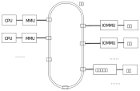
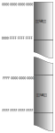

.. Copyright by Kenneth Lee. All Right Reserved.

地址空间
========

综述
----

系统总线为我们建立了一个可以通讯的物理基础，但软件并不直接用通讯的语义来使用系
统总线。总线和总线上的CPU和设备，共同为软件营造了一个以地址为中心的语义空间。这
个语义空间包括对地址空间的定义，以及对不同地址的读，写要求。

同一组读写指令的所有可选地址，构成地址空间。

服务器系统的地址空间非常复杂，有IO地址，内存地址，物理地址，虚拟地址等种种区别
。本小节我们通过鲲鹏920上涉及的各种地址空间来了解总线地址空间的设计。

MMIO
-----
早期的计算机由于设备相对内存都是低速设备，通常内存和设备使用不同的总线和CPU连接
。所以，访问设备和访问内存有不同的指令，从指令上发出的地址，构成两个互相独立的
地址空间。

但随着技术的发展，这种分离已经逐渐变得没有必要了。前面我们已经看到，鲲鹏920就是
使用唯一的总线连同所有的设备。现代的很多处理器都取消了独立的IO空间，而把IO空间
合并到内存地址空间，把两个地址空间合并成一个。这种技术，为了区别于过去的分离的
IO空间设计，称为MMIO。

        | MMIO
        | Memory Mapped Input/Ouput。
        | MMIO是为了区分把内存和IO访问分离的技术而建立的概念。
        | 它表示内存和IO是在一个地址空间中编址的一种总线地址应用方式。

前面我们已经看到了，鲲鹏920的内存控制器和普通的设备使用相同的总线相连，所以很自
然，它也采用MMIO访问所有的设备。

从总线通讯上说，设备和内存没有什么不同，都是发消息给Station。但对于上层语义就不
同的了。对于设备来说，给一个地址读一个值，或者写一个值，都是对设备的一个请求，可
以引起某种物理的反应，比如点亮一盏灯。这个读写的长度不同，物理反应也可以不同。

而内存则不同，内存是无差别的存储实体，访问A地址和B地址，除了内容不同，基本上可
以认为没有区别。对这些内存做个缓冲，只要肯定那个地址的内容没有其他人修改，下次
不访问那个内存的真正内容，直接使用缓冲中的值，对软件的感受是一样的。但设备就不能
这样，设备地址上的值，并不是只有内容这一个含义。

鲲鹏920在内部把设备组织成一个个独立的IO Cluster，简称ICL，ICL内部的结构是这样的
：

        .. figure:: kunpeng920_icl.svg

每个ICL连着总线的一个Station，Station收到本Station的数据，把总线的地址也发给调
度器，调度器根据本Station的偏移，调度给每个具体的设备。

ARM AMBA协议对设备和CPU定义了NoC的通讯和地址空间语义，鲲鹏920复用了这个协议的地
址空间语义部分，但重新设计了总线通讯协议本身，所以，每个具体的CPU，ICL以及Cache
，内存控制器，在接入Station前，都有相应的代理，把这个AMBA协议翻译为总线可以理解
的通讯协议。


物理地址空间
------------
这样，我们在总线上，就可以构成一个统一的地址空间了，这个空间我们称为物理地址空
间。

鲲鹏在每个Station上设计了一个称为DAW（Danymic Address Window）的设施，在系统初
始化的时候，通过一个内部的协议，让BIOS给每个Station设置一个Node ID和地址范围，
这样，任何一个物理地址，都可以映射给某个特定的Station，消息到了Station中，就由
Station后面的AXI Scheduler或者DDRC进行消息处理了。

DAW不但决定了某个物理地址的请求需要发给哪个Station，同时也控制这个地址的属性，
如果DAW判断某个物理地址请求是个设备，它就会按设备的要求来发送请求，如果它发现这
个物理地址是个内存，它就会按内存的要求来发送请求。内存交织也通过DAW的相关设施来
完成 [1]_ 。

.. [1] 注：DAW只是完成某个级别的内存交织，部分内存交织是通过DDRC本身去完成的。

鲲鹏兼容ARMv8的安全模式架构。根据这个架构定义，物理地址也分成两个空间，如果CPU
处于安全模式，发出的地址就是安全物理地址，否则发出的是非安全地址，这两个地址是
不同的。这同样构成两个物理地址空间。具体哪个物理空间被安排在安全或者非安全物理
空间的什么位置，这和硬件单板设计相关，相关的设计者需要从硬件提供商获取这个信息
。

虚拟地址空间
------------

MMU和IOMMU
```````````
ARMv8通过读写指令发出地址，但现代服务器处理器基本上都不会把这个地址作为物理地址
发出去。这种地址都需要经过翻译。这通常出于如下考虑：

* 安全的需要。现代服务器需要给不同的角色赋予不同的权限，就需要给不同的软件实体
  赋予不同的权限，那么控制不同的地址空间对不同的角色不同的访问权限，就成为基本
  的要求了。

* 虚拟分层的需要。在例如进程、虚拟机这样的层次，系统软件需要为被虚拟的软件模拟
  一个“看似”真实的地址空间。这些被模拟的软件每个都认为自己占据全部的物理空间，
  要进行这种模拟，就需要对目标地址进行转换。

* 地址空间扩展的需要。部分低端的设备，地址总线的长度不如系统总线，无法访问系统
  总线上的部分设备，地址翻译服务器可以扩展这个地址，让这些设备的地址范围可以提
  升。

鲲鹏通过MMU和IOMMU单元提供地址翻译服务。其结构示意如下：



        鲲鹏MMU和IOMMU服务

无论是CPU还是ICL发出的地址请求，都经过MMU/IOMMU进行翻译，这些从CPU或者ICL发出的
地址，对比总线觉得自己的“真实的，物理的”的地址，我们称为虚拟地址，VA。理论上，
CPU发出的VA和设备发出的VA是不同的，我们常常把后者特别称为IOVA。在CPU和设备通讯
的时候IOVA和VA可以具有一致性，也可以不具有一致性，我们再后面的讨论中具体看这些
区别。

页式地址翻译
`````````````
地址翻译本质上是这样一个翻译函数：

.. math::
        
        pa, attrbutes = MMU.AddressTranslate(va)
        pa, attrbutes = IOMMU.AddressTranslate(iova)

其中va表示CPU发出的地址，iova表示设备发出的地址，pa表示总线收到的地址，
attributes是这个请求地址访问要求。MMU和IOMMU中必须还有支持这个翻译的控制数据。

AddressTranslate()函数控制了定义域和值域，当va不在允许范围内，MMU或者SMMU可以
报错，这样它就兼有了安全保护的功能了。

AddressTranslation()函数可以有很多设计方法，比如段式地址翻译，我们可以指定一个
段寄存器，给定段的首地址（和地址范围），每次都给va加上一个地址头，这样就可以完
成一个翻译。图示如下：

        .. segment_address_translation.svg

这种方法也能实现多进程控制，只要每次切换进程的时候更改一下段寄存器就可以指向物
理地址的另一个位置了。但很明显，它不是太灵活，因为物理地址空间必须整段整段地使
用，很容易产生碎片，对于每次都是固定的几个进程的嵌入式应用还可以接受，对于灵活
的服务器就没法接受了。

服务器更多使用的是页式算法，这也可以图示如下：

        .. page_address_translation.svg

其实两个算法并没有本质的区别，都是把单个的地址表述变成一段地址描述。大一点的，
大小可以变化的叫段，小一点的，大小相对统一的叫页。只是一个度的差别。

但在工程上，度的差别就是质的差别。段的数量少，可以用几个CPU的内部寄存器表示，页
的数量多，页表就没法再用内部寄存器表示了。这样，我们不得不把页表放到内存中。这
就形成一个循环了：为了范围一个内存的内容，我们需要访问页表，但为了访问页表，我
们必须访问内存。

解决这个问题的方法是Cache。MMU和IOMMU专用的Cache，这称为TLB，Translation
Lookaside Buffer。简单说，就是MMU或者IOMMU为了访问内存需要查页表，查完了页表，
页表的内容就放在TLB中，TLB中有的页表，MMU或者IOMMU可以直接使用，用于得到地址翻
译的目标。

所以MMU和IOMMU翻译都有Fast Path和Slow Path两种路径。Fast Path是TLB中已经有数据
了，直接查表成功，地址翻译直接完成。Slow Path是TLB中没有数据，MMU或者IOMMU首先
去查一次内存中的页表（这称为一次页表的Walk），之后这个问题就成为前一个问题了。

和所有Cache的运作一样，页表Walk有透明的也有不透明的。透明就是硬件自己去做。不透
明的，就是硬件直接报错，让软件自己去填TLB。前者对页表的格式有要求，后者对页表的
格式没有要求，只对TLB的访问接口有要求。鲲鹏920遵循ARMv8的要求，TLB填充是透明的。

最后我们看看页大小的问题。页的大小是个度的问题，页大了可能造成浪费，但省页表，
同时也省TLB。反过来，页小了利用比较充分，但浪费页表和TLB。这完全取决于业务。传
统上Linux都使用4K的页，这成为大部分服务器的标配。但随着内存越来越大，4K不见得是
最优的选择，鲲鹏提供ARMv8可选的全部4K、16K、64K三种也大小。不同的操作系统发行版
使用不同的配置，它们各有优势，取决于用户使用的应用的业务模型是什么样的。

todo：需要一些64K和4K的页配置对比性能数据。

字长和内存访问属性
```````````````````
MMU/IOMMU翻译不但输出物理地址，还输出访问属性和访问长度。

从编程的角度，我们可以从两方面来控制CPU或者设备发出的地址请求。其一是发出的地址
的指令指定的字长。ARMv8指令集对不同的字长有不同的访问指令，比如：

* 8位读写 strb, ldrb
* 16位读写 strh, ldrh
* 32/64位读写 str, ldr （取决于操作数的不同会生成不同的指令编码）
* 128位读写 stp, ldp

这些指令只是CPU的期望，当这些请求发到MMU上，MMU要根据地址对其进行解释，再变成物
理地址。下面是一种ARMv8的页表的格式：

        .. figure:: arm64_4k_pte_format.svg

ARMv8支持双Stage页表翻译，每个Stage支持多种页表格式，每种页表还支持多种页的大小
。所以这里其实有很多的变体，但其实我们不是那么关心这些实现细节，我们主要还是希
望通过这个实例，让读者对于访存的语义映射为一种硬件的行为的时候，大致会有哪些方
面的细节问题需要被考量有所了解。

这个例子中的MemAttr指明了这个目标地址的内存类型和访问属性，它表示如下选择：

内存：

* MemAttr[1:0]=00 Outter内存
        * MemAttr[3:2]=01 Inner或者Outer NonCacheable
        * MemAttr[3:2]=10 Outer Write-through Cacheable
        * MemAttr[3:2]=11 Outer Write-back Cacheable
* MemAttr[1:0]=01 NonCacheable Outter内存
* MemAttr[1:0]=10 Write-through Cacheable Outter内存
* MemAttr[1:0]=11 Write-back Cacheable Outter内存

设备：

* MemAttr[3:2]=00 设备内存
        * MemAttr[1:0]=00 nGnRnE
        * MemAttr[1:0]=01 nGnRE
        * MemAttr[1:0]=10 nGRE
        * MemAttr[1:0]=11 GRE

Cache相关的属性的原理在介绍Cache的时候再来讨论，我们重点先看看设备属性的行为。
ARMv8对设备访问给出了三种属性：

* G，Gatthering，这表示是否允许MMU和总线收集多个请求以后一次发出去
* R，Reordering，这个表示是否允许MMU和总线对同一个通讯目标重排请求的顺序
* E，Write Acknowledgement，这个表示如何认可一个写操作成功了。E表示等写响应消息
  回来才是写成功了，nE表示只要发出去就成功了。

地址发出时给出的地址大小和顺序，配合上MMU的属性，才最终决定在物理地址上看到的请
求是什么。

需要补充的是，地址发出的顺序还和超标量发射有关，这我们在讨论内存顺序的时候再来
看这部分逻辑。

虚拟地址空间和多级页表
```````````````````````
如前所述，虚拟地址空间地址翻译构造了多个独立的地址空间。地址空间是个不清晰的概
念，本节我们来细化一下它。

首先，所有VA可以选择的地址，构成一个VA地址空间。这个从指令上控制出来的。比如：::

        ldr r2, [r1, #4]
        str r2, [sp, #16]

这样的地址请求，本身就带来地址可以表示范围的假设。鲲鹏使用ARMv8 AArch64指令空间
，用一个64位的整数表示地址，这个地址范围就可以达到如下范围：

        .. math::

                0 .. 2^{64}-1

这表达了一个16EB的空间，虽然说地址永远都不嫌多，但至少现在基本上都是浪费的。所
以ARMv8架构实际并不认知这个地址的全部，它默认只支持48位的虚拟地址。多出来的高位
不在地址翻译中更使用。ARMv8.2开始，又引入可一个可选的特性，称为LVA，Large
Virutal Address，如果使能这个功能，就多使用4位，认知52位的VA地址。

todo：确认一下鲲鹏920是否支持LVA，应该不支持。

多出来的地址可以做很多用途，比如ARMv8的Address Tagging可选特性用了最高的8位作为
Tag，可以为指针增加属性。而PAuth可选特性可以提供指针鉴权功能，可以控制一段内存
只能给特定的指针访问，这都能为软件制造很多优势。

但正如我们一直说的，架构是个两难的选择，如果你用了这个特性，未来你真的用得上64
位的地址的时候，这些程序就不再具有兼容性了。

设备的IOVA地址受设备的设计左右，如果设备使用了IOMMU，IOMMU会对这个地址进行截断
或者扩展处理，这个和每个设备的具体设计相关，我们在具体讨论每个设备的时候再讨论
这个问题。

上面这个解释的VA地址空间通过MMU/IOMMU的转换变成物理地址，每次把不同转换数据送到
MMU/IOMMU，转化的物理地址都不一样。所以，相同的VA地址空间可以被转化为不同的物理
地址集合，我们把这种指向不同物理地址集合的VA地址空间，有时也称为VA地址空间，在
本文中，如果需要做出这种区分，我们把这种考虑了所指向的物理地址空间的VA地址空间
称为“有效VA地址空间”，而把不考虑这个要素的地址空间称为“一般VA地址空间”。一般VA
地址空间可以很大，但有效VA地址空间可以很小。操作系统可以通过切换不同的有效VA地
址空间，切换不同的进程。但这些进程可以有相同的一般VA地址空间。

有效VA地址空间这个概念体现了多级页表的存在价值。我们简单研究一下这个问题。

所谓多级页表，是指从VA或者IOVA到最终的页表的翻译项（在OS中通常简称PTE，Page
Table Entry），需要经过几次查表，如果只有一次，就是一级页表，超过一次，就叫多级
页表。

假设我们用一级页表，一个48位的VA，用4K的页，页内偏移占用12位，剩下的36位用于表
示页表，为了让AddressTranslation()函数的定义域可以充满整个16EB的空间，那么这个
页表得有2的36次方项才能任意表示48位空间里的任何一个位置。假定每项64个字节，这个
页表很可能比一个有效VA地址空间本身都大。这在工程上根本无法接受。

这样我们就有必要把这个页表分成多级的，比如我们用两级页表，第一级用10位，第二级
26位。如果我们需要的有效地址空间不多，最小的情况下，我们只需要一个一级页表，一
个二级页表就够了，这只需要如下数量的页表项：

        .. math::

                2^{10} + 2^{26}

这是把乘法变成了加法。如果我们再多分几个分段，比如按9, 9, 9, 9来做多级页表，
最小页表空间就可以再降到：

        .. math::

                2^9 + 2^9 + 2^9 + 2^9

多级页表本质上就是赌有效虚拟地址空间远远小于一般虚拟地址空间，如果这个假设不成
立，多级页表并没有意义。

设计师一般会尽量让每个页表的大小接近一个页的大小而不会超过，因为用作页表的页大
部分时候也不可能用于其他用途了，物尽其用是最优的选择。

todo：最好用当前Linux kernel的的标准配置，但需要去查一下现在最新的配置是什么。


一般虚拟地址空间和进程
```````````````````````
本小节我们开始看看CPU的这些设计如何和操作系统的设计联系在一起。

鲲鹏920实现了ARMv8定义的全部特权级（部分特权级是可选的）：

* EL0：用户级
* EL1：内核级
* EL2: 虚拟机管理级
* EL3：安全管理级

本小节我们先看EL0和EL1是怎么工作。其他部分的工作原理我们留到介绍计算子系统的时
候再来介绍。

EL0用于进程，EL1用于操作系统内核，如果不考虑EL2和EL3，系统启动的时候最终进入EL1
Boot Loader加载操作系统的内核，内核代码拥有CPU的最高权限，可以访问所有资源，包括
设置EL0将使用的页表。

鲲鹏920，遵循ARMv8的架构要求，在EL1提供了两个页表寄存器，TTBR0和TTBR1，每个寄存
器都可以指向物理内存中的一个全48位（或者52位）的页表结构。它的意图是这两个空间
一个用于内核，一个用于用户。

实际上，一个VA具体可以用于内核，还是用于用户，是在PTE中定义的。所以，意图是意图
用户怎么用这是用户自己可以选择的。

Linux内核5.5是根据这个意图来设计的，其TTBR0用于用户空间，TTBR1用于内核空间。内核
设置好自己的页表后，设置TTBR1，然后使能MMU，内核自己就可以访问分配给自己的所有
有效虚拟地址空间了，在Linux Kernel中这个空间和物理空间是一个线性的对应关系。

当Linux Kernel需要调度一个进程投入运行，它先给这个进程分配物理空间，同时多分配
一些页面用作这个进程的页表，设置进程的页表，最后把页表的物理地址设置到TTBR0中，
这样，内核的页表空间和用户的页表空间就都生效了，MMU可以对两个地址空间的地址进行
翻译。

这时CPU的特权级仍停留在EL1，Linux Kernel通过eret模拟系统调用返回，放弃当前的特
权级，CPU就退出到EL0特权级，这时TTBR0和1仍都起作用，但由于TTBR1中的PTE的权限都
是EL1的，CPU再访问TTBR1地址空间的范围，就会引起异常（异常会重新回到EL1，并进入
操作系统设置好的入口），这样被调度的进程就被控制在TTBR0限定的范围内了。

当CPU因为用户进程发起系统调用，访问非法指令，系统发生中断等原因重新回到EL1，并
且进入Kernel的代码中，CPU可以把另一个进程的页表设置到TTBR0中，调度另一个进程投
入运行。

但正如我们前面反复强调的，我们这里描述的只是一种基本的行为。实际上所有这些行为
都针对不同的情形有不同的变体的。比如我们前面提到EL1有权限同时访问TTBR0和TTBR1的
有效虚拟地址空间。但如果用户设置了PAuth（指针鉴权），那么部分地址也是被屏蔽的。
ARMv8还可以使能PAN，UAO等功能，可以限制EL1不能访问用户态的部分资源，这些都属于
基本设计之上的变体。

简单总结，一个主线5.5的Linux Kernel，在鲲鹏920上，0 - 0x ffff ffff ffff 用于用
户空间，使用TTBR0，0x ffff 0000 0000 0000 到0xffff ffff ffff ffff用于内核空间，
使用TTBR1。这样，在某个特定的时刻，某个CPU上的地址空间是这样的：



每个CPU有自己独立的有效VA地址空间，但它们的有效内核地址空间是一样的。所以，对于
多核系统，进程是真实地“同时”被运行的。

ASID
`````
CPU每次切换地址空间，就更改TTBR，但仅仅更改TTBR是不够的，因为TLB里面还有上一个
进程的页表缓存，需要把这些缓存全部清除掉（称为Invalidate）。这个地方可以做成“透
明”的，但这并不高效。所以ARMv8的定义中，这个地方不是透明的，它需要CPU主动做TLB
Flush操作，刷新TLB的内容。

但每次切换进程都要刷新TLB操作，这个成本也不低，特别是对于微内核操作系统那种有大
量进程间通讯的系统，这几乎无法接受。所以很多通用处理器都会用通过ASID对此进行优
化：每个TLB的条目录被加载到MMU/SMMU里面后，带一个进程的ID，称为ASID，地址翻译不
但要匹配上VA，还要匹配上ASID，翻译才有效。这样TLB中可以存在多个进程的页表项，在
一定程度上就降低了进程切换的成本。

        | ASID
        | todo

ARMv8的ASID可以实现成8位或者16位的，鲲鹏实现为16位（todo：和手册对一下），但这
和操作系统使用的进程ID（比如Linux Kernel的PID）常常还是不一样的，这也制造了软件
实现上的麻烦，两者还需要有映射和冲突管理算法。但工程常常就是如此了。


虚拟机空间和多Stage翻译
-----------------------
上面的逻辑同样适用于虚拟机空间。关于虚拟机的工作原理，我们在介绍计算子系统的时
候再详细介绍。这里我们聚焦到虚拟机的空间的工作原理。

和操作系统控制进程的原理一样，虚拟机管理器（Hypervisor）从EL2控制EL1/0的地址访
问。但EL1设置了一个页表，EL2再设置一个页表，两个页表一起交给MMU或者IOMMU。它们
就需要做两次翻译才能把真正的物理地址找出来。

在ARMv8架构中，这称为双Stage地址翻译，Hypervisor通过TTBR_EL2设置Stage 2页表（这
只有一个，没有两个了），然后退出到EL1让虚拟机运行，虚拟机设置TTBR0_EL1和
TTBR1_EL1设置Stage 1的页表，这两者都设置到MMU中，MMU先用Stage 1翻译，得到一个
EL1的物理地址，作为EL2的虚拟地址进行Stage 2的翻译，最终就得到物理地址了。那个
EL1的物理地址，称为中间物理地址，IPA。


IOMMU页表
---------
进程切换通过切换CPU MMU的页表实现，同样的策略却不能用于IOMMU。

IOMMU有两种情形，一种是仅内核要共享数据给设备，另一种是用户态程序要共享数据给设
备。

第一种情形通常发生在内核驱动的场景。比如一个网卡在内存中放了一个要发送的报文，
它把地址告知设备，设备通过这个地址发出去。在很早的时候，不少服务器系统都没有
IOMMU，这需要把这个地址转化为物理地址，设备直接在总线上发出物理地址就可以了。

这种方式有很多问题，包括：

1. 简单设备的物理地址总线可能很短，比如它只有16位，这样很多物理空间就都访问不了
   。所以Linux的内核中还保留着DMA_ZONE和Bounce Buffer这样的设计，对这种设备做
   DMA，只能从特定的物理地址空间中分配，如果不是从这里分配的内存要做DMA，就要先
   拷贝到这样的内存中才能做，这种用作跳板的内存就叫Bounce Buffer。这些行为，不
   但影响灵活性，也影响效率。

        | DMA
        | Direct Memory Access
        | 直接内存访问。传统的IO设备和内存不是同一条总线，
        | 所以要从IO设备访问内存需要CPU作为中介。
        | 有CPU从内存中获得数据，写到设备，或者从设备中得到数据写回内存。
        | 为了加快速度，部分设备中会带一些装置，可以和内存直接交互，
        | 这种装置，称为DMA。部分DMA引擎还可以简单用于脱离CPU直接进行内存搬移。
        | 在设备和内存共总线后，这个概念其实常常只是简单表示设备访问内存。

2. 物理地址分配容易产生碎片，地址常常不连续。所以Scatter-Gather DMA成了这种不少
   设备的标配，这种配置增加了软硬件的实现成本和复杂度。

        | Scatter-Gather DMA
        | todo

3. 不安全。硬件可以发出任何物理地址，也就意味着攻击者可以通过插入一个恶意的设备
   读取或者修改内存中的任何数据，这样所有的安全措施都被解锁了。考虑现在很多设备
   都可以动态插入IO接口（比如USB），这个问题就可以很大了。todo：放一两个实际案例的例子。

所以，现代的服务器中，IOMMU是标配，否则安全这一关就过不去。基于IOMMU，每次CPU给
设备发送数据的时候，在IOMMU的页表中找一个空闲的va空间（称为iova），映射到它的物
理地址，然后才通知设备访问这个iova，这样才是安全的。

但这只适合内核驱动，因为内核只有一个，也只需要一个页表。但如果是用户态的进程需
要和设备通讯，这样就不行了。CPU进程切换可以切换页表，但CPU进程切换了，设备不可
能也切换页表。

所以IOMMU都需要支持多进程。ARM SMMU规范定义的IOMMU页表第一级称为一个Context
Desciptor表，每个Descriptor对应一个MMU意义上的页表。这样，一个SMMU单元，可以有
多张页表，这样才能保证IOMMU可以正常工作。但这样也给TLB带来更大的负担。

Linux Kernel通过VFIO提供用户态DMA接口，我们在讨论计算子系统WarpDrive结构的时候
再来深入探讨这里的问题。


IOMMU的No-Strict模式问题
`````````````````````````
基于IOMMU做设备的DMA，在实际中最大的一个成本常常是unmap_dma()操作。下面是一个
hns3的性能profile报告：

todo：需要一个hns3没有开no-strict的性能数据

UNMAP本身其实没有什么功能，但在硬件上，要完整这个工作，就要在IOMMU的TLB把对应的
映射条目挑出来，然后一个个删掉，这要等IOMMU完成了，才能继续做下一个操作。

其实不等也是可以的，在功能上不会有什么问题，但确实破坏承诺，造成一定程度上的不
安全。因为你一波操作处理完成了，你的内存准备用于其他功能了，不断开设备的访问权
限，这个设备可能通过这一个小小的时间窗口窥探你的数据。但它能否利用这个时间窗口
是存疑的。

鲲鹏在主线Linux中合入了一个称为No-strict的特性：(todo：版本，配置项），把unmap
做成异步的，这可以大大提高性能，下面是开启了no-strict的数据：

todo：no-strict的数据

软件和硬件都在优化这里的性能，最终哪个会占上风，我们还不知道，这也是工程的特点。
WarpDrive改变整个应用模式，也能为解决这个问题提供帮助。

IOMMU的局部性问题
``````````````````
todo：IOMMU的stream模式对IOMMU翻译性能的影响。

软件控制总线地址访问
`````````````````````
我们配合软件实现看看这个过程如何起作用。在5.5主线的Linux Kernel的实现中，设备驱
动一般通过ioremap()映射设备MMIO空间到内核虚拟空间，这个实现是这样的：

这是设备的映射：

.. code-block:: c

        //arch/arm64/include/asm/io.h
        #define ioremap(addr, size)		__ioremap((addr), (size), __pgprot(PROT_DEVICE_nGnRE))
        #define ioremap_wc(addr, size)		__ioremap((addr), (size), __pgprot(PROT_NORMAL_NC))

Linux默认为这种映射选定了nGnRE的访问方式，既不成组，不重新排序，等待写成功。这
是最慢也最保险的一种方式，如果驱动有不同的需要，就必须使用更低一层的接口进行定
制的映射了。

内存的映射直接控制每次填入PTE的内容就可以了：

.. code-block:: c

        // arch/arm64/mm/proc.S
	ldr	x5, =MAIR(0x00, MT_DEVICE_nGnRnE) | \
		     MAIR(0x04, MT_DEVICE_nGnRE) | \
		     MAIR(0x0c, MT_DEVICE_GRE) | \
		     MAIR(0x44, MT_NORMAL_NC) | \
		     MAIR(0xff, MT_NORMAL) | \
		     MAIR(0xbb, MT_NORMAL_WT)
	msr	mair_el1, x5

.. code-block:: c

        // arch/arm64/include/asm/pgtable-prot.h
        #define PROT_NORMAL (PROT_DEFAULT | PTE_PXN | PTE_UXN | PTE_WRITE | PTE_ATTRINDX(MT_NORMAL))

这个地方用的页表格式和我们前面举的例子用的那个不太一样，它的内存属性不是直接放
在页表项中的，而是页表项放一个索引，内容放在寄存器MAIR中，这里MT_NORMAL是5，所
以其实索引了NORMAL_WT的配置，但最终逻辑都是一样的。所以，Linux内核模式使用了
Cache Write-Through模式访问一般的内存。

要控制访问的长度，这通常用于MMIO，Linux也封装成了具体的函数：

.. code-block:: c

        //arch/arm64/include/asm/io.h
        #define __raw_writeb __raw_writeb
        static inline void __raw_writeb(u8 val, volatile void __iomem *addr)
        {
                asm volatile("strb %w0, [%1]" : : "rZ" (val), "r" (addr));
        }

        #define __raw_writew __raw_writew
        static inline void __raw_writew(u16 val, volatile void __iomem *addr)
        {
                asm volatile("strh %w0, [%1]" : : "rZ" (val), "r" (addr));
        }

        #define __raw_writel __raw_writel
        static inline void __raw_writel(u32 val, volatile void __iomem *addr)
        {
                asm volatile("str %w0, [%1]" : : "rZ" (val), "r" (addr));
        }

        #define __raw_writeq __raw_writeq
        static inline void __raw_writeq(u64 val, volatile void __iomem *addr)
        {
                asm volatile("str %x0, [%1]" : : "rZ" (val), "r" (addr));
        }

        #define __raw_readb __raw_readb
        static inline u8 __raw_readb(const volatile void __iomem *addr)
        {
                u8 val;
                asm volatile(ALTERNATIVE("ldrb %w0, [%1]",
                                         "ldarb %w0, [%1]",
                                         ARM64_WORKAROUND_DEVICE_LOAD_ACQUIRE)
                             : "=r" (val) : "r" (addr));
                return val;
        }

        #define __raw_readw __raw_readw
        static inline u16 __raw_readw(const volatile void __iomem *addr)
        {
                u16 val;

                asm volatile(ALTERNATIVE("ldrh %w0, [%1]",
                                         "ldarh %w0, [%1]",
                                         ARM64_WORKAROUND_DEVICE_LOAD_ACQUIRE)
                             : "=r" (val) : "r" (addr));
                return val;
        }

        #define __raw_readl __raw_readl
        static inline u32 __raw_readl(const volatile void __iomem *addr)
        {
                u32 val;
                asm volatile(ALTERNATIVE("ldr %w0, [%1]",
                                         "ldar %w0, [%1]",
                                         ARM64_WORKAROUND_DEVICE_LOAD_ACQUIRE)
                             : "=r" (val) : "r" (addr));
                return val;
        }

        #define __raw_readq __raw_readq
        static inline u64 __raw_readq(const volatile void __iomem *addr)
        {
                u64 val;
                asm volatile(ALTERNATIVE("ldr %0, [%1]",
                                         "ldar %0, [%1]",
                                         ARM64_WORKAROUND_DEVICE_LOAD_ACQUIRE)
                             : "=r" (val) : "r" (addr));
                return val;
        }

Linux没有考虑对128长度的封装，有些请求是要求一次发出128位的地址的，比如下面是鲲
鹏920的加速器设备设置邮箱命令的方法，它强行使用128位的访问，如果分开成两次64位
访问，就会出错：

.. code-block:: c

        // drivers/crypto/hisilicon/qm.c
        static void qm_mb_write(struct hisi_qm *qm, const void *src)
        {
                void __iomem *fun_base = qm->io_base + QM_MB_CMD_SEND_BASE;
                unsigned long tmp0 = 0, tmp1 = 0;

                if (!IS_ENABLED(CONFIG_ARM64)) {
                        memcpy_toio(fun_base, src, 16);
                        wmb();
                        return;
                }

                asm volatile("ldp %0, %1, %3\n"
                             "stp %0, %1, %2\n"
                             "dsb sy\n"
                             : "=&r" (tmp0),
                               "=&r" (tmp1),
                               "+Q" (*((char __iomem *)fun_base))
                             : "Q" (*((char *)src))
                             : "memory");
        }


