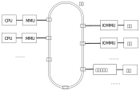
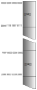

.. Copyright by Kenneth Lee. All Right Reserved.

地址翻译和保护
==============

介绍
----
现代服务器几乎都提供虚拟地址服务。这出于如下考虑：

* 安全的需要。现代服务器需要给不同的角色赋予不同的权限，就需要给不同的软件实体
  赋予不同的权限，那么控制不同的地址空间对不同的角色不同的访问权限，就成为基本
  的要求了。

* 虚拟分层的需要。在例如进程、虚拟机这样的层次，系统软件需要为被虚拟的软件模拟
  一个“看似”真实的地址空间，这也需要对目标地址进行转换。

* 地址空间扩展的需要。部分低端的设备，地址总线的长度不如系统总线，无法访问系统
  总线上的部分设备，地址翻译服务器可以扩展这个地址，让这些设备的地址范围可以提
  升。

鲲鹏通过MMU和IOMMU单元提供地址翻译服务。其结构示意如下：



        鲲鹏MMU和IOMMU服务

鲲鹏的主CPU由于使用ARM标准，所以完全遵循ARMv8构架标准，而IOMMU遵循ARM SMMU标准
。但无论使用的是哪个标准，其原理基本上是不变的。两者都采用（相同格式）的页表格
式描述虚拟地址到物理地址的转换关系，以及对应地址段的关系。

页式地址翻译
------------
地址翻译本质上是这样一个函数：

.. math::
        
        pa = Tran(va)

其中va表示CPU或者设备发出的地址，pa表示总线收到的地址。Tran()函数控制了定义域和
值域，当va不在允许范围内，MMU或者SMMU可以报错，这样它就兼有了安全保护的功能了。

Tran()函数可以有很多设计方法，比如段式地址翻译，我们可以指定一个段寄存器，给定
段的首地址（和地址范围），每次都给va加上一个地址头，这样就可以完成一个翻译。图
示如下：

        .. segment_address_translation.svg

这种方法也能实现多进程控制，只要每次切换进程的时候更改一下段寄存器就可以指向物
理地址的另一个位置了。但很明显，它不是太灵活，因为物理地址必须整段整段地使用，
很容易产生水平，对于每次都是固定的几个进程的嵌入式应用还可以接受，对于灵活的服
务器就没法接受了。

服务器更多使用的是页式算法，这也可以图示如下：

        .. page_address_translation.svg

其实两个算法并没有本质的区别，都是把单个的地址表述变成一段地址描述，大一点的，
大小可以变化的叫段，小一点的，大小相对统一的叫页。只是一个度的差别。

但在工程上，度的差别就是质的差别。段的数量少，可以用几个CPU的内部寄存器表示，页
的数量多，页表就没法再用内部寄存器表示了。这样，我们不得不把页表放到内存中。这
就形成一个循环了：为了范围一个内存的内容，我们需要访问页表，但为了访问页表，我
们必须访问内存。

解决这个问题的方法是Cache。MMU和IOMMU专用的Cache，这称为TLB，Translation
Lookaside Buffer。简单说，就是MMU或者IOMMU为了访问内存需要查页表，查完了页表，
页表的内容就放在TLB中，TLB中有的页表，MMU或者IOMMU可以直接使用，用于得到地址翻
译的目标。

所以MMU和IOMMU有Fast Path和Slow Path两种路径。Fast Path是TLB中已经有数据了，直
接查表成功，地址翻译直接完成。Slow Path是TLB中没有数据，MMU或者IOMMU首先去查一
次内存中的页表（这称为一次页表的Walk），之后这个问题就成为前一个问题了。

和所有Cache的运作一样，页表Walk有透明的也有不透明的。透明就是硬件自己去做。不透
明的，就是硬件直接报错，让软件自己去填TLB。前者对页表的格式有要求，后者对页表的
格式没有要求，只对TLB的访问接口有要求。鲲鹏920遵循ARMv8的要求，TLB填充是透明的。

最后我们看看页大小的问题。页的大小是个度的问题，页大了可能造成浪费，但省页表，
同时也省TLB。反过来，也小了利用比较充分，但浪费页表和TLB。这完全取决于业务。传
统上Linux都使用4K的页，这成为大部分服务器的标配。ARM提供4K、16K、64K等多种大小
的页配置，不同的发行版使用不同的配置，它们各有优势，取决于用户使用的应用的业务
模型是什么样的。

todo：需要一些64K和4K的页配置对比性能数据。


地址空间和多级页表
------------------
地址翻译构造了多个独立的地址空间。地址空间是个不清晰的概念，本节我们来细化一下
这个概念。

首先，所有VA可以选择的地址，构成一个VA地址空间。这个从指令上控制出来的。比如：::

        ldr r2, [r1, #4]
        str r2, [sp, #16]

这样的地址请求，本身就带来地址可以表示范围的假设。鲲鹏使用ARMv8 Aarch64指令空间
，用一个64位的整数表示地址，这个地址范围就可以达到如下范围：

        .. math::

                0 .. 2^{64}-1

这表达了一个16EB的空间，虽然说地址永远都不嫌多，但至少现在基本上都是浪费的。所
以ARM在这上面进行了各种扩展，比如使能了Address Tagging功能（通过TCR_ELx.TBIy设
置），最高的8位用作这个地址的Tag，可以让软件用来管理管理这个指针的状态等。这样
地址空间减少了8位，但可以表达的空间仍高达64PB。所以，其实这个空间仍然是浪费的，
所以现在实施的页表策略，基本都不会支持用尽64位的VA空间。换句话说，指令可以表达
64或者56位的地址空间，但MMU/IOMMU不一定需要支持对所有这些地址的翻译。ARM标准的
VA默认只有两个48位空间，ARMv8.2开始，通过LVA特性，可以扩展到52位（todo：确认920
是否支持这个特性）。

设备的IO地址受设备的设计左右，如果设备使用了IOMMU，IOMMU会对这个地址进行截断或
者扩展处理，这个和每个设备的具体设计相关，我们在具体讨论每个设备的时候再讨论这
个问题。

上面这个解释的VA地址空间通过MMU/IOMMU的转换变成物理地址，每次把不同转换数据送到
MMU/IOMMU，转化的物理地址都不一样。所以，相同的VA地址空间可以被转化为不同的物理
地址集合，我们把这种指向不同物理地址集合的VA地址空间，有时也称为VA地址空间，在
本文中，如果需要做出这种区分，我们把这种考虑了所指向的物理地址空间的VA地址空间
称为“有效VA地址空间”，而把不考虑这个要素的地址空间称为“通用VA地址空间”。通用VA
地址空间可以很大，但有效VA地址空间可以很小。操作系统可以通过切换不同的有效VA地
址空间，切换不同的进程。

有效VA地址空间这个概念体现了多级页表的存在价值。我们简单研究一下这个问题。

假设我们用一级页表，一个64位的VA，用4K的页，页内偏移占用12位，剩下的52位用于表
示页表，为了让Tran()函数的定义域可以充满整个16EB的空间，那么这个页表得有2的52次
方项才能任意表示64位里的任何一个位置。假定每项64个字节，这个页表很可能比一个有
效VA地址空间本身都大。这在工程上根本无法接受。

其实我们也用不上这么大的空间，假定我们仅仅用其中的48位，页表也有2的36次方项，这
在工程上仍然无法接受。

这样我们就有必要把这个页表分成多级的，比如我们用两级页表，第一级用10位，第二级
26位。如果我们需要的有效地址空间不多，最小的情况下，我们只需要一个一级页表，一
个二级页表就够了，这只需要如下数量的页表项：

        .. math::

                2^{10} + 2^{26}

这是把乘法变成了加法。如果我们再多分几个分段，比如按9, 9, 9, 9来做多级页表，
最小页表空间就可以再降到：

        .. math::

                2^9 + 2^9 + 2^9 + 2^9

设计师一般会尽量让每个页表的大小接近一个页的大小而不会超过，因为用作页表的页大
部分时候也不可能用于其他用途了，物尽其用是最优的选择。

todo：最好用当前Linux kernel的的标准配置，但需要去查一下现在最新的配置是什么。


地址空间和特权级
----------------
地址空间是CPU特权级实施权限控制的其中一种方法，给予不同特权级不同的地址空间，就
能给予不同的特权级不同的地址访问权限，切换特权级的地址空间，就能切换那个特权级
的地址范围。

鲲鹏920，遵循ARMv8的定义，在页表项中描述每个页的具体权限（具体在页表的AP域中），
这些权限不但区分特权级的访问权限，还区分读，写，执行等不同权限。通过ARMv8升级版
本的扩展空间，鲲鹏920不但控制低特权级不能越权访问高特权级的权限，还通过PAN，UAO
一类的功能控制高特权级不能访问低特权级的部分权限。这可以防止高特权级被作为攻击
跳板。

ARMv8定义了两个页表寄存器，TTBR0和TTBR1，[1]_ ，同时支持两个48位的VA空间，其意
图是一个用于用户进程，一个用户内核。这样，切换进程的时候，更改其中一个指向的页
表就可以了，内核不受任何影响。当然，这是意图，用户要怎么使用这两个页表，这是用
户的事。鲲鹏920支持ARMv8.2的LVA特性（todo：不记得这是920还是930的特性了，待确认
），每个VA空间可以进一步扩展到52位，但原理是一样的。

.. [1] TTBR在不同特权级下有不同的含义，所以不能简单理解为两个寄存器，实际上有很
       多个寄存器。

在主线5.5的Linux Kernel的实现中，默认采用ARMv8暗示的这种地址空间布局。按这种布
局，0 - 0x ffff ffff ffff 用于用户空间，使用TTBR0，0x ffff 0000 0000 0000 到
0xffff ffff ffff ffff用于内核空间，使用TTBR1。这样，在某个特定的时刻，某个CPU上
的地址空间是这样的：



每个CPU有自己独立的有效VA地址空间，但它们的有效内核地址空间是一样的。

CPU每次切换地址空间，就更改TTBR，但仅仅更改TTBR是不够的，因为TLB里面还有上一个
进程的页表缓存。这个地方可以做成“透明”的，但这并不高效。所以ARMv8的定义中，这个
地方不是透明的，它需要CPU主动做TLB Flush操作，刷新TLB的内容。

但每次切换进程都要刷新TLB操作，这个成本也不低，特别是对于微内核操作系统那种有大
量进程间通讯的系统，这几乎无法接受。所以这里加入一个很多通用处理器都会用的优化
：每个TLB的条目录被加载到MMU/SMMU里面后，带一个进程的ID，称为ASID，地址翻译不但
要匹配上VA，还要匹配上ASID，才能进行翻译。这样TLB中可以存在多个进程的页表项，在
一定程度上就降低了进程切换的成本。

        | ASID
        | todo

ARMv8的ASID可以实现成8位或者16位的，鲲鹏实现为16位（todo：和手册对一下），但这
和操作系统使用的进程ID（比如Linux Kernel的PID）常常还是不一样的，这也制造了实现
上的麻烦，两者还需要有映射和冲突管理算法。但工程常常就是如此了。

IOMMU页表
---------
进程切换通过切换CPU MMU的页表实现，同样的策略却不能用于IOMMU。

IOMMU有两种情形，一种是仅内核要共享数据给设备，另一种是用户态程序要共享数据给设
备。

第一种情形通常发生在内核驱动的场景。比如一个网卡在内存中放了一个要发送的报文，
它把地址告知设备，设备通过这个地址发出去。在很早的时候，不少服务器系统都没有
IOMMU，这需要把这个地址转化为物理地址，设备直接在总线上发出物理地址就可以了。

这种方式有很多问题，包括：

1. 简单设备的物理地址总线可能很短，比如它只有16位，这样很多内存都访问不了。所以
   Linux的内核中还保留着DMA_ZONE和Bounce Buffer这样的设计，对这种设备做DMA，只
   能从特定的物理地址空间中分配，如果不是从这里分配的内存要做DMA，就要先拷贝到
   这样的内存中才能做，这种用作跳板的内存就叫Bounce Buffer。这些行为，不但影响
   灵活性，也影响效率。

2. 物理地址分配容易产生碎片，地址常常不连续。所以Scatter-Gather DMA成了这种不少
   设备的标配，这种配置增加了软硬件的实现成本和复杂度。

        | Scatter-Gather DMA
        | todo

3. 不安全。硬件可以发出任何物理地址，也就意味着攻击者可以通过插入一个恶意的设备
   读取或者修改内存中的任何数据，这样所有的安全措施都被解锁了。考虑现在很多设备
   都可以动态插入USB一类的动态接口，这个问题就可以很大了。todo：放一两个实际案例的例子。

所以，现代的服务器中，IOMMU是标配，否则安全这一关就过不去。基于IOMMU，每次CPU给
设备发送数据的时候，在IOMMU的页表中找一个空闲的va空间（称为iova），映射到它的物
理地址，然后才通知设备访问这个iova，这样才是安全的。

但这只适合内核驱动，因为内核只有一个，也只需要一个页表。但如果是用户态的进程需
要和设备通讯，这样就不行了。CPU进程切换可以切换页表，但CPU进程切换了，设备不可
能也切换页表。

所以IOMMU都需要支持多进程。ARM SMMU规范定义的IOMMU页表第一级称为一个Context
Desciptor表，每个Descriptor对应一个MMU意义上的页表。这样，一个SMMU单元，可以有
多张页表，这样才能保证IOMMU可以正常工作。但这样也给TLB带来更大的负担。

Linux Kernel通过VFIO提供用户态DMA接口，我们在讨论计算子系统WarpDrive结构的时候
再来深入探讨这里的问题。用户态的缺页问题也讲在哪里讨论。

IOMMU的No-Strict模式问题
`````````````````````````
基于IOMMU做设备的DMA，在实际中最大的一个成本常常是unmap_dma()操作。下面是一个
hns3的性能profile报告：

todo：需要一个hns3没有开no-strict的性能数据

UNMAP本身其实没有什么功能，但在硬件上，要完整这个工作，就要在IOMMU的TLB把对应的
映射条目挑出来，然后一个个删掉，这要等IOMMU完成了，才能继续做下一个操作。

其实不等也是可以的，在功能上不会有什么问题，但确实破坏承诺，造成一定程度上的不
安全。因为你一波操作处理完成了，你的内存准备用于其他功能了，不断开设备的访问权
限，这个设备可能通过这一个小小的时间窗口窥探你的数据。但它能否利用这个时间窗口
是存疑的。

鲲鹏在主线Linux中合入了一个称为No-strict的特性：(todo：版本，配置项），把unmap
做成异步的，这可以大大提高性能，下面是开启了no-strict的数据：

todo：no-strict的数据

软件和硬件都在优化这里的性能，最终哪个会占上风，我们还不知道，这也是工程的特点。
WarpDrive改变整个应用模式，也能为解决这个问题提供帮助。

虚拟化和多Stage翻译
--------------------
到此为止，我们一直聚焦在讨论没有虚拟机的情形


