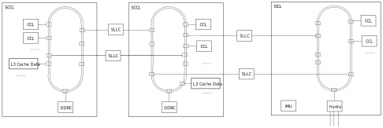
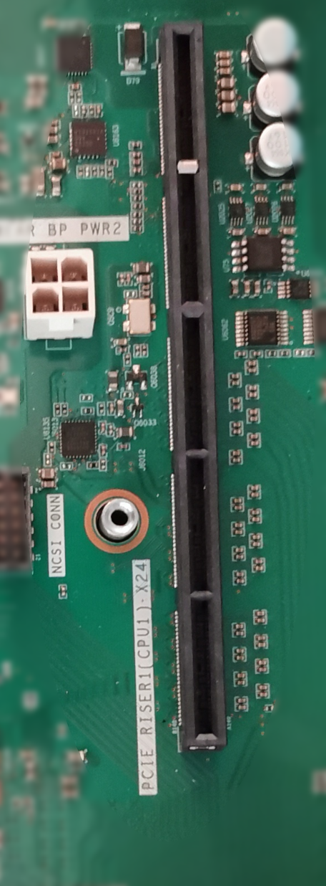

.. Copyright by Kenneth Lee. 2020. All Right Reserved.

总线
====

总线，Bus，是把系统各个部件连接在一起的技术。广义上的总线可以包括芯片内部互联的
片上总线，单机内部互联的外设总线，多机互联的背板总线，乃至网络连接。本章重点介
绍片上总线的设计，其他总线我们在介绍设备的时候再详细讨论。

片上总线
--------
片上总线，Network on Chip，是SoC设计的基础，SoC上的所有CPU和IO设备，都需要通过
NoC连接在一起。

NoC是一个独立的技术门类，其中包括介质，拓扑，安全，算法等各方面专门的研究。每种
SoC会根据自己的需求特点，选择不同的技术方案和参数。本书不准备深入到总线设计的细
节中，我们更关注总线的设计是如何影响到服务器的使用者的使用方式的。

作为片内的通讯方式，大部分NoC的基础是一种数字电路。也就是说，它本质是一个门电路
，在时钟的驱动下，按一次一跳的方式在不同的组件间传递信息。从软件的角度来来看，
这可以认为是种“同步”的过程：时钟周期到了，每个部件必须做出唯一的选择。

        .. figure:: noc_principal.svg

这种方法最大的缺点是拉线不能太长，对于高速电路，不同的连线长度稍有差别，时钟就
不一定能同步。所以，只要拉线长度不同，时钟频率不同，就需要切换总线，这通过某个
节点来转发，这种节点就叫网桥，它起到接续和转换速率的作用。和软件一样，网桥需要
通过队列缓存某种速度的总线数据，然后按另一个总线的速率要求，把数据送到那个总线
上：

        .. figure:: network_bridge.svg

由于NoC作为数字电路的这个特点，现代计算机NoC之外的高速总线几乎没有使用NoC这种方
式连接的。它们大部分采用串行总线。串行总线没有复杂的时钟同步问题，对拉线的要求
就低得多。这种设计形成了很标准化的设计模式，称为SerDes。SerDes是
SERializer-DESerializer的缩写，表示把片内的并行总线信号转化为串行信号，到了目标
端，再重新变成同步的数字并行信号，从而完成整个通讯。

这种标准化的方法可以给不同的设计人员各自的自由度。片内设计师专心控制数字电路的
逻辑，通讯介质的设计师专心控制介质提高通讯效率。但串行通讯的速度理论肯定是比不
上并行通讯的。这样一个自然的想法是多用几个SerDes。所以，片外总线常常有Lane的概
念，一个Lane，就是一个SerDes的通道。只要在通讯的两端做一个调度器，把数据重新排
序，就可以扩展通讯带宽了。这种靠一个或者多个Lane构成的通道，称为一个链路，Link
。增加Lane只是能提高链路的带宽，并不能提高链路的时延。当然这也看角度，因为如果
因为带宽不足造成了等待，低带宽也可以带来高时延。

总线通讯协议大致可以分成两层，下层提供基本的通讯能力，上层在这个通讯能力上提供
读、写，IO，Cache同步等软件语义。

NoC通讯可以有不同的拓扑结构和通讯协议，不同SoC在这些方案上有不同的选择，从而达
成这种SoC应用上的性能优势。鲲鹏使用一条全局的Cache Coherent的总线把所有的设备连
在一起，在上层使用AMBA协议以便可以方便地和任何ARM的设备（包括CPU）进行互通。

        | Cache Coherent
        | 由于跨越总线访问其他数据需要时间，肯定不如直接在本子系统中直接访问的
        | 速度快，设计者会为本子系统设计本地的缓冲，这个缓冲称为Cache。Cache带
        | 来了性能的提升，但同时也带来对数据的多副本问题。部分总线的设计，需要
        | 每个子系统自己处理这种多副本问题。而Cache Coherent的总线本身带了协议
        | 解决这样的同步问题，可以保证如果一个副本给更新了，其他副本在被读取前
        | 总是被更新了的。

        | AMBA
        | Advanced Microcontroller Bus Architecture，
        | 是ARM公司设计的一种总线协议，
        | 用于ARM的CPU和各种ARM CPU兼容设备的通讯。
        | AMBA包含上层的总线语义封装和下层的通讯协议，
        | 以及适配不同的速度需要的网桥定义。
        | 鲲鹏920使用自己的全局统一下层网络实现，
        | 但上层仍使用AMBA协议的语义，
        | 保证ARM兼容设备仍可以接入这个总线系统中。

鲲鹏920使用以环状总线为基础的总线拓扑，下面是一个示意图：

.. figure:: kunpeng_ring_bus.svg
        :alt: Kungpeng Ring Bus

        鲲鹏环状总线示意图

这个结构有点像城市里的环线地铁：列车在一个环线上一直循环，在每个车站停车上下乘
客，周而复始。数据在总线时钟的驱动下，以成组的数据为单位（称为一个Flit），从一
个Station发到下一个Station。一个Flit到达本站，取走以本站为目的地的数据，发走需
要发出去的数据，从而完成任意两个节点的通讯需求。

即使是相同的总线结构，选择不同的参数都会对通讯效率带来很大的不同。比如鲲鹏920对
时延的要求很高，它设计上会保证Flit的空载率在70%左右，这样每次数据都可以上车，
这需要留很大的通讯余量。而使用相同技术的Hi1980（市场上所知的达芬奇AI芯片），重
点要保证的是综合的计算效果，它的Flit利用率就会高达90%，这时，数据常常可能上不了
车，导致时延上升，但它的带宽可以做得很高。

在鲲鹏920中，每个Super Cluster都是一条环状总线，如果多个Super Cluster合封在一起
，就需要网桥，在鲲鹏中称为SLLC，实现在两个总线之间实现数据的“转乘”。这种转乘的
路线仍是数字电路，但因为经过了网桥的缓存再发，这个效率总是不如在本环之内的。下
面是一个典型的多Super Cluster的鲲鹏920的连接示意图：

        鲲鹏跨Super Cluster互联示意图。注意图中的SLLC实际上是通过Super Cluster
        内部的两个部件实现的一个逻辑概念。

它包含了两个Super CPU Cluster和一个Super IO Cluster。每个环内有多个Station连接
了SLLC网桥提供转发功能。SLLC按一定的平衡算法调度Flit连通多个环状总线。

如果需要多片互联，总线就需要延伸到片外，就需要片间互联的网桥。如前所述，片间互
联需要使用SerDes。鲲鹏920在SICL中设计了一个用于片间互联的模块，称为Hydra。Hydra
对外提供3个端口，每个端口可以提供8个Lane。这样，鲲鹏920最大可以连成4个芯片组成
的系统。这时互联的形态可以图示如下：

.. figure:: kunpeng920_4p.svg

通过这样一个结构，无论是同一个芯片内部还是多个芯片互联，系统里的任意两个单元都
是可以互相访问的，但跨SCL就会慢一些，而跨片，就会更慢。

内存控制器（DDRC）也是挂在SCCL上的，这样，不同的CPU核和设备访问内存的速度就是不
一样的。这样的系统，就称为NUMA系统。在NUMA系统上，软件需要意识到访问不同的内存
地址，速度是不一样的。考虑前面提到的NoC的特点，我们几乎可以认为，如果基础技术不
发生根本性的变化，未来CPU和设备越来越多的时候，NUMA几乎是不可避免的。作为程序员
的读者可能可以把这个作为未来软件开发的一个基本考量。

        | NUMA
        | Non-uniform memory access. 这是一种计算机内存构架，不同位置的内存对
        | 不同的CPU的访问速度是不同的。感知NUMA的软件可以通过使用靠近本CPU的内
        | 存，从而让性能达到最优。
        | 需要注意的是，NUMA是一种软件接口上的呈现，不一定和内存连接在什么地方
        | 相关，因为硬件可以已通过总线的上层协议实现内存访问的interleave，把软
        | 件可见的物理地址空间，分散在多片物理内存上。

下图是鲲鹏920上测试的不同距离内存访问的Latency，可以作为编程上的一种定性的参考：

（单位: 纳秒）

+------------------+-----+
| 同ring访问       | 89  | 
+------------------+-----+
| 跨SCCL访问       | 106 |
+------------------+-----+
| 跨Hydra访问      | 184 |
+------------------+-----+
| 跨SCCL+Hydra访问 | 221 |
+------------------+-----+

内存地址的访问速度不但和访问者和内存的位置相关，还和Cache的设计相关，这我们在讨
论Cache和计算子系统的时候再来讨论。

PCIe总线
--------
PCI总线，Peripheral Component Interconnect，是Intel早年推出的一种外设总线，用于
连接外部高速设备。这种总线后来逐步成为高速外设的一种标准。PCI是一种并行总线，速
度有限，最后一个版本PCI-66也就支持533MB/s的传输速度。

        鲲鹏服务器上的组合PCIE端口

PCIe总线是PCI的发展，它改用了串行DerDes的物理层，鲲鹏实现的PCIe的总线速度就可以
达到6GB/s。它可以级联，构成多样的组合和物理布局。

        鲲鹏服务器上PCIE扩展器

在鲲鹏920的实现中，PCIe总线作为网桥连接在NoC上：

.. figure:: kp_pcie_on_noc.svg

PCIe总线和系统设备通向MMIO空间，所以PCIE设备和总线上的设备非常接近，其他总线设
备可以直接访问PCIe设备的的MMIO空间，而PCIe设备也可以访问其他的总线空间，包括其
他设备的MMIO空间或者总线控制器后面的内存。很多时候，我们都可以认为PCIe总线是NoC
的一部分。

USB
----
USB总线是更灵活的总线，但带宽和可靠性无法发PCIe相比，一般用于临时的维护。

.. figure:: kp_usb_port.png

        鲲鹏服务器上USB端口

鲲鹏920的USB实现在辅助设备ICL中：

从软件的角度看，USB和PCIe总线不同，USB的控制器是USB总线的代理，要和USB设备通讯，
只能通过USB向设备发送消息。每个USB设备的用户其实只是USB控制器的一个用户，通过
USB控制器和目标设备通讯，从而完成功能的提供。这和PCIe直接为设备封装一套地址访问
接口是不同的。

其他总线
--------
除了前述的标准总线，服务器中还会存在一些非常规的总线，比如I2C，GPIO，SGPIO等，
这些总线一般用于各种管理功能。比如鲲鹏920用SGPIO来控制各种LED灯的状态。

这部分总线，和大部分应用无关，本书不深入讨论。
