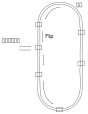

.. Copyright by Kenneth Lee. 2020. All Right Reserved.

总线系统
========

概述
----
鲲鹏使用一条全局的Cache Coherent的总线把所有的设备连在一起，使CPU和设备都可以访
问系统中的任何内存。

        | Cache Coherent
        | 由于跨越总线访问其他数据需要时间，肯定不如直接在本子系统中直接访问的
        | 速度快，设计者会为本子系统设计本地的缓冲，这个缓冲称为Cache。Cache带
        | 来了性能的提升，但同时也带来对数据的多副本问题。部分总线的设计，需要
        | 每个子系统自己处理这种多副本问题。而Cache Coherent的总线本身带了协议
        | 解决这样的同步问题，可以保证如果一个副本给更新了，其他副本在被读取前
        | 总是被更新了的。

计算机的总线互联技术称为NoC，Network on Chip。是一个独立的技术门类，其中包括介
质，拓扑，安全，算法等各方面专门的研究。每种计算会根据自己的需求特点，选择不同
的技术方案和参数。

鲲鹏920使用以环状总线为基础的总线技术，下面是一个示意图：



        鲲鹏环状总线示意图

环状总线结构有点像城市里的环线地铁：列车在一个环线上一直循环，在每个车站停车上
下乘客，无限循环。环状总线在时钟的驱动下，每个时钟周期，电路逻辑把数据从一个
Station发送到下一个Station。这种每次发送的数据称为Flit，多个Flit组成一个Packet，
Station向Packet加入自己的Flit或者读走发给自己的Flit。有了这样一个基础，总线就可
以在时钟的驱动上，一直循环把数据发给每个Station。

        | 鲲鹏环状总线和AMBA协议的关系
        | 总线提供节点间通讯的能力，但要封装为地址访问协议，
        | 还需要在这个通讯能力之上封装相关的协议，
        | ARM公司的的AMBA定义这包括物理层在内的整个协议，
        | 这个协议经过多年的发展，成熟而有各种历史沉积，
        | 鲲鹏环状总线使用一种统一的物理层取代了所有旧的物理层协议，
        | 但仍兼容原来的上层协议，以便平衡构架简化和向前兼容的关系。

不同的应用会选择不同的总线参数，比如鲲鹏920的Flit为了保证Latency，会选择70%的空
载率，而使用相同技术的Hi1980（市场上所知的达芬奇AI芯片），首先保证吞吐率，它的
Flit利用率就会高达90%。

环状总线是Super Cluster内部的机制，如果需要跨越Super Cluster，就需要在部分
Station上实现数据的“转乘”，从另一条线路出去。下面是一个典型鲲鹏920的配置，两个
SCCL，一个SICL的单Chip示意图：

.. figure:: kunpeng920_typical_connection.svg

SCCL是Super CPU CLuster，主要用于承载计算子系统，SICL是Super IO CLuster，主要用
于承载IO子系统。在片内可以设置多个转发Station进行数据转发，如果要跨片，则要通过
Hydra模块进行核外中转。每个Hydra提供三个对外接口，所以鲲鹏920最大可以连成4个芯片
的系统，保证任何两个芯片都有可以直达的通路。

下面是一个鲲鹏920 4 SoC互联的示意图：

.. figure:: kunpeng920_4p.svg

通过这样一个结构，无论是同一个芯片内部还是多个芯片互联，系统里的任意两个单元都
是可以互相访问的。

.. 地址上Station用nodeID标识，目的地用SrcID、TgtID标识

对于鲲鹏，由于同一个封装之内的线路是可控的，所以跨Super Cluster的总线是不经过
Serdes电路的，而跨封装的，就需要经过这样一个过程了。所以，从通讯效率上看，Super
Cluster内是最快的，跨封装相对来说是最慢的，但作为总线，它仍比访问内存本身快得多
。

下面是一个我们在鲲鹏920上访问不同区域内存的速度测试：

todo：需要一个内存测试数据。

        | Serdes
        | Serdes是Serializer/Deserializer的缩写。现代计算机互联技术向高速发展后
        | 并行总线由于信号干扰的问题，很难在芯片之外的布线中实现，所以，在实际
        | 在进行芯片之外的互联中，都会使用串行通讯电路，这样就需要专门的技术实现
        | 这种串行和反串行的过程，这种方法，实践和具体的技术，称为Serdes。

但我们也看到了，其实数据转到系统不同位置上的时间是不同的。现代片上网络设计有很
多新的发展，比如通过3D的互联结构，提供更多样的路由优化，或者改变Flit的调度和流
控算法减少冲突等。但如果考虑到越来越多的节点和前面提到的引线的问题。我们几乎可
以预期未来更多核的系统，必然是NUMA系统。程序员是肯定需要关心到被访问的地址和本
设备的距离的。作为程序员的读者可能可以把这个作为未来开发的一个基本考虑。

        | NUMA
        | Non-uniform memory access. 这是一种计算机内存构架，不同位置的内存对
        | 不同的CPU的访问速度是不同的。感知NUMA的软件可以通过使用靠近本CPU的内
        | 存，从而让性能达到最优。

总线系统是鲲鹏所有全局设计的中心，CPU和设备访问内存，CPU访问设备，设备之间互相
访问，乃至中断的分发，都基于这个总线系统。后面我们会看到更多和它相关的设计。

MMIO和物理地址编址
------------------
早期的计算机都把和内存的通讯，以及和设备的通讯分开。由于访问效率和访问功能不同
访问内存和进行设备通讯用的总线也不同。但随着技术的发展，这种分离已经逐渐没有必
要了。

        | MMIO
        | Memory Mapped Input/Ouput。
        | MMIO是为了区分把内存和IO访问分离的技术而建立的概念。
        | 它表示内存和IO是在一个地址空间中编址的一种总线地址应用方式。

鲲鹏920就使用一条系统总线沟通所有的设备和内存控制器。所以它访问内存的某个位置和
访问某个设备的方法从指令上看起来都是一样的。无论设备还是CPU发出地址请求，经过
MMU或者SMMU翻译，最后都会成为Flit中的一个请求，这个请求中包含读写类型，访问字长
，安全标记，写入数据等等信息，从一个Station发出去，这个Station会根据目标地址得
到目标的Station ID，Flit到达目的地Station，就会从那里读走，然后控制目标一侧的设
备做出反应。无论是读写，也无论消息的目标是内存控制器还是设备，最后都是消息。读写
都只是语义上的封装，在设备内部它是这样的：

        .. figure:: kunpeng920_icl.svg

.. 这里的Scheduler其实就是AXI Scheduler，后面是设备逻辑在控制调度，鲲鹏部分模块，
   比如加速器，使用公共的OOO模块做这种各类型的调度。

当然，在这个消息之上的协议行为可能是不同的，比如写操作可能就不需要等待目标设备
响应，读操作就需要等待。读写内存可以基于Cacheline一次读写整个Cacheline，读设备
这需要严格根据字长的要求进行控制。如果内存配置了交织访问，还需要对请求进行拆解
，变成多个针对不同目标的请求。鲲鹏通过一个实现在每个Station中的称为DAW（Danymic
Address Window）的设计对地址的范围进行判断，再根据这个判断决定最终的Flit的内容。
DAW在BIOS配置阶段由BIOS全局分配给每个Station，从而让每个Station的用户有全局唯一
的地址空间。


鲲鹏920使用48位物理地址，其中x位（todo：4位？要确认一下）用于DAW窗口，剩下的是
Station内部使用的偏移地址，这整个地址都在Flit内，收到的设备如何处理它，就是地址
读写协议的问题了。

从编程的角度，我们可以从两方面来控制CPU或者设备发出的地址请求。其一是发出的地址
的指令指定的字长。鲲鹏遵循ARMv8标准，ARMv8对不同的字长有不同的访问指令，比如：

* 8位读写 strb, ldrb
* 16位读写 strh, ldrh
* 32/64位读写 str, ldr （取决于操作数的不同会生成不同的指令编码）
* 128位读写 stp, ldp

这些指令只是CPU的期望，当这些请求发到MMU上，MMU要根据地址对其进行解释，再变成物
理地址。下面是一种ARMv8的页表的格式：

        .. figure:: arm64_4k_pte_format.svg

其中的MemAttr指明了这个目标地址是内存类型的还是设备类型的，内存类型分三种：

* MemAttr[3:2]=01 Inner或者Outer NonCacheable
* MemAttr[3:2]=10 Outer Write-through Cacheable
* MemAttr[3:2]=11 Outer Write-back Cacheable

Inner和Outter基本上是两种Cache Coherency的界限，Inner之内内存是CC的，Outter则需
要任用进行Cache同步。鲲鹏920上，对所有计算子系统和内存，都是Inner域中的内存。

Write-through和Write-back，是两种常见的Cache写入算法，表示写入Cache的时候是否理
解更新内存。

Inner的内存又分三种：

* MemAttr[1:0]=01 NonCacheable
* MemAttr[1:0]=10 Write-through Cacheable
* MemAttr[1:0]=11 Write-back Cacheable

设备（MemAttr[3:2]=00）分四种类型：

* MemAttr[1:0]=00 nGnRnE
* MemAttr[1:0]=01 nGnRE
* MemAttr[1:0]=10 nGRE
* MemAttr[1:0]=11 GRE

这里定义了三种访问行为定义：

* G，Gatthering，这表示是否允许MMU和总线收集多个请求以后一次发出去
* R，Reordering，这个表示是否允许MMU和总线对同一个通讯目标重排请求的顺序
* E，Write Acknowledgement，这个表示如何认可一个写操作成功了。E表示等写响应消息
  回来才是写成功了，nE表示只要发出去就成功了。

todo：鲲鹏在实现G、R、E的时候的特殊考虑。

在5.5主线的Linux Kernel的实现中，我们可以看到它默认选择的属性：

这是设备的映射：
.. code-block:: c
        //arch/arm64/include/asm/io.h
        #define ioremap(addr, size)		__ioremap((addr), (size), __pgprot(PROT_DEVICE_nGnRE))
        #define ioremap_wc(addr, size)		__ioremap((addr), (size), __pgprot(PROT_NORMAL_NC))

这是内存的映射：
.. code-block::
        // arch/arm64/mm/proc.S
	ldr	x5, =MAIR(0x00, MT_DEVICE_nGnRnE) | \
		     MAIR(0x04, MT_DEVICE_nGnRE) | \
		     MAIR(0x0c, MT_DEVICE_GRE) | \
		     MAIR(0x44, MT_NORMAL_NC) | \
		     MAIR(0xff, MT_NORMAL) | \
		     MAIR(0xbb, MT_NORMAL_WT)
	msr	mair_el1, x5

.. code-block:: c
        // arch/arm64/include/asm/pgtable-prot.h
        #define PROT_NORMAL (PROT_DEFAULT | PTE_PXN | PTE_UXN | PTE_WRITE | PTE_ATTRINDX(MT_NORMAL))


这个地方用的页表格式和我们前面举的例子用的那个不太一样，它的内存属性不是直接放
在页表项中的，而是页表项放一个索引，内容放在寄存器MAIR中，这里MT_NORMAL是5，所
以其实索引了NORMAL_WT的配置，但最终逻辑都是一样的。

ARMv8支持双Stage页表翻译，每个Stage支持多种页表格式，每种页表还支持多种页的大小
。所以这里其实有很多的变体，但其实我们不是那么关心这些实现细节，我们主要还是希
望通过这个实例，让读者对于访存的语义映射为一种硬件的行为的时候，大致会有哪些方
面的细节问题需要被考量有所了解。

综合起来，CPU发出一个总线地址请求，这个请求会有自己的要求，但MMU和DAW也会对这个
请求做出自己的理解，并按这个理解对这个请求进行二次解释，最终变成对设备（包括DDR
控制器）的请求。

这也说明了按抽象层次的语义编程的重要性。在这种合作和发展的过程中，每个抽象层次
只是维持自己保证的语义，在新的版本中可能会在没有承诺的部分做出改变，如果工程是
按“我试过了，这样可以”的心态来写程序，可能任何一个环节升级，这个程序就不能工作
了。

有些设备是对访问的长度和方法是有明确要求的，比如下面是鲲鹏920的加速器设备设置邮
箱命令的方法，它强行使用128位的访问，如果分开成两次64位访问，就会出错：

.. code-block:: c
        // drivers/crypto/hisilicon/qm.c
        static void qm_mb_write(struct hisi_qm *qm, const void *src)
        {
                void __iomem *fun_base = qm->io_base + QM_MB_CMD_SEND_BASE;
                unsigned long tmp0 = 0, tmp1 = 0;

                if (!IS_ENABLED(CONFIG_ARM64)) {
                        memcpy_toio(fun_base, src, 16);
                        wmb();
                        return;
                }

                asm volatile("ldp %0, %1, %3\n"
                             "stp %0, %1, %2\n"
                             "dsb sy\n"
                             : "=&r" (tmp0),
                               "=&r" (tmp1),
                               "+Q" (*((char __iomem *)fun_base))
                             : "Q" (*((char *)src))
                             : "memory");
        }

Cache
-----
Cache互联设计的典型优化手段。它基于两个简单的想法：

1. 如果一个访问对象很远，而我又没有确定最终的结果，我可以先用更近的对象暂存数据
   ，等确切决定这个最终结果了，再一次更新到那个对象上。

2. 如果一个访问对象很慢，而我又没有确定最终的结果，我可以先用更快的对象暂存数据
   ，等确切决定这个最终结果了，再一次更新到那个对象上。

这个想法的前提是这个事实存在：“我还没有确定最终的结果”，这个事实不是总是存在的，
比如做IO的时候：我在内存中有一个数据包，我需要发到设备上，发完我就要发新的数据
了，这时做Cache就是多余的。但如果我要对这个数据包做计算，对每一段都做一个
Checksum，然后还要根据里面的域进行查表，然后更新他们的内容，这个结果没有完成之
前，这些数据除了本CPU任何其他总线上的设备都不关心，这时，使用Cache就有必要了。

下面是鲲鹏920的内存三级Cache设计示意图：

todo：晚点画这个图。

todo：介绍L3 tag和data分离的设计。

不同级别Cache的访问速度是差别是很大的，下面是鲲鹏920不同级别Cache访问速度的参考
数据：

todo：Cache访问数据参考数据。

Cache可以设计成对程序员透明，也可以设计成不透明。所谓透明，就是程序员可以不认为
存在Cache，认为自己访问的就是内存，所有因为Cache可能造成的误会，都由硬件想办法
弥补。而不透明就是程序员知道自己正在使用的是Cache还是实际的内存，主动维护两种内
存的关系。现代服务器基本都使用透明设计，但这些透明大部分时候只是对功能透明，对
性能并不透明，所以进行性能优化的时候，常常还是要考虑到Cache存在的影响。

Cacheline
```````````
讨论Cache不能回避的一个问题是Cacheline，我们理解一下为什么会存在Cacheline。所有
的暂存表，都存在一个比原表小的问题，然后会会存在一个地址离散的问题。原表可以是
连续地址，每个地址都有内容。而暂存表不行，你的每个空间都会需要一个地址说明它是
原表的哪个位置。对于内存来说，这个成本尤其高，因为一个地址和地址的内容基本上信
息量是一样的。所以，从逻辑上说，无论我们用什么算法来解决这个问题，一个地址代表
一个足够长的内容是必然的。这个足够长的内容，就是一个Cacheline。

而为了效率，如果针对的是内存，大部分访问者，都会以Cacheline为单位来获取内存，即
使你访问的仅仅是Cachenline中的一个字节。这样，把数据结构按Cacheline的长度对齐，
就会有访问上的优势。

todo：多级Cache的Cacheline长度不一样的问题如何考量？

在编程上，我们知道实现是一回事，但程序员还是应该遵循语义来编程，一般程序最好不
要感知Cacheline的长度，只有在性能强相关的关键程序中，才适合去获取本平台的
Cacheline长度。对于Linux平台，大部分时候我们可以通过getconf命令或者sysconf系统
调用获得这些参数。

todo：鲲鹏920的平台上如何知道Cachenline的长度？

Cache Prefetch
```````````````
Cache Prefetch也是一个针对Cache的优化设计。Cache比实际的内存快很多，所以如果我
们可以提前加载部分内存到Cache中，就会在性能上有优势。

鲲鹏920通过ARMv8的PRFM系列指令实现预取准备。PRFM系列指令是一组内存系统的Hint指
令，在功能上它可以认为相当于一个nop（空操作）指令，但总线的内存相关功能可以通过
这个通知提前对Cache进行准备，可能包括从内存上读入内容，也可能提前在Cache上分配
空间，（有些SoC实现甚至可以什么都不干，反正这是个实现相关的功能）这个动作可以和
其他操作并行发生，考虑到一般的指令只需要几个时钟周期，而读写一次内存需要上百个
时钟周期，这个并行就能带来很多明显的优势。

todo：鲲鹏在这个请求上的实际操作，需要去梳理一下。

下面是Linux内核中鲲鹏HNS3网卡驱动通过预取进行数据收发的代码：

.. code-block:: c
        netdev_tx_t hns3_nic_net_xmit(struct sk_buff *skb, struct net_device *netdev)
        {
                struct hns3_nic_priv *priv = netdev_priv(netdev);
                struct hns3_enet_ring *ring = &priv->ring[skb->queue_mapping];
                struct netdev_queue *dev_queue;
                int pre_ntu, next_to_use_head;
                struct sk_buff *frag_skb;
                int bd_num = 0;
                int ret;

                /* Prefetch the data used later */
                prefetch(skb->data);

                ret = hns3_nic_maybe_stop_tx(ring, netdev, skb);
                if (unlikely(ret <= 0)) {
                        if (ret == -EBUSY) {
                                u64_stats_update_begin(&ring->syncp);
                                ring->stats.tx_busy++;
                                u64_stats_update_end(&ring->syncp);
                                return NETDEV_TX_BUSY;
                        } else if (ret == -ENOMEM) {
                                u64_stats_update_begin(&ring->syncp);
                                ring->stats.sw_err_cnt++;
                                u64_stats_update_end(&ring->syncp);
                        }

                        hns3_rl_err(netdev, "xmit error: %d!\n", ret);
                        goto out_err_tx_ok;
                }

                next_to_use_head = ring->next_to_use;

                ret = hns3_fill_skb_to_desc(ring, skb, DESC_TYPE_SKB);
                if (unlikely(ret < 0))
                        goto fill_err;
        ...
        }

这是skb网络数据发送的代码，最前面的perfetch(skb->data)本身不产生功能，但去掉这
一行，网卡的性能就会有明显的下降：

todo：需要一个删除prefetch的性能数据。

Cache Coherency
================

Cache制造了多份数据，这又会带来一堆数据同步的问题。比如，总线用户A有Cache，它修
改了某个地址的内容，这个修改暂存在A本地的Cache中。然后总线用户B要来读这个数据，
它怎么知道这个最新的数据在A的Cache中？

这种问题仍有透明和不透明两种设计。不透明的设计，要求用户自己知道Cache的存在，如
果要通知其他总线用户，就必须主动进行刷新，广播等等。而透明是说，总线有机制保证
知道Cache中有数据被修改了，它总能保证每个总线用户都是知道什么数据在Cache中，并
有办法得到最新的数据的。这种Cache特性，称为Cache Coherency，简称CC。

ARMv8架构要求所有SMP的CPU在Inner域中，必须是互相是Cache Coherency的，对于设备则
没有要求。而鲲鹏920使用全CC总线，所有的CPU，加速器，设备都是CC的，不需要使用者对
Cache做任何特殊处理。

CC可以有多种机制实现，鲲鹏920主要通过Snooping实现。Snooper跟踪共享的地址的
Cacheline，如果发生更改，就通过总线消息通知所有的用户同步消息。所以，共享方越多
，这个协议的效率越低。如果没有Cacheline共享，Snooper不会工作，性能不会有任何影
响，但如果有很多方共享同一个数据，这个效率就会掉下去。这种情况常常发生在
spinlock的情形下。比如你有32个核参与计算，你使用spinlock，那么每次有一个核更新
了spinlock，snooper就要通知31个核这个数据发生了更新，这个效率会变得非常低。特别
是由于总线是一个去中心化的系统，并没有一个控制中心控制一个全局的行为，每个用户
发现自己的Cache被刷新了，就想要去通知其他方，这样会导致互相更新对方，如果发生冲
突，这个性能就会进一步下降。

todo：需要一副Snooper工作原理的图

        | Spinlock
        | Spinlock，中文常翻译为自旋锁，是一种常用的共享内存多核系统的同步手段。
        | 其原理是所有需要同步的CPU等待一个相同的内存地址的内容转变为特定的值，
        | 才进入互斥的代码中访问公共资源。
        | Spinlock通常需要CAS指令的支持。

        | CAS
        | Compare-And-Set指令是一种原子指令，
        | 可以全局原子化地判断某个内存地址的内容，
        | 并在内容变成特定的值的时候，把它设置为指定的值。
        | 这个过程对于所有的其他核来说都是原子的，
        | 也就是说，对于这些核来说，Compare和Set两个操作或者同时生效，
        | 或者都不生效。

解决这个问题的方法是减少数据的共享方。Linux中mcs_spinlock（封装为qspinlock），
就是为解决这个问题而引入的。Mcs_spinlock的原理图示如下：

        .. figure:: mcs_lock.svg

它是一种典型的空间换时间的设计。每个新的等待者进入等待了，不等在原来的锁上，
而是等待在一个新分配的共享变量上，一旦前一个等待者拿到锁了，这个等待者就开始通
过新的共享变量和下一个等待者互相等待了。这样同一个地址上的等待者就会减少。但很
明显，这增加了内存和准备时间。

Linux通过如下配置项使能qspinlock功能，在ARM平台上，这个配置是默认开启的。

::
        CONFIG_ARCH_USE_QUEUED_SPINLOCKS=y
        CONFIG_QUEUED_SPINLOCKS=y
        CONFIG_ARCH_USE_QUEUED_RWLOCKS=y
        CONFIG_QUEUED_RWLOCKS=y

