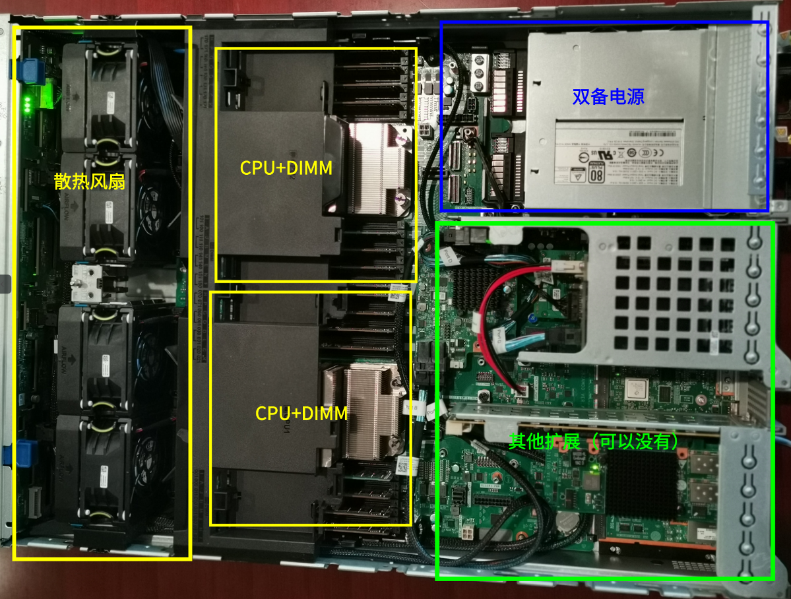

.. Copyright by Kenneth Lee. All Right Reserved.

综述
====

SoC
----

鲲鹏920是一个服务器SoC。

        | SoC
        | System on Chip。这是一个指向不是非常明确的概念。
        | 传统上，人们把CPU和外部设备分别做成不同的芯片，
        | 所以一个系统（System）通常包含很多不同的Chip，
        | 如果我们把系统的很多功能都做到同一个Chip上，
        | 人们就把这样的Chip，称为一个SoC。

        | Chip
        | 一般翻译为“芯片”。这是一个指向不是非常明确的概念。
        | 传统上，制造芯片的工厂先在一个称为晶元的基板上通过
        | 蚀刻等工艺得到一组物理电路，然后切割为多个独立的“晶片（DIE）”，
        | 最后使用树脂等材料进行封装并引线到封装外，
        | 从而得到的“方片”，称为一个Chip。但随着生产工艺的发展，
        | 这个过程可以有很多的变化，比如，可以把多个DIE合并封装在一起，
        | 这仍会称为一个Chip。

为了理解它作为一个SoC的意义，我们可以看看上一章提到的5885Hv5的内部布局：

todo：需要一幅图，展示网卡，桥片，存储卡等等单元的位置。

而下面这个是使用鲲鹏920的泰山服务器的布局：

        注：开放版本临时用图

下面是露出单板的示意：

        注：开放版本临时用图

服务器主要包含三个基本功能：计算，存储和网络。鲲鹏920基本上把这些功能都直接集成
到芯片内部了，所以单板上不再有桥片和其他的外接设备，全部空间都可以留给物理设备。

下面是一张Kunpeng 920的内部结构图，可以看到相关的功能是如何被集成到芯片中的。

todo：需要一张展示不同功能处于什么位置的芯片示意图。最好是生产或者设计过程中的某种不反映技术细节的图

通过SoC的设计，鲲鹏可以提升服务器的集成度和功耗水平。比如它可以实现只有300mm深
的机柜，不需要为其他外设留空间。另一方面，设计成SoC是有代价的，它降低了灵活性。
换句话说，即使不需要这些外设，在使用这个SoC的时候，它们都在芯片里了。

为了改进灵活性上的问题，鲲鹏使用一种称为“乐高”的架构方式。它的CPU和IO设备是分别
制作的，这种制作出来的单个未封装的芯片，在制造上称为DIE，而在鲲鹏的架构中称为
Super Cluster。鲲鹏可以通过对Super Cluster做不同的组合形成不同配置的封装。

        | DIE
        | DIE是芯片制作的概念。芯片在整片的晶元上被制作，再进行切割，
        | 变成单个的芯片，再进行封装，成为一般人平时能看到的芯片，
        | 这种单个的芯片，称为DIE。

比如一个鲲鹏920 SoC就包含了两个Super CPU Cluster和一个Super IO Cluster。而在其
他低端的芯片中，它可以提供一个Super CPU Cluster和一个Super IO Cluster。甚至还有
一些用做IO扩展器的设备，可以仅包含一个Super IO Cluster。

一个SCCL提供最大24个CPU核，所以一个鲲鹏920 SoC里可以包含最大48个CPU核，如果使用
四个鲲鹏920构成一台服务器，这台服务器就可以有192个核，同时，还会有4个Super IO
Cluster，其中的网卡，存储控制器等，都会有4份。每个Chip的SCCL带有多个内存控制器，
但最终引线出来总共可以提供8个内存通道，完整可以插入32条DIMM。通过总线，可以连成
一个完整的平衡系统。

        注：开放版本临时用图，正式版本会修改

构架兼容
--------

鲲鹏920对很多标准兼容，比如ARMv8架构，ARM GIC，SMMU，RAS兼容，PCIE, SAS, SATA标
准兼容等等。这些都是架构兼容。

架构兼容类似软件的API/ABI兼容，表示和所有一样提供这种兼容的部件提供相同的承诺，
这可以图示如下：

.. figure:: arch_compatible.svg

架构的使用者可以和任何一个架构的实现者配合，这为壮大整个生态提供了可能。深入一
点考虑这个问题，架构其实是设计的一部分。某个架构实现者提供了100个功能，其中50个
是架构定义里面定义的，架构的使用者为了保证架构兼容，只能使用那50个，这影响了架构
使用者的竞争力，但如果架构使用者使用了另外那些架构外的特性，它未来就不能被使用在
其他的架构实现者上面了。这是个两难。所以，架构定义其实是一种高级别的设计，对比
架构实现，有点类似前文提到的架构分支和战地分支。

在我们后面的介绍中，很多特性是这些兼容构架定义的特性，也有很多是这些特性的实现
方法和鲲鹏自己定义的特性。我们不刻意区分它们，因为我们重点是讨论服务器设计本身
的考量。但如果我们介绍的是某个完整的特性，我们会尽量说明这个特性是什么架构标准
中定义的，以便读者更容易意识到架构在这些地方起了什么作用。
