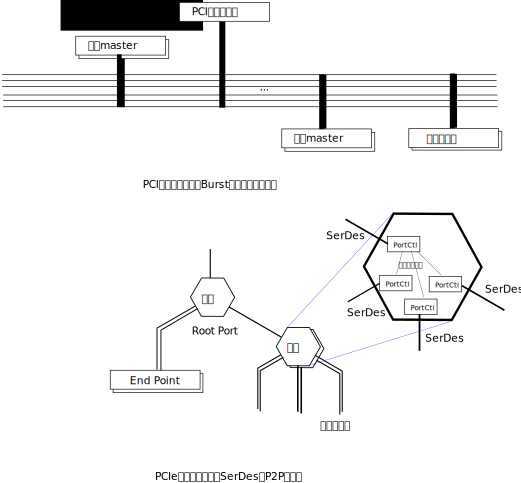
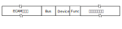
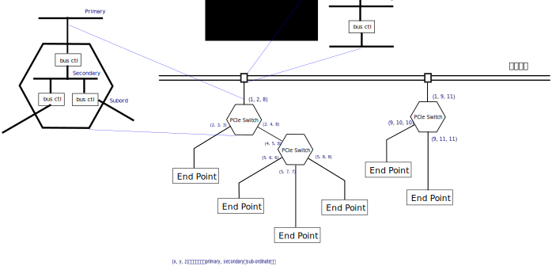
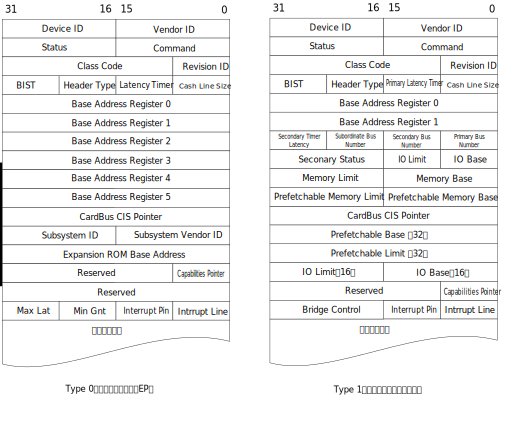
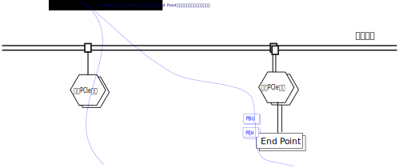
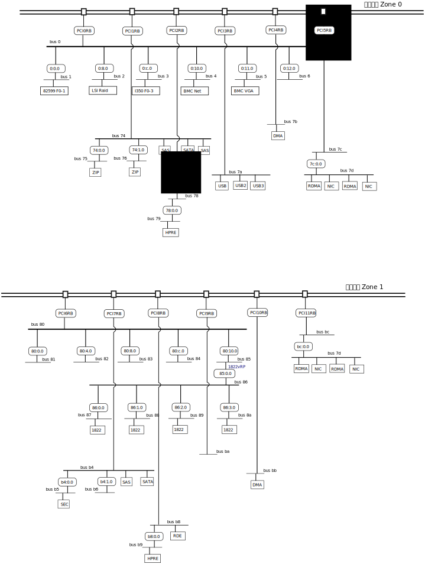

.. Copyright by Kenneth Lee. 2020. All Right Reserved.

设备和设备总线
==============

前面介绍总线的时候我们介绍了鲲鹏的总线结构，本章我们看看设备是怎么连到总线上的。

忽略一些非关键功能的辅助设备，基于鲲鹏920构成的系统主要有两种类型的设备，一种内
置在SoC内，直接连接在NoC上。另一种是片外的，这些设备主要通过PCIe总线接入系统。
还有一些非高速设备使用其他一些特殊手段连接的，那些不是设计的重点，我们先忽略，
等需要介绍特定的设计的时候再讨论。

为了软件编程的方便，鲲鹏920的片内设备也提供PCIe一样的编程接口，所以，要理解这些
设备的设计，我们也需要先了解PCIe的工作原理。

PCIe
-----

PCIe从PCI接口发展而来，它向前兼容PCI的软硬件接口，旧的PCI接口卡可以插到PCIe的硬
件插槽中，旧的PCI驱动也可以直接驱动这些设备。这一方面带来了生态上的稳定，但另一
方面也带来很多不必要的负担。

正如我们前面提到的，PCIe对于PCI的一大升级是从并行总线换成了基于Serdes的多Lane
P2P串行总线。图示如下：



所以PCIe总线和鲲鹏的系统总线不同，它是一个树状的分层架构：

.. figure:: pcie-arch.svg

其中的RC是一个虚拟的概念，相当于软件对于PCI设备访问的一个抽象，实现相关，之后是
链接出去的独立的终点（EP，End Point）或者网桥，网桥复制这个结构，就形成整个网络
了。

这样的网络结构在理解上反而相对简单，不会像PCI总线那样，每个高层语义都要转化为物
理信号。PCIe的高层语义直接可以建立在通讯语义的基础上。这个协议上分成三层：

* 会话层：定义总线不同业务，比如内存/IO访问，中断，低功耗处理等的通讯和消息协议

* 数据链路层：定义会话，链路，通道等协议

* 物理层：定义Serdes层的协议要求

用户能感知的是会话层，直接决定功能。数据链路层，对使用者的感知呈现为对设备QoS的
控制，通过配置总线属性来访问。而物理层，基本上对用户不可见。

正因为这样一个架构，鲲鹏920的片内设备很容易就封装为会话层接口，对软件提供PCIe的
设备语义。有些协议，比如CCIX，可以工作在PCIe的数据链路层上，替换了会话层，只要
修改一下PCIe控制器的工作模式，就可以让部分端口工作在CCIX模式上了。


地址空间
````````

前面说过，PCI/PCIe的最大特点是提供了系统总线一样的语义，可以直接通过地址访问直
接访问每个设备。

但对于PCIe总线，这个问题比一般的系统总线设备会复杂得多。系统总线是固定的，有多
少设备一开始就可以知道，配合DAW机制，我们可以给每个设备固定的地址空间。而对于
PCIe的网桥，我们可以给它一个地址空间。但当数据发到这个网桥本身的时候，它怎么知道
这个数据属于下属的哪个设备或者哪个网桥呢？

这涉及PCIe总线控制器的枚举过程，BIOS或者OS在使用PCIE设备前，需要扫描整个总线结
构，找到每个通讯节点，给它指定地址，这样未来再发地址请求过来，PCIe的设备和网桥
就知道如何处理这个地址了。

PCIe控制器支持三种地址：

* 配置地址，这在PCI标准中称为配置空间，在PCIe中作了扩展，称为ECAM空间，Enhanced
  Configuration Access echanism。在本文中，在不会引起误会的情况下，我们混用这两
  个概念，两者是兼容的。

* 内存地址，这个访问的可能是内存，也可能是MMIO

* IO地址，这个是为了兼容传统有独立IO访问指令的处理器设计的。

前面我们说过，早期的CPU常常用不同的指令访问内存和IO。新的处理器就只用MMIO，内存
和IO是统一编址的。但PCIe兼容PCI，还支持传统的IO地址。所以这里的三个地址其实有三
种地址方式，其中配置地址可以映射为IO空间的地址，或者MMIO空间的地址，在鲲鹏中，
主要就是MMIO的地址。而内存地址主要就是指总线的物理地址。而IO地址，需要CPU中用io
指令发出这样的请求。在鲲鹏中，会把这个地址空间映射为一段MMIO的空间。

下面是使用鲲鹏920的泰山服务器Linux 5.0内核启动时打印的IO空间对内存空间的映射：::

        Remapped I/O 0x00000000efff0000 to [io  0x0000-0xffff window]
        Remapped I/O 0x00000000ffff0000 to [io  0x10000-0x1ffff window]
        
代码在drivers/acpi/pci_root.c:acpi_pci_root_remap_iospace()中。它从ACPI的配置表
中得到对应的物理空间，映射到内核虚拟空间中，以便在设备要求用IO的方式访问的时候
可以通过MMIO访问这个虚拟地址空间实现对应的IO请求。

ECAM空间是分配给PCIe控制器的物理地址的一部分，系统可以选择有一个或者多个ECAM空
间。

下面是使用鲲鹏920的泰山服务器Linux 5.0内核启动时打印的所有ECAM空间：::

         acpi PNP0A08:00: ECAM at [mem 0xd0000000-0xd3ffffff] for [bus 00-3f]
         acpi PNP0A08:01: ECAM at [mem 0xd7b00000-0xd7bfffff] for [bus 7b]
         acpi PNP0A08:02: ECAM at [mem 0xd7a00000-0xd7afffff] for [bus 7a]
         acpi PNP0A08:03: ECAM at [mem 0xd7800000-0xd79fffff] for [bus 78-79]
         acpi PNP0A08:04: ECAM at [mem 0xd7c00000-0xd7dfffff] for [bus 7c-7d]
         acpi PNP0A08:05: ECAM at [mem 0xd7400000-0xd76fffff] for [bus 74-76]
         acpi PNP0A08:06: ECAM at [mem 0xd8000000-0xd9ffffff] for [bus 80-9f]
         acpi PNP0A08:07: ECAM at [mem 0xdbb00000-0xdbbfffff] for [bus bb]
         acpi PNP0A08:08: ECAM at [mem 0xdba00000-0xdbafffff] for [bus ba]
         acpi PNP0A08:09: ECAM at [mem 0xdb800000-0xdb9fffff] for [bus b8-b9]
         acpi PNP0A08:0a: ECAM at [mem 0xdbc00000-0xdbdfffff] for [bus bc-bd]
         acpi PNP0A08:0b: ECAM at [mem 0xdb400000-0xdb6fffff] for [bus b4-b6]

注意了，这个看起来包含了多个ECAM空间，其实只是一个配置空间，这个空间的首地址在
0xd0000000，其他的地址是以Bus ID为区分的，比如PNP0A08:01的总线是7b，它的配置空间
首地址就在0xd0000000+0x7b00000的位置上。

PCIe控制器先用ECAM空间来保证CPU可以找到每个设备，然后再配置每个设备的其他地址。
为了从ECAM中定位到设备，从PCI开始就引入了一个Bus-Device-Function的概念，用来区
分地址上的不同设备：

* Bus：总线编号，用于唯一标识系统中的总线

* Device：EP的编号，用于标识一个网桥上的一个设备

* Function：EP内一个独立的功能的编号，这用于一个硬件有多个功能的情形，比如一张
  同时支持Ethernet和RoCE的网卡，就包含两个Function了。

Bus-Device-Function简称BDF，可以唯一定位一个设备，一般用b:d.f这种格式表示。把
BDF和ECAM的首地址组合起来，我们就可以组成一个地址，用于唯一定位一个设备的配置空
间：



所以，如果我们知道BDF，和ECAM的首地址，我们就可以访问一个设备的配置空间——如果这
个设备存在的话。

我们用PCIe的一个例子看看具体的BDF是如何指配的。下图给出这样一个示例：



由于PCIe是个P2P的总线，网桥内部实际是报文的重新调度，而没有原来PCI总线的意义了
，PCIe标准虚拟化地认为总线仍是存在的，网桥内部包含多个总线控制器。而控制器也是
一个设备，这个设备的上游总线称为Primary Bus，下游总线称为Secondary Bus。

这样网桥内部其实可以认为包含了一条Secondary Bus和多个总线控制器，虽然其实物理上
它只是多个端口之间的调度。这样，基于ECAM空间加上BDF，我们总是可以试验出所有可以
访问的设备的。下面是这个过程的一个示例：

1. 扫描程序访问0:0.0，0:1.0, 0:2.0……的配置空间，看能否读到其中的Vendor寄存器，
   这样我们就可以刺探到这个设备是否真实存在。如果设备存在，而且类型是个EP，这个
   设备就找到了。如果这个设备又是一个总线控制器，我们进入总线设置的过程。
   
2. 假设这个总线控制器的BDF=0:x.0，根据约定，我们设置它的Primary是0，Secondary
   是我们要指派的总线号，我们分配1给它，我们就又得到一个总线1，我们可以用第一步
   一样的方法扫描1:0.0, 1:1.0, 1:2.0……得到这条总线上的设备或者总线控制器。

3. 等我们深度优先扫描完一条总线，我们也知道每个网桥的Sub Ordinary应该是多少了，
   把这个结果配置上，我们就得到这个根桥中所有总线对象的配置空间的地址了。之后的
   问题是怎么访问这些空间的问题而已。

配置空间的格式如下：



PCI和PCIE对每个配置空间预留的大小是不同的，但它们的头部都是一样的。

扫描的过程通常由BIOS和OS共同完成。BIOS可以是要进行第一轮扫描和指配的，否则它无
法找到相关的设备完成启动过程。比如如果启动设备挂在PCIe总线上，BIOS不做这个扫描
就无法完成启动过程。但进入OS后，OS不一定会认可这个扫描结果，它可能全部或者部分
重新扫描，这都和具体的设计相关。

除了ECAM空间，现在只剩下设备本身的IO地址或者MMIO地址问题了。由于我们已经有了所
有设备和网桥的配置空间，只要软件对分配给这个总线控制器的物理空间进行分配，然后
写到对应设备的BAR寄存器（Base Address Register）中即可。而网桥则需要配置哪部分
地址需要下发给它的下游，就可以支持这个通讯。

要注意的是，地址请求不但可以从PCIe空间之外的其他设备发起，也可以从PCIe空间之内
的设备发起。


鲲鹏920的实际和虚拟PCIe接口
---------------------------

鲲鹏的920的每个SICL中包含一个PCI_ICL提供PCIe控制器，同时在每个主要的片上设备中
嵌入PEH和PBU提供PCIe的会话层响应，从总线访问接口看来，这些设备都连在同一个RC上
。

鲲鹏920在每个ICL中内置了一些PEH或者PBU单元，在会话层提供PCIe的配置和访问语义。

        | PEH
        | PCI Endpoint Header，是嵌入到每个鲲鹏920内部设备上的PCI EP模拟单元

        | PBU
        | PCI Bridge Unit，是嵌入到鲲鹏920内部设备中用于模拟PCI网桥的单元

这个原理图示如下：



整个系统构成一个单一RC的结构，总线的DAW机制提供第一级的地址控制行为。BIOS配置
DAW把各个根桥的地址分配到不同的Station上，之后不同的地址空间就可以走到不同的设
备上了。

总线地址完成分配后，在Linux中可以通过lspci看到整个分配的过程。比如，下面是一个
插了外置设备的泰山服务器的lspci结果：

        ::
        00:00.0 PCI bridge: Huawei Technologies Co., Ltd. HiSilicon PCIe Root Port with Gen4 (rev 21)
        00:08.0 PCI bridge: Huawei Technologies Co., Ltd. HiSilicon PCIe Root Port with Gen4 (rev 21)
        00:0c.0 PCI bridge: Huawei Technologies Co., Ltd. HiSilicon PCIe Root Port with Gen4 (rev 21)
        00:10.0 PCI bridge: Huawei Technologies Co., Ltd. HiSilicon PCIe Root Port with Gen4 (rev 21)
        00:11.0 PCI bridge: Huawei Technologies Co., Ltd. HiSilicon PCIe Root Port with Gen4 (rev 21)
        00:12.0 PCI bridge: Huawei Technologies Co., Ltd. HiSilicon PCIe Root Port with Gen4 (rev 21)
        01:00.0 Ethernet controller: Intel Corporation 82599ES 10-Gigabit SFI/SFP+ Network Connection (rev 01)
        01:00.1 Ethernet controller: Intel Corporation 82599ES 10-Gigabit SFI/SFP+ Network Connection (rev 01)
        02:00.0 RAID bus controller: LSI Logic / Symbios Logic MegaRAID Tri-Mode SAS3508 (rev 01)
        03:00.0 Ethernet controller: Intel Corporation I350 Gigabit Network Connection (rev 01)
        03:00.1 Ethernet controller: Intel Corporation I350 Gigabit Network Connection (rev 01)
        03:00.2 Ethernet controller: Intel Corporation I350 Gigabit Network Connection (rev 01)
        03:00.3 Ethernet controller: Intel Corporation I350 Gigabit Network Connection (rev 01)
        04:00.0 Signal processing controller: Huawei Technologies Co., Ltd. iBMA Virtual Network Adapter (rev 01)
        05:00.0 VGA compatible controller: Huawei Technologies Co., Ltd. Hi1710 [iBMC Intelligent Management system chip w/VGA support] (rev 01)
        74:00.0 PCI bridge: Huawei Technologies Co., Ltd. HiSilicon PCI-PCI Bridge (rev 20)
        74:01.0 PCI bridge: Huawei Technologies Co., Ltd. HiSilicon PCI-PCI Bridge (rev 20)
        74:02.0 Serial Attached SCSI controller: Huawei Technologies Co., Ltd. HiSilicon SAS 3.0 HBA (rev 21)
        74:03.0 SATA controller: Huawei Technologies Co., Ltd. HiSilicon AHCI HBA (rev 21)
        74:04.0 Serial Attached SCSI controller: Huawei Technologies Co., Ltd. HiSilicon SAS 3.0 HBA (rev 21)
        75:00.0 Processing accelerators: Huawei Technologies Co., Ltd. HiSilicon ZIP Engine (rev 21)
        76:00.0 Network and computing encryption device: Huawei Technologies Co., Ltd. HiSilicon SEC Engine (rev 21)
        78:00.0 PCI bridge: Huawei Technologies Co., Ltd. HiSilicon PCI-PCI Bridge (rev 20)
        78:01.0 RAID bus controller: Huawei Technologies Co., Ltd. HiSilicon RDE Engine (rev 21)
        79:00.0 Network and computing encryption device: Huawei Technologies Co., Ltd. HiSilicon HPRE Engine (rev 21)
        7a:00.0 USB controller: Huawei Technologies Co., Ltd. Device a23b (rev 21)
        7a:01.0 USB controller: Huawei Technologies Co., Ltd. HiSilicon USB 2.0 2-port Host Controller (rev 21)
        7a:02.0 USB controller: Huawei Technologies Co., Ltd. HiSilicon USB 3.0 Host Controller (rev 21)
        7b:00.0 System peripheral: Huawei Technologies Co., Ltd. HiSilicon Embedded DMA Engine (rev 21)
        7c:00.0 PCI bridge: Huawei Technologies Co., Ltd. HiSilicon PCI-PCI Bridge (rev 20)
        7d:00.0 Ethernet controller: Huawei Technologies Co., Ltd. HNS GE/10GE/25GE RDMA Network Controller (rev 21)
        7d:00.1 Ethernet controller: Huawei Technologies Co., Ltd. HNS GE/10GE/25GE Network Controller (rev 21)
        7d:00.2 Ethernet controller: Huawei Technologies Co., Ltd. HNS GE/10GE/25GE RDMA Network Controller (rev 21)
        7d:00.3 Ethernet controller: Huawei Technologies Co., Ltd. HNS GE/10GE/25GE Network Controller (rev 21)
        80:00.0 PCI bridge: Huawei Technologies Co., Ltd. HiSilicon PCIe Root Port with Gen4 (rev 21)
        80:04.0 PCI bridge: Huawei Technologies Co., Ltd. HiSilicon PCIe Root Port with Gen4 (rev 21)
        80:08.0 PCI bridge: Huawei Technologies Co., Ltd. HiSilicon PCIe Root Port with Gen4 (rev 21)
        80:0c.0 PCI bridge: Huawei Technologies Co., Ltd. HiSilicon PCIe Root Port with Gen4 (rev 21)
        80:10.0 PCI bridge: Huawei Technologies Co., Ltd. HiSilicon PCIe Root Port with Gen4 (rev 21)
        85:00.0 PCI bridge: Huawei Technologies Co., Ltd. Hi1822 Family Virtual Bridge (rev 45)
        86:00.0 PCI bridge: Huawei Technologies Co., Ltd. Hi1822 Family Virtual Bridge (rev 45)
        86:01.0 PCI bridge: Huawei Technologies Co., Ltd. Hi1822 Family Virtual Bridge (rev 45)
        86:02.0 PCI bridge: Huawei Technologies Co., Ltd. Hi1822 Family Virtual Bridge (rev 45)
        86:03.0 PCI bridge: Huawei Technologies Co., Ltd. Hi1822 Family Virtual Bridge (rev 45)
        87:00.0 Ethernet controller: Huawei Technologies Co., Ltd. Hi1822 Family (4*25GE) (rev 45)
        88:00.0 Ethernet controller: Huawei Technologies Co., Ltd. Hi1822 Family (4*25GE) (rev 45)
        89:00.0 Ethernet controller: Huawei Technologies Co., Ltd. Hi1822 Family (4*25GE) (rev 45)
        8a:00.0 Ethernet controller: Huawei Technologies Co., Ltd. Hi1822 Family (4*25GE) (rev 45)
        b4:00.0 PCI bridge: Huawei Technologies Co., Ltd. HiSilicon PCI-PCI Bridge (rev 20)
        b4:01.0 PCI bridge: Huawei Technologies Co., Ltd. HiSilicon PCI-PCI Bridge (rev 20)
        b4:02.0 Serial Attached SCSI controller: Huawei Technologies Co., Ltd. HiSilicon SAS 3.0 HBA (rev 21)
        b4:03.0 SATA controller: Huawei Technologies Co., Ltd. HiSilicon AHCI HBA (rev 21)
        b4:04.0 Serial Attached SCSI controller: Huawei Technologies Co., Ltd. HiSilicon SAS 3.0 HBA (rev 21)
        b5:00.0 Processing accelerators: Huawei Technologies Co., Ltd. HiSilicon ZIP Engine (rev 21)
        b6:00.0 Network and computing encryption device: Huawei Technologies Co., Ltd. HiSilicon SEC Engine (rev 21)
        b8:00.0 PCI bridge: Huawei Technologies Co., Ltd. HiSilicon PCI-PCI Bridge (rev 20)
        b8:01.0 RAID bus controller: Huawei Technologies Co., Ltd. HiSilicon RDE Engine (rev 21)
        b9:00.0 Network and computing encryption device: Huawei Technologies Co., Ltd. HiSilicon HPRE Engine (rev 21)
        bb:00.0 System peripheral: Huawei Technologies Co., Ltd. HiSilicon Embedded DMA Engine (rev 21)
        bc:00.0 PCI bridge: Huawei Technologies Co., Ltd. HiSilicon PCI-PCI Bridge (rev 20)
        bd:00.0 Ethernet controller: Huawei Technologies Co., Ltd. HNS GE/10GE/25GE RDMA Network Controller (rev 21)
        bd:00.1 Ethernet controller: Huawei Technologies Co., Ltd. HNS GE/10GE/25GE Network Controller (rev 21)
        bd:00.2 Ethernet controller: Huawei Technologies Co., Ltd. HNS GE/10GE/25GE RDMA Network Controller (rev 21)
        bd:00.3 Ethernet controller: Huawei Technologies Co., Ltd. HNS GE/10GE/25GE Network Controller (rev 21)

把它绘制成一个完整的连接图，就是这样的：



可以看到两个不同的SICL构成了两个NUMA域，PCI0和6是真正的PCIe端口，连接外部设备，
其他的外设，以ICL单位，连入不同的根桥。


中断处理
---------

IO虚拟化
--------
todo

