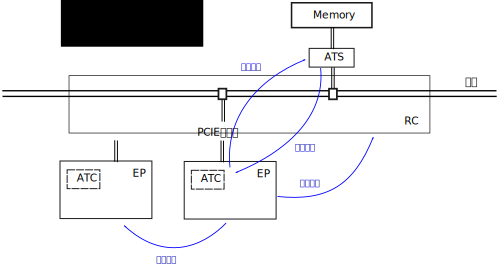

.. Copyright by Kenneth Lee. 2020. All Right Reserved.

设备和设备总线
==============

前面介绍总线的时候我们介绍了鲲鹏的总线结构，本章我们看看设备是怎么连到总线上的。

忽略一些非关键功能的辅助设备，基于鲲鹏920构成的系统主要有两种类型的设备，一种内
置在SoC内，直接连接在NoC上。另一种是片外的，这些设备主要通过PCIe总线接入系统。
还有一些非高速设备使用其他一些特殊手段连接的，那些不是设计的重点，我们先忽略，
等需要介绍特定的设计的时候再讨论。

为了软件编程的方便，鲲鹏920的片内设备也提供PCIe一样的编程接口，所以，要理解这些
设备的设计，我们也需要先了解PCIe的工作原理。

PCIe
-----

PCIe从PCI接口发展而来，它向前兼容PCI的软硬件接口，旧的PCI接口卡可以插到PCIe的硬
件插槽中，旧的PCI驱动也可以直接驱动这些设备。这一方面带来了生态上的稳定，但另一
方面也带来很多不必要的负担。

正如我们前面提到的，PCIe对于PCI的一大升级是从并行总线换成了基于Serdes的多Lane
P2P串行总线。图示如下：

.. figure:: pci_vs_pcie.svg

所以PCIe总线和鲲鹏的系统总线不同，它是一个树状的分层架构：


其中的RC是一个虚拟的概念，相当于软件对于PCI设备访问的一个抽象，实现相关，之后是
链接出去的独立的终点（EP，End Point）或者网桥，网桥复制这个结构，就形成整个网络
了。

这样的网络结构在理解上反而相对简单，不会像PCI总线那样，每个高层语义都要转化为物
理信号。PCIe的高层语义直接可以建立在通讯语义的基础上。这个协议上分成三层：

* 会话层：定义总线不同业务，比如内存/IO访问，中断，低功耗处理等的通讯和消息协议

* 数据链路层：定义会话，链路，通道等协议

* 物理层：定义Serdes层的协议要求

用户能感知的是会话层，直接决定功能。数据链路层，对使用者的感知呈现为对设备QoS的
控制，通过配置总线属性来访问。而物理层，基本上对用户不可见。

正因为这样一个架构，鲲鹏920的片内设备很容易就封装为会话层接口，对软件提供PCIe的
设备语义。有些协议，比如CCIX，可以工作在PCIe的数据链路层上，替换了会话层，只要
修改一下PCIe控制器的工作模式，就可以让部分端口工作在CCIX模式上了。


地址空间
````````

前面说过，PCI/PCIe的最大特点是提供了系统总线一样的语义，可以直接通过地址访问直
接访问每个设备。

但对于PCIe总线，这个问题比一般的系统总线设备会复杂得多。系统总线是固定的，有多
少设备一开始就可以知道，配合DAW机制，我们可以给每个设备固定的地址空间。而对于
PCIe的网桥，我们可以给它一个地址空间。但当数据发到这个网桥本身的时候，它怎么知
道这个数据属于下属的哪个设备或者哪个网桥呢？

这涉及PCIe总线控制器的枚举过程，BIOS或者OS在使用PCIE设备前，需要扫描整个总线结
构，找到每个通讯节点，给它指定地址，这样未来再发地址请求过来，PCIe的设备和网桥
就知道如何处理这个地址了。

PCIe控制器支持三种地址：

* 配置地址，这在PCI标准中称为配置空间，在PCIe中作了扩展，称为ECAM空间，Enhanced
  Configuration Access echanism。在本文中，在不会引起误会的情况下，我们混用这两
  个概念，两者是兼容的。

* 内存地址，这个访问的可能是内存，也可能是MMIO

* IO地址，这个是为了兼容传统有独立IO访问指令的处理器设计的。

前面我们说过，早期的CPU常常用不同的指令访问内存和IO。新的处理器就只用MMIO，内存
和IO是统一编址的。但PCIe兼容PCI，还支持传统的IO地址。所以这里的三个地址其实有三
种地址方式，其中配置地址可以映射为IO空间的地址，或者MMIO空间的地址，在鲲鹏中，
主要就是MMIO的地址。而内存地址主要就是指总线的物理地址。而IO地址，需要CPU中用io
指令发出这样的请求。在鲲鹏中，会把这个地址空间映射为一段MMIO的空间。

下面是使用鲲鹏920的泰山服务器Linux 5.0内核启动时打印的IO空间对内存空间的映射：::

        Remapped I/O 0x00000000efff0000 to [io  0x0000-0xffff window]
        Remapped I/O 0x00000000ffff0000 to [io  0x10000-0x1ffff window]
        
代码在drivers/acpi/pci_root.c:acpi_pci_root_remap_iospace()中。它从ACPI的配置表
中得到对应的物理空间，映射到内核虚拟空间中，以便在设备要求用IO的方式访问的时候
可以通过MMIO访问这个虚拟地址空间实现对应的IO请求。

ECAM空间是分配给PCIe控制器的物理地址的一部分，系统可以选择有一个或者多个ECAM空
间。

下面是使用鲲鹏920的泰山服务器Linux 5.0内核启动时打印的所有ECAM空间：::

         acpi PNP0A08:00: ECAM at [mem 0xd0000000-0xd3ffffff] for [bus 00-3f]
         acpi PNP0A08:01: ECAM at [mem 0xd7b00000-0xd7bfffff] for [bus 7b]
         acpi PNP0A08:02: ECAM at [mem 0xd7a00000-0xd7afffff] for [bus 7a]
         acpi PNP0A08:03: ECAM at [mem 0xd7800000-0xd79fffff] for [bus 78-79]
         acpi PNP0A08:04: ECAM at [mem 0xd7c00000-0xd7dfffff] for [bus 7c-7d]
         acpi PNP0A08:05: ECAM at [mem 0xd7400000-0xd76fffff] for [bus 74-76]
         acpi PNP0A08:06: ECAM at [mem 0xd8000000-0xd9ffffff] for [bus 80-9f]
         acpi PNP0A08:07: ECAM at [mem 0xdbb00000-0xdbbfffff] for [bus bb]
         acpi PNP0A08:08: ECAM at [mem 0xdba00000-0xdbafffff] for [bus ba]
         acpi PNP0A08:09: ECAM at [mem 0xdb800000-0xdb9fffff] for [bus b8-b9]
         acpi PNP0A08:0a: ECAM at [mem 0xdbc00000-0xdbdfffff] for [bus bc-bd]
         acpi PNP0A08:0b: ECAM at [mem 0xdb400000-0xdb6fffff] for [bus b4-b6]

注意了，这个看起来包含了多个ECAM空间，其实只是一个配置空间，这个空间的首地址在
0xd0000000，其他的地址是以Bus ID为区分的，比如PNP0A08:01的总线是7b，它的配置空间
首地址就在0xd0000000+0x7b00000的位置上。

PCIe控制器先用ECAM空间来保证CPU可以找到每个设备，然后再配置每个设备的其他地址。
为了从ECAM中定位到设备，从PCI开始就引入了一个Bus-Device-Function的概念，用来区
分地址上的不同设备：

* Bus：总线编号，用于唯一标识系统中的总线

* Device：EP的编号，用于标识一个网桥上的一个设备

* Function：EP内一个独立的功能的编号，这用于一个硬件有多个功能的情形，比如一张
  同时支持Ethernet和RoCE的网卡，就包含两个Function了。

Bus-Device-Function简称BDF，可以唯一定位一个设备，一般用b:d.f这种格式表示。把
BDF和ECAM的首地址组合起来，我们就可以组成一个地址，用于唯一定位一个设备的配置空
间：


所以，如果我们知道BDF，和ECAM的首地址，我们就可以访问一个设备的配置空间——如果这
个设备存在的话。

我们用PCIe的一个例子看看具体的BDF是如何指配的。下图给出这样一个示例：

.. figure:: pci_bus_id_allocation.svg

由于PCIe是个P2P的总线，网桥内部实际是报文的重新调度，而没有原来PCI总线的意义了
，PCIe标准虚拟化地认为总线仍是存在的，网桥内部包含多个总线控制器。而控制器也是
一个设备，这个设备的上游总线称为Primary Bus，下游总线称为Secondary Bus。

这样网桥内部其实可以认为包含了一条Secondary Bus和多个总线控制器，虽然其实物理上
它只是多个端口之间的调度。这样，基于ECAM空间加上BDF，我们总是可以试验出所有可以
访问的设备的。下面是这个过程的一个示例：

1. 扫描程序访问0:0.0，0:1.0, 0:2.0……的配置空间，看能否读到其中的Vendor寄存器，
   这样我们就可以刺探到这个设备是否真实存在。如果设备存在，而且类型是个EP，这个
   设备就找到了。如果这个设备又是一个总线控制器，我们进入总线设置的过程。
   
2. 假设这个总线控制器的BDF=0:x.0，根据约定，我们设置它的Primary是0，Secondary
   是我们要指派的总线号，我们分配1给它，我们就又得到一个总线1，我们可以用第一步
   一样的方法扫描1:0.0, 1:1.0, 1:2.0……得到这条总线上的设备或者总线控制器。

3. 等我们深度优先扫描完一条总线，我们也知道每个网桥的Sub Ordinary应该是多少了，
   把这个结果配置上，我们就得到这个根桥中所有总线对象的配置空间的地址了。之后的
   问题是怎么访问这些空间的问题而已。

配置空间的格式如下：

.. figure:: pci_config_space.svg

PCI和PCIE对每个配置空间预留的大小是不同的，但它们的头部都是一样的。

扫描的过程通常由BIOS和OS共同完成。BIOS可以是要进行第一轮扫描和指配的，否则它无
法找到相关的设备完成启动过程。比如如果启动设备挂在PCIe总线上，BIOS不做这个扫描
就无法完成启动过程。但进入OS后，OS不一定会认可这个扫描结果，它可能全部或者部分
重新扫描，这都和具体的设计相关。

除了ECAM空间，现在只剩下设备本身的IO地址或者MMIO地址问题了。由于我们已经有了所
有设备和网桥的配置空间，只要软件对分配给这个总线控制器的物理空间进行分配，然后
写到对应设备的BAR寄存器（Base Address Register）中即可。而网桥则需要配置哪部分
地址需要下发给它的下游，就可以支持这个通讯。

要注意的是，地址请求不但可以从PCIe空间之外的其他设备发起，也可以从PCIe空间之内
的设备发起。


鲲鹏920的实际和虚拟PCIe接口
---------------------------

鲲鹏的920的每个SICL中包含一个PCI_ICL提供PCIe控制器，同时在每个主要的片上设备中
嵌入PEH和PBU提供PCIe的会话层响应，从总线访问接口看来，这些设备都连在同一个RC上
。

鲲鹏920在每个ICL中内置了一些PEH或者PBU单元，在会话层提供PCIe的配置和访问语义。

        | PEH
        | PCI Endpoint Header，是嵌入到每个鲲鹏920内部设备上的PCI EP模拟单元

        | PBU
        | PCI Bridge Unit，是嵌入到鲲鹏920内部设备中用于模拟PCI网桥的单元

这个原理图示如下：

.. figure:: kp920_pci_vpci_arch.svg

整个系统构成一个单一RC的结构，总线的DAW机制提供第一级的地址控制行为。BIOS配置
DAW把各个根桥的地址分配到不同的Station上，之后不同的地址空间就可以走到不同的设
备上了。

总线地址完成分配后，在Linux中可以通过lspci看到整个分配的过程。比如，下面是一个
插了外置设备的泰山服务器的lspci结果：::

        00:00.0 PCI bridge: Huawei Technologies Co., Ltd. HiSilicon PCIe Root Port with Gen4 (rev 21)
        00:08.0 PCI bridge: Huawei Technologies Co., Ltd. HiSilicon PCIe Root Port with Gen4 (rev 21)
        00:0c.0 PCI bridge: Huawei Technologies Co., Ltd. HiSilicon PCIe Root Port with Gen4 (rev 21)
        00:10.0 PCI bridge: Huawei Technologies Co., Ltd. HiSilicon PCIe Root Port with Gen4 (rev 21)
        00:11.0 PCI bridge: Huawei Technologies Co., Ltd. HiSilicon PCIe Root Port with Gen4 (rev 21)
        00:12.0 PCI bridge: Huawei Technologies Co., Ltd. HiSilicon PCIe Root Port with Gen4 (rev 21)
        01:00.0 Ethernet controller: Intel Corporation 82599ES 10-Gigabit SFI/SFP+ Network Connection (rev 01)
        01:00.1 Ethernet controller: Intel Corporation 82599ES 10-Gigabit SFI/SFP+ Network Connection (rev 01)
        02:00.0 RAID bus controller: LSI Logic / Symbios Logic MegaRAID Tri-Mode SAS3508 (rev 01)
        03:00.0 Ethernet controller: Intel Corporation I350 Gigabit Network Connection (rev 01)
        03:00.1 Ethernet controller: Intel Corporation I350 Gigabit Network Connection (rev 01)
        03:00.2 Ethernet controller: Intel Corporation I350 Gigabit Network Connection (rev 01)
        03:00.3 Ethernet controller: Intel Corporation I350 Gigabit Network Connection (rev 01)
        04:00.0 Signal processing controller: Huawei Technologies Co., Ltd. iBMA Virtual Network Adapter (rev 01)
        05:00.0 VGA compatible controller: Huawei Technologies Co., Ltd. Hi1710 [iBMC Intelligent Management system chip w/VGA support] (rev 01)
        74:00.0 PCI bridge: Huawei Technologies Co., Ltd. HiSilicon PCI-PCI Bridge (rev 20)
        74:01.0 PCI bridge: Huawei Technologies Co., Ltd. HiSilicon PCI-PCI Bridge (rev 20)
        74:02.0 Serial Attached SCSI controller: Huawei Technologies Co., Ltd. HiSilicon SAS 3.0 HBA (rev 21)
        74:03.0 SATA controller: Huawei Technologies Co., Ltd. HiSilicon AHCI HBA (rev 21)
        74:04.0 Serial Attached SCSI controller: Huawei Technologies Co., Ltd. HiSilicon SAS 3.0 HBA (rev 21)
        75:00.0 Processing accelerators: Huawei Technologies Co., Ltd. HiSilicon ZIP Engine (rev 21)
        76:00.0 Network and computing encryption device: Huawei Technologies Co., Ltd. HiSilicon SEC Engine (rev 21)
        78:00.0 PCI bridge: Huawei Technologies Co., Ltd. HiSilicon PCI-PCI Bridge (rev 20)
        78:01.0 RAID bus controller: Huawei Technologies Co., Ltd. HiSilicon RDE Engine (rev 21)
        79:00.0 Network and computing encryption device: Huawei Technologies Co., Ltd. HiSilicon HPRE Engine (rev 21)
        7a:00.0 USB controller: Huawei Technologies Co., Ltd. Device a23b (rev 21)
        7a:01.0 USB controller: Huawei Technologies Co., Ltd. HiSilicon USB 2.0 2-port Host Controller (rev 21)
        7a:02.0 USB controller: Huawei Technologies Co., Ltd. HiSilicon USB 3.0 Host Controller (rev 21)
        7b:00.0 System peripheral: Huawei Technologies Co., Ltd. HiSilicon Embedded DMA Engine (rev 21)
        7c:00.0 PCI bridge: Huawei Technologies Co., Ltd. HiSilicon PCI-PCI Bridge (rev 20)
        7d:00.0 Ethernet controller: Huawei Technologies Co., Ltd. HNS GE/10GE/25GE RDMA Network Controller (rev 21)
        7d:00.1 Ethernet controller: Huawei Technologies Co., Ltd. HNS GE/10GE/25GE Network Controller (rev 21)
        7d:00.2 Ethernet controller: Huawei Technologies Co., Ltd. HNS GE/10GE/25GE RDMA Network Controller (rev 21)
        7d:00.3 Ethernet controller: Huawei Technologies Co., Ltd. HNS GE/10GE/25GE Network Controller (rev 21)
        80:00.0 PCI bridge: Huawei Technologies Co., Ltd. HiSilicon PCIe Root Port with Gen4 (rev 21)
        80:04.0 PCI bridge: Huawei Technologies Co., Ltd. HiSilicon PCIe Root Port with Gen4 (rev 21)
        80:08.0 PCI bridge: Huawei Technologies Co., Ltd. HiSilicon PCIe Root Port with Gen4 (rev 21)
        80:0c.0 PCI bridge: Huawei Technologies Co., Ltd. HiSilicon PCIe Root Port with Gen4 (rev 21)
        80:10.0 PCI bridge: Huawei Technologies Co., Ltd. HiSilicon PCIe Root Port with Gen4 (rev 21)
        85:00.0 PCI bridge: Huawei Technologies Co., Ltd. Hi1822 Family Virtual Bridge (rev 45)
        86:00.0 PCI bridge: Huawei Technologies Co., Ltd. Hi1822 Family Virtual Bridge (rev 45)
        86:01.0 PCI bridge: Huawei Technologies Co., Ltd. Hi1822 Family Virtual Bridge (rev 45)
        86:02.0 PCI bridge: Huawei Technologies Co., Ltd. Hi1822 Family Virtual Bridge (rev 45)
        86:03.0 PCI bridge: Huawei Technologies Co., Ltd. Hi1822 Family Virtual Bridge (rev 45)
        87:00.0 Ethernet controller: Huawei Technologies Co., Ltd. Hi1822 Family (4*25GE) (rev 45)
        88:00.0 Ethernet controller: Huawei Technologies Co., Ltd. Hi1822 Family (4*25GE) (rev 45)
        89:00.0 Ethernet controller: Huawei Technologies Co., Ltd. Hi1822 Family (4*25GE) (rev 45)
        8a:00.0 Ethernet controller: Huawei Technologies Co., Ltd. Hi1822 Family (4*25GE) (rev 45)
        b4:00.0 PCI bridge: Huawei Technologies Co., Ltd. HiSilicon PCI-PCI Bridge (rev 20)
        b4:01.0 PCI bridge: Huawei Technologies Co., Ltd. HiSilicon PCI-PCI Bridge (rev 20)
        b4:02.0 Serial Attached SCSI controller: Huawei Technologies Co., Ltd. HiSilicon SAS 3.0 HBA (rev 21)
        b4:03.0 SATA controller: Huawei Technologies Co., Ltd. HiSilicon AHCI HBA (rev 21)
        b4:04.0 Serial Attached SCSI controller: Huawei Technologies Co., Ltd. HiSilicon SAS 3.0 HBA (rev 21)
        b5:00.0 Processing accelerators: Huawei Technologies Co., Ltd. HiSilicon ZIP Engine (rev 21)
        b6:00.0 Network and computing encryption device: Huawei Technologies Co., Ltd. HiSilicon SEC Engine (rev 21)
        b8:00.0 PCI bridge: Huawei Technologies Co., Ltd. HiSilicon PCI-PCI Bridge (rev 20)
        b8:01.0 RAID bus controller: Huawei Technologies Co., Ltd. HiSilicon RDE Engine (rev 21)
        b9:00.0 Network and computing encryption device: Huawei Technologies Co., Ltd. HiSilicon HPRE Engine (rev 21)
        bb:00.0 System peripheral: Huawei Technologies Co., Ltd. HiSilicon Embedded DMA Engine (rev 21)
        bc:00.0 PCI bridge: Huawei Technologies Co., Ltd. HiSilicon PCI-PCI Bridge (rev 20)
        bd:00.0 Ethernet controller: Huawei Technologies Co., Ltd. HNS GE/10GE/25GE RDMA Network Controller (rev 21)
        bd:00.1 Ethernet controller: Huawei Technologies Co., Ltd. HNS GE/10GE/25GE Network Controller (rev 21)
        bd:00.2 Ethernet controller: Huawei Technologies Co., Ltd. HNS GE/10GE/25GE RDMA Network Controller (rev 21)
        bd:00.3 Ethernet controller: Huawei Technologies Co., Ltd. HNS GE/10GE/25GE Network Controller (rev 21)


把它绘制成一个完整的连接图，就是这样的：


可以看到两个不同的SICL构成了两个NUMA域，PCI0和6是真正的PCIe端口，连接外部设备，
其他的外设，以ICL单位，连入不同的根桥。


中断处理
---------

PCIe兼容旧式的INTx中断上报协议，但鲲鹏的根桥不需要实现这些复杂的兼容性功能，无
论是真实的PCIE根桥，还是片上设备的根桥，都是MSI-X接口，最终都变成内存地址的写请
求。所以，整个中断问题仅仅转化为设备写物理地址的问题了。


IO虚拟化
--------

IO虚拟化是在IO设备上进行特殊的设计以提高IO性能的方法。以网卡为例，比如系统中有
一张物理网卡，现在创建了两个虚拟机，VM1和VM2，每个都需要一张网卡，虚拟机可以怎
么做？

不依靠IO设备的支持，我们只能在虚拟机中模拟两个设备，设备的IO空间实现为不可访问
空间。当虚拟机访问这个空间的时候，从虚拟机退出到Hypervisor（虚拟机管理程序），
在Hypervisor中仿真这个IO行为。这个仿真过程很慢，但大部分时候是可以接受的，因为
真正的IO空间访问除了配置就是Doorbell，配置在初始化的时候才会做，而Doorbell只是
一个通知，真正的发送工作是从内存中把消息发出去。所以Hypervisor需要在网络协议栈
中仿真另一个设备（比如Linux中可以用veth仿真一个虚拟的Ethernet设备），模拟从外部
收到一个报文，然后经过Linux内核的调度过程，再发送到本地的应用上，或者转发到真实
的那个物理网口上，这个地方经过多次内存拷贝，也会降低系统的性能。

IO虚拟化的意思是：真实的物理设备的IO空间分成多份，给每个虚拟机一份，这样
Hypervisor就不需要仿真IO行为了，物理硬件收到这个请求，直接根据要求，直接发出去
或者路由回本地就可以了，整个过程都不需要软件参与。

        .. figure:: vio_vs_novio.svg

可以看到IO虚拟化的要求其实就是要求硬件一开始准备多份自己的IO空间，直接把每个IO
空间作为一个虚拟设备进行处理。

但仅这样理解也是不够的，因为其实用一个真实设备的IO空间是不能作用虚拟IO设备来用
的。这个区别在于，当VM的驱动向IO空间中写入一个地址，这个地址并非是一个物理地址，
而是Hypervisor给VM生成的“中间物理地址”（下面简称IPA）。所以，虚拟设备不但要给VM
一个真实的IO空间，还需要可以解释IPA。这就是IO虚拟化的主要内涵了。

每种硬件可以有自己的独特IO虚拟化方案。PCIE把这个功能标准化，定义为一个设备特性。
IO Virtualization。它有两个标准，Multi-Root IOV和Single-Root IOV，后者是前者的
子集，但实际使用中大部分平台都只实现后者，所以本文主要讨论的也是后者。

这里所谓Multi-root和Single Root主要是说有多少个RC，Root Complex。Root Complex在
PCI/PCIE标准中是个实现相关的虚拟概念，用于指代一个独立管理整个PCI/PCIE总线的对
象，比如一个操作系统和它管理之下的整个计算子系统。对于大部分服务器，包括泰山服
务器，我们也只有一个这样的对象。

SR-IOV实现为一个PCIE的Capability。我们先解释一下PCIE的Capability的概念是什么。

Capability的概念从PCI标准继承。这是个很简单直接的设计：PCI的配置空间定义了一个
标准的数据结构，定义了基本的访问接口，比如Device ID，Vendor ID，BAR空间，等等。
但如果要增加新的可选功能，就需要有一个动态的方法可以在这个标准的头部后面增加新
的数据结构。PCI在标准头上放了一个指针：Capabilties Point，指向下一个Capability
的配置结构，这些Capability配置结构每个有相同的头，给出Capability的ID和下一个
Capability的指针，这样所有的Capability就构成一条单链表。顺着链表就可以枚举所有
的Capability，然后根据那种Capability的具体定义进行配置就可以了。

Linux下lspci -vvv命令可以输出每个设备的Capabilities。比如下面是一个鲲鹏920内置
SAS控制器的Capabilties：::

        74:02.0 Serial Attached SCSI controller: Huawei Technologies Co., Ltd. HiSilicon SAS 3.0 HBA (rev 21)
                Control: I/O- Mem+ BusMaster+ SpecCycle- MemWINV- VGASnoop- ParErr- Stepping- SERR- FastB2B- DisINTx-
                Status: Cap+ 66MHz- UDF- FastB2B- ParErr- DEVSEL=fast >TAbort- <TAbort- <MAbort- >SERR- <PERR- INTx-
                Latency: 0
                Interrupt: pin ? routed to IRQ 1360
                NUMA node: 0
                Region 5: Memory at a2000000 (32-bit, non-prefetchable) [size=32K]
                Capabilities: [40] Express (v2) Root Complex Integrated Endpoint, MSI 00
                        DevCap:	MaxPayload 128 bytes, PhantFunc 0
                                ExtTag+ RBE+
                        DevCtl:	Report errors: Correctable- Non-Fatal- Fatal- Unsupported-
                                RlxdOrd+ ExtTag+ PhantFunc- AuxPwr- NoSnoop-
                                MaxPayload 128 bytes, MaxReadReq 512 bytes
                        DevSta:	CorrErr- UncorrErr- FatalErr- UnsuppReq- AuxPwr- TransPend-
                        DevCap2: Completion Timeout: Not Supported, TimeoutDis+, LTR-, OBFF Not Supported
                        DevCtl2: Completion Timeout: 50us to 50ms, TimeoutDis-, LTR-, OBFF Disabled
                Capabilities: [80] MSI: Enable+ Count=32/32 Maskable+ 64bit+
                        Address: 00000000fdfff040  Data: 0000
                        Masking: 0000f7f9  Pending: 00000000
                Capabilities: [b0] Power Management version 3
                        Flags: PMEClk- DSI- D1- D2- AuxCurrent=0mA PME(D0-,D1-,D2-,D3hot-,D3cold-)
                        Status: D0 NoSoftRst- PME-Enable- DSel=0 DScale=0 PME-
                Kernel driver in use: hisi_sas_v3_hw
                Kernel modules: hisi_sas_v3_hw

SR-IOV也是一种Capability，鲲鹏920的网卡系统就支持这个Capability，我们同样可以通
过lspci看到它：::

	Capabilities: [200 v1] Single Root I/O Virtualization (SR-IOV)
		IOVCap:	Migration-, Interrupt Message Number: 000
		IOVCtl:	Enable- Migration- Interrupt- MSE- ARIHierarchy-
		IOVSta:	Migration-
		Initial VFs: 3, Total VFs: 3, Number of VFs: 0, Function Dependency Link: 03
		VF offset: 14, stride: 1, Device ID: a22e
		Supported Page Size: 00000553, System Page Size: 00000001
		Region 0: Memory at 00002001210d0000 (64-bit, prefetchable)
		Region 2: Memory at 0000200120d00000 (64-bit, prefetchable)
		VF Migration: offset: 00000000, BIR: 0

它的配置空间如下：


在SR-IOV的定义中，原来的Function称为Physical Function，PF，而创建的虚拟功能称为
Virtual Function， VF。使用者通过配置PF的SR-IOV Capabilty的配置空间创建新的VF。

其中，这里的Total VFs给出总共支持多少个VF。使用者可以通过写入不超过Total VFs的
数值到Num of VFs域中创建VF。新的VF会获得自己的BDF。PF的硬件基于这个范围的BDF
处理对应VF的配置请求即可。

上面的逻辑解决了IO空间怎么分配的问题，还没有讨论IPA怎么翻译的问题。地址翻译是
计算子系统的工作，PCIE总线本身不能解决这个问题，所以，它把这个问题推给RC。下图
是一个示意：



SR-IOV认为EP发到RC去的内存请求不会被直接认为是一个物理地址，而需要经过一个地址
翻译服务，ATS，转换为真正的物理地址再进行寻址。而EP可以选择内置或者不内置Cache，
这个Cache称为ATC，如果有ATC，地址可以就近翻译。PCIE的ATS标准定义了ATS和ATC需要
支持的页表的特性和互相交换的格式，但它不定义两者的访问接口。这个部分留给实现者。

鲲鹏920使用ARM SMMU标准来完成这个实现，ATS服务由SMMU单元响应，而SMMU的配置则使用
SMMU标准的接口，它同时兼容PCIE标准的要求和ARMv8 MMU单元的页表格式。

todo：ssid和vmid的对应关系是否正确，需要确认一下。

Linux下使用虚拟设备
````````````````````
Linux的SR-IOV接口更新速度相当快，很多设备驱动没有跟随升级，所以不是每种设备的用
法相同的。鲲鹏920至少到Linux 5.6都是直接支持最新的用法的，本小结我们看看这个工
作逻辑是什么样的。

我们用鲲鹏内置网卡作为例子来研究这个过程。

首先，Linux PCI子系统进行设备发现，会找到每个PF，比如这个：::

        bd:00.0 Ethernet controller: Huawei Technologies Co., Ltd. HNS GE/10GE/25GE RDMA Network Controller (rev 21)
        bd:00.1 Ethernet controller: Huawei Technologies Co., Ltd. HNS GE/10GE/25GE Network Controller (rev 21)
        bd:00.2 Ethernet controller: Huawei Technologies Co., Ltd. HNS GE/10GE/25GE RDMA Network Controller (rev 21)
        bd:00.3 Ethernet controller: Huawei Technologies Co., Ltd. HNS GE/10GE/25GE Network Controller (rev 21)

我们可以lspci直接从配置空间里看到这个设备是否支持SR-IOV。当然，作为操作系统的用
户我们应该从操作系统的接口上看，我们可以通过/sys/bus/pci/devices里面找到这四个
设备：::

        lrwxrwxrwx 1 root root 0 Mar 12 01:08 0000:bd:00.0 -> ../../../devices/pci0000:bc/0000:bc:00.0/0000:bd:00.0
        lrwxrwxrwx 1 root root 0 Mar 12 01:08 0000:bd:00.1 -> ../../../devices/pci0000:bc/0000:bc:00.0/0000:bd:00.1
        lrwxrwxrwx 1 root root 0 Mar 12 01:08 0000:bd:00.2 -> ../../../devices/pci0000:bc/0000:bc:00.0/0000:bd:00.2
        lrwxrwxrwx 1 root root 0 Mar 12 01:08 0000:bd:00.3 -> ../../../devices/pci0000:bc/0000:bc:00.0/0000:bd:00.3

我们拿最后一个设备bd:00.3作为研究对象，查看它的内容：::

        root@host:/sys/bus/pci/devices/0000:bd:00.3# ls -l sriov_*
        -rw-rw-r-- 1 root root 4096 Mar 12 02:25 sriov_drivers_autoprobe
        -rw-rw-r-- 1 root root 4096 Mar 12 02:25 sriov_numvfs
        -r--r--r-- 1 root root 4096 Mar 12 02:25 sriov_offset
        -r--r--r-- 1 root root 4096 Mar 12 02:25 sriov_stride
        -r--r--r-- 1 root root 4096 Mar 12 02:25 sriov_totalvfs
        -r--r--r-- 1 root root 4096 Mar 12 02:25 sriov_vf_device

其中的sriov_开头的文件就是操作系统暴露的SR-IOV相关控制属性，我们先看sriov_totalvfs：::

        root@host:/sys/bus/pci/devices/0000:bd:00.3# cat sriov_totalvfs 
        3
        root@host:/sys/bus/pci/devices/0000:bd:00.3# cat sriov_numvfs
        0

这个设备支持最多3个VF，现在的配置是0。我们把3个都创建了：::

        root@host:/sys/bus/pci/devices/0000:bd:00.3# echo 3 > sriov_numvfs
        root@host:/sys/bus/pci/devices/0000:bd:00.3# ls -l
        ...
        lrwxrwxrwx 1 root root       0 Mar 12 02:29 virtfn0 -> ../0000:bd:02.1
        lrwxrwxrwx 1 root root       0 Mar 12 02:29 virtfn1 -> ../0000:bd:02.2
        lrwxrwxrwx 1 root root       0 Mar 12 02:29 virtfn2 -> ../0000:bd:02.3

可以看到，PF的bdf是bd:00.3，创建的虚拟设备的BDF是bd:02.1,2,3。这里分配了新的
device id，并复用这个id创建了三个Function。用lspci看virtfn0的配置是这样的：::

        bd:02.1 Ethernet controller: Huawei Technologies Co., Ltd. HNS Network Controller (Virtual Function) (rev 21)
                Subsystem: Huawei Technologies Co., Ltd. Device 0000
                Control: I/O- Mem- BusMaster+ SpecCycle- MemWINV- VGASnoop- ParErr- Stepping- SERR- FastB2B- DisINTx-
                Status: Cap+ 66MHz- UDF- FastB2B- ParErr- DEVSEL=fast >TAbort- <TAbort- <MAbort- >SERR- <PERR- INTx-
                Latency: 0
                NUMA node: 2
                Region 0: [virtual] Memory at 2001210d0000 (64-bit, prefetchable) [size=64K]
                Region 2: [virtual] Memory at 200120d00000 (64-bit, prefetchable) [size=1M]
                Capabilities: [40] Express (v2) Endpoint, MSI 00
                        DevCap:	MaxPayload 128 bytes, PhantFunc 0, Latency L0s <64ns, L1 <1us
                                ExtTag+ AttnBtn- AttnInd- PwrInd- RBE+ FLReset+ SlotPowerLimit 0.000W
                        DevCtl:	Report errors: Correctable- Non-Fatal- Fatal- Unsupported-
                                RlxdOrd- ExtTag- PhantFunc- AuxPwr- NoSnoop- FLReset-
                                MaxPayload 128 bytes, MaxReadReq 128 bytes
                        DevSta:	CorrErr- UncorrErr- FatalErr- UnsuppReq- AuxPwr- TransPend-
                        LnkCap:	Port #0, Speed 2.5GT/s, Width x1, ASPM not supported, Exit Latency L0s <64ns, L1 <1us
                                ClockPM- Surprise- LLActRep- BwNot- ASPMOptComp+
                        LnkCtl:	ASPM Disabled; RCB 64 bytes Disabled- CommClk-
                                ExtSynch- ClockPM- AutWidDis- BWInt- AutBWInt-
                        LnkSta:	Speed unknown, Width x0, TrErr- Train- SlotClk- DLActive- BWMgmt- ABWMgmt-
                        DevCap2: Completion Timeout: Not Supported, TimeoutDis+, LTR-, OBFF Not Supported
                        DevCtl2: Completion Timeout: 50us to 50ms, TimeoutDis-, LTR-, OBFF Disabled
                        LnkSta2: Current De-emphasis Level: -6dB, EqualizationComplete-, EqualizationPhase1-
                                 EqualizationPhase2-, EqualizationPhase3-, LinkEqualizationRequest-
                Capabilities: [a0] MSI-X: Enable+ Count=67 Masked-
                        Vector table: BAR=0 offset=00000000
                        PBA: BAR=0 offset=00008000
                Capabilities: [b0] Power Management version 3
                        Flags: PMEClk- DSI- D1- D2- AuxCurrent=0mA PME(D0-,D1-,D2-,D3hot-,D3cold-)
                        Status: D0 NoSoftRst- PME-Enable- DSel=0 DScale=0 PME-
                Capabilities: [100 v1] Access Control Services
                        ACSCap:	SrcValid- TransBlk- ReqRedir- CmpltRedir- UpstreamFwd- EgressCtrl- DirectTrans-
                        ACSCtl:	SrcValid- TransBlk- ReqRedir- CmpltRedir- UpstreamFwd- EgressCtrl- DirectTrans-
                Capabilities: [300 v1] Transaction Processing Hints
                        Device specific mode supported
                        No steering table available
                Capabilities: [450 v1] Alternative Routing-ID Interpretation (ARI)
                        ARICap:	MFVC- ACS-, Next Function: 0
                        ARICtl:	MFVC- ACS-, Function Group: 0
                Kernel driver in use: hns3
                Kernel modules: hclgevf, hns3

这个信息显示，这个设备已经绑定了驱动hns3，所以其实这个设备已经可以用了，用
ifconfig或者ip命令都可以看到它：::

	enp189s0f3: flags=4099<UP,BROADCAST,MULTICAST>  mtu 1500
		ether 44:00:4d:a7:95:43  txqueuelen 1000  (Ethernet)
		RX packets 0  bytes 0 (0.0 B)
		RX errors 0  dropped 0  overruns 0  frame 0
		TX packets 0  bytes 0 (0.0 B)
		TX errors 0  dropped 0 overruns 0  carrier 0  collisions 0

	enp189s2f1: flags=4098<BROADCAST,MULTICAST>  mtu 1500
		ether 5a:21:6d:a7:84:1d  txqueuelen 1000  (Ethernet)
		RX packets 0  bytes 0 (0.0 B)
		RX errors 0  dropped 0  overruns 0  frame 0
		TX packets 0  bytes 0 (0.0 B)
		TX errors 0  dropped 0 overruns 0  carrier 0  collisions 0

	enp189s2f2: flags=4098<BROADCAST,MULTICAST>  mtu 1500
		ether c2:a1:d0:1f:8f:7b  txqueuelen 1000  (Ethernet)
		RX packets 0  bytes 0 (0.0 B)
		RX errors 0  dropped 0  overruns 0  frame 0
		TX packets 0  bytes 0 (0.0 B)
		TX errors 0  dropped 0 overruns 0  carrier 0  collisions 0

如果读者不能确定这些就是增加的链路，可以用ethtool -i去确认：::

	# ethtool -i enp189s2f1
	driver: hns3
	version: 5.0.0-23-generic SMP mod_unload
	firmware-version: 0x01091d10
	expansion-rom-version:
	bus-info: 0000:bd:02.1
	supports-statistics: yes
	supports-test: no
	supports-eeprom-access: no
	supports-register-dump: yes
	supports-priv-flags: no

这和一个真实的网卡没有什么区别，用户直接给它配置地址也可以当做一个真正的网卡来
用，只是它对外并没有真实的物理链路而已。

现在我们看怎么把这个网卡用于虚拟机。首先我们不能让本地系统直接使用它，所以我们
首先把它的驱动绑定去掉：

我们先进入它的驱动目录，然后把设备名称写入unbind：::

        cd /sys/devices/pci0000:bc/0000:bc:00.0/0000:bd:00.3/virtfn0/driver
        echo "0000:bd:00.3" > unbind

/sys/devices/pci0000:bc/0000:bc:00.0/0000:bd:00.3/virtfn0中driver这个链接就会消
失。virtfn0仍是一个pci设备，但没有pci驱动绑定它。

然后给它绑定vfio-pci驱动，这个驱动把任何pci设备暴露为一个vfio接口，供虚拟机使用
。为了做到这一点，我们需要做三个事情：

* 保证vfio-pci驱动在内核中
* 设置这个设备的driver_override为vfio-pci，要求它不要绑定默认的驱动
* 要求pci总线对这个设备重新probe

::
        modprobe vfio-pci
        cd /sys/devices/pci0000:bc/0000:bc:00.0/0000:bd:00.3/virtfn0
        echo "vfio-pci" > driver_override
        echo "0000:bd:02.1" > /sys/bus/pci/drivers_probe

最后我们把这个设备“种入”虚拟机中：::

        qemu-system-aarch64 -machine virt,kernel_irqchip=on,gic-version=3 \
                -cpu host -enable-kvm -smp 1 \
                -nographic -machine virt \
                -m 1024m -kernel ~/work/mainline-kernel/arch/arm64/boot/Image \
                -drive if=none,file=../ubuntu-14.04-server-cloudimg-arm64-uefi1.img,id=hd0 \
                -device virtio-blk-device,drive=hd0 \
                -append "root=/dev/vda1 init=/bin/sh console=ttyAMA0 earlycon=pl011,0x90000000" \
                -device vfio-pci,host=0000:bd:02.1,id=net0,bus=pcie.0,addr=0x8 \

前面的参数和这里的讨论无关，我们留给讨论计算子系统的时候再来讨论，这里仅讨论最
后一行。这里-device为系统定义了一个设备，设备类型是vfio-pci，这是要求qemu本身
用vfio-pci驱动的接口去访问本地的设备设备。host给出本地的设备名称，这里是
0000:bd:02.1。id给出设备名称，bus给出虚拟PCIE总线的总线编号，这里用了pcie.0，
表示这是连在虚拟根桥上的设备，最后addr是根桥设备上的设备号。

进入虚拟机后，我们再用lspci来看虚拟机里面的PCI总线接口，就是这样的：::

        root@(none):/sys/bus/pci/devices# lspci
        00:00.0 Host bridge: Red Hat, Inc. Device 0008
        00:01.0 Ethernet controller: Red Hat, Inc Virtio network device
        00:08.0 Ethernet controller: Device 19e5:a22e (rev 21)

        root@(none):/sys/bus/pci/devices# lspci -t
        -[0000:00]-+-00.0
                   +-01.0
                   \-08.0

00.0和01.0是虚拟机本身创建的节点，08是我们前面指定的设备地址，这个设备的配置空间
被直接暴露给了虚拟机，我们可以对照它的配置空间信息：::

	00:08.0 Ethernet controller: Device 19e5:a22e (rev 21)
		Subsystem: Device 19e5:0000
		Control: I/O- Mem- BusMaster- SpecCycle- MemWINV- VGASnoop- ParErr- Stepping- SERR- FastB2B- DisINTx-
		Status: Cap+ 66MHz- UDF- FastB2B- ParErr- DEVSEL=fast >TAbort- <TAbort- <MAbort- >SERR- <PERR- INTx-
		Region 0: Memory at 8000100000 (64-bit, prefetchable) [disabled] [size=64K]
		Region 2: Memory at 8000000000 (64-bit, prefetchable) [disabled] [size=1M]
		Capabilities: [40] Express (v2) Root Complex Integrated Endpoint, MSI 00
			DevCap: MaxPayload 128 bytes, PhantFunc 0
				ExtTag+ RBE+
			DevCtl: Report errors: Correctable- Non-Fatal- Fatal- Unsupported-
				RlxdOrd- ExtTag- PhantFunc- AuxPwr- NoSnoop-
				MaxPayload 128 bytes, MaxReadReq 128 bytes
			DevSta: CorrErr- UncorrErr- FatalErr- UnsuppReq- AuxPwr- TransPend-
			DevCap2: Completion Timeout: Not Supported, TimeoutDis+, LTR-, OBFF Not Supported
			DevCtl2: Completion Timeout: 50us to 50ms, TimeoutDis-, LTR-, OBFF Disabled
		Capabilities: [a0] MSI-X: Enable- Count=67 Masked-
			Vector table: BAR=0 offset=00000000
			PBA: BAR=0 offset=00008000
		Capabilities: [b0] Power Management version 3
			Flags: PMEClk- DSI- D1- D2- AuxCurrent=0mA PME(D0-,D1-,D2-,D3hot-,D3cold-)
			Status: D0 NoSoftRst- PME-Enable- DSel=0 DScale=0 PME-
		Capabilities: [100 v1] Access Control Services
			ACSCap: SrcValid- TransBlk- ReqRedir- CmpltRedir- UpstreamFwd- EgressCtrl- DirectTrans-
			ACSCtl: SrcValid- TransBlk- ReqRedir- CmpltRedir- UpstreamFwd- EgressCtrl- DirectTrans-
		Capabilities: [300 v1] Transaction Processing Hints
			Device specific mode supported
			No steering table available

除了动态Probe的内容，大部分的设置都是一样的。
